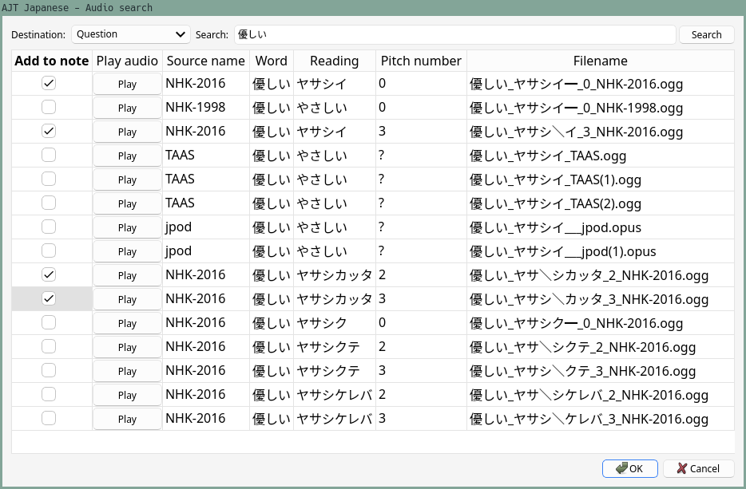

[Anki](setting-up-anki.html)
can be used
to learn a variety of different subjects,
including languages.
What makes Anki such a fantastic tool for Japanese learners is the vast array of plugins or "add-ons"
that extend its functionality.
One of the most useful add-ons for learning Japanese is
[AJT Japanese](https://ankiweb.net/shared/info/1344485230).
Its main features include
adding furigana,
adding pitch accent information,
and adding pronunciation audio files to Anki cards.

****

## Installation

The installation process is similar to other Anki plugins and can be accomplished in three steps:

1) Open the "Install Add-on" dialog by selecting "Tools" > "Add-ons" > "Get Add-ons..." in Anki.
2) Input `1344485230` into the text box labeled `Code` and press the OK button to proceed.
2) Restart Anki when prompted to do so in order to complete the installation of AJT Japanese.

To improve parsing quality (not necessary, but recommended), install these AUR packages:

* [mecab](https://aur.archlinux.org/packages/mecab-git)
* [mecab-ipadic-neologd](https://aur.archlinux.org/packages/mecab-ipadic-neologd-git)

To install AUR packages, you can use [Trizen](https://github.com/trizen/trizen/blob/master/TRIZEN.md)
or any other AUR helper.

When Anki starts, AJT Japanese will try to use
`/usr/lib/mecab/dic/mecab-ipadic-neologd` as a system `dicdir` for Mecab.
This directory is provided by `mecab-ipadic-neologd`.
If the directory is not found, the add-on will fall back to the built-in dictionary,
which is smaller (to fit on AnkiWeb).

## Overview

The AJT Japanese add-on provides a range of features
to make learning Japanese easier.
The main feature is the furigana generation,
which automatically adds [furigana](https://ja.wikipedia.org/wiki/%E6%8C%AF%E3%82%8A%E4%BB%AE%E5%90%8D)
&mdash; readings of kanji characters.
The readings appear as small kana characters above the kanji.
When a card is created or modified by the user,
furigana will be placed to a dedicated field,
allowing the user to learn how words should be read.
If a word has many readings,
the add-on will print a list of readings, separated by commas by default.
The learner needs to be aware that a word can be read different ways
and learn the reading relevant to the example sentence the word is used in.

**Note:** Apart from some corner cases,
we always recommend [having an example sentence](discussing-various-card-templates.html#targeted-sentence-cards)
displayed on the front side of a flashcard.
Words never exist in isolation, people use them to form sentences.
Without reading a usage example it is nearly impossible to reason
about the meaning or reading of a word.

Another important aspect of the Japanese language is pitch accent.
[Pitch accent](https://ja.wikipedia.org/wiki/%E9%AB%98%E4%BD%8E%E3%82%A2%E3%82%AF%E3%82%BB%E3%83%B3%E3%83%88)
is taken very seriously among Japanese learners,
and especially among AJATTers.
Most people study it diligently.
If you don't know pitch accent of a word, you don't know how to say it.
AJT Japanese offers two ways to add pitch accent information to your Anki cards.
It can add [pitch numbers](understanding-monolingual-definitions.html#understanding-pitch-accent) or pitch patterns to cards.
Pattern and number can be placed in separate fields or combined in one field.
Pitch accent **pattern** indicates the rising and falling tone that occurs when speaking.
Pitch accent **number** indicates the number of a [mora](https://ja.wikipedia.org/wiki/%E3%83%A2%E3%83%BC%E3%83%A9)
after which the tone of the voice **drops** from high to low,
when counting morae from the beginning of the word.
Most of the time pitch drops only once in a given word,
so its entire accent can be represented with one number.
In a few corner cases the add-on will output two digits.

Of course,
the best way to learn correct pronunciation is to hear it.
AJT Japanese includes built-in support for adding pronunciation audio to your cards.
By default, it comes with audio sources provided by Ajatt-Tools,
and supports adding custom sources.
Any user can create their own audio sources.
The audio files provided by default come from Japanese accent dictionaries,
so they are pretty accurate.
Audio sources can be online or offline.
Online audio sources fetch audio files from the internet,
whilst offline audio sources are stored locally.
If you have additional disk space on your computer,
it is recommended to download and use offline sources
to ensure that audio files are added instantly.
The default audio sources are online.

## Usage

If you have fields named `VocabKanji`, `VocabFurigana`, `VocabPitchPattern`, `VocabAudio` on your notes,
the lookups will be performed on the `VocabKanji` field,
furigana will be added to the `VocabFurigana` field,
accents will be added to the `VocabPitchPattern` field,
and audio will be added to the `VocabAudio` field.

<video width="1032" autoplay loop controls muted>
	<source src="https://user-images.githubusercontent.com/69171671/230740335-8e374dfb-6965-47c8-bc51-20d5e683b1b2.mp4" type="video/mp4">
</video>
<p align="center"><i>Video demonstration.</i></p>

To generate readings, accents and audio,
focus in the `VocabKanji` field and press <kbd>Tab</kbd> or switch focus away from the field.

You can change field names or add more source and destination fields in Options.

When a new card is created via AnkiConnect
(by using [Yomichan](setting-up-yomichan.html), [GoldenDict](setting-up-goldendict.html), etc.),
the add-on detects such events and will append the needed information to the card as well.

In the Anki Browser's toolbar you will find the following buttons:

* Regenerate all fields.
  A shortcut that allows you to replace all readings,
  accents and audio files with freshly generated information.
* Generate furigana in field.
  Replace the content of the current field with the same text but with furigana added.
* Reconvert field as hiragana.
  Replace all kanji with their kana readings.
* Clean furigana in field.
  Remove all text in brackets, effectively removing furigana.

Some of these buttons are off by default.
Check the configuration.

In the Anki Browser's context menu actions you will find the following options:

* Pitch accent lookup.
  Show a window with the currently selected text split into individual words,
  with pitch accent information shown next to each word.
* Furigana for selection.
  Add furigana to the selected text.
* Convert to katakana.
  Replace hiragana characters with katakana characters.
* Convert to hiragana.
  Replace katakana characters with hiragana characters.
* Literal pronunciation.
  Convert selected text to a form that resembles the way it is actually pronounced.
  Implies conversion to katakana and replacement of certain characters.
* Look up in GoldenDict.
  A handy shortcut to send the selected text to GoldenDict.
  Requires GoldenDict to be
  [installed](setting-up-goldendict.html)
  and [added to the PATH](how-do-i-add-a-directory-to-the-path.html).

## Configuration

To configure the add-on, open Anki and select "AJT" > "Japanese Options...".

## Profiles

Each of the three main features works according to profiles
which are created by the user.
A profile specifies a source field, a destination field, and what triggers the profile.
When the specified conditions are met, the profile invokes a task associated with it.
For example, when the Note Type is Japanese and the source field is `VocabKanji`,
the task is to write furigana to the `VocabFurigana` field.

The `split morphemes` setting determines whether an input string should be split into words.
It makes sense to enable splitting for fields that are expected to contain more than one word,
but keep it disabled for fields that are expected to contain only one word.

The `overwrite_destination` setting determines whether the contents of the destination field
should be replaced if the field is already filled.
By default, if a field already contains data, it won't be modified.

Profile types are tried in this order:

1) Furigana
2) Pitch accent
3) Audio

If there is more than one profile inside a profile type,
the profiles are tried in the order they are listed.

Each task can be triggered by one of the 4 callers:

1) `Focus lost`. When the user presses <kbd>Tab</kbd> or switches focus away
   from the selected source field in the Browser or in the Add dialog.
1) `Toolbar button`. When the user presses the "Regenerate all fields" button in the Browser's toolbar.
1) `Note added`. When AnkiConnect adds a new note,
   but not when the user adds a note manually via the Add dialog.
1) `Bulk add`. When the user presses the "Bulk-generate" button in the Browser's "Edit" menu.

When editing a profile, you can select what callers the profile should "answer" to.
For example, you can generate furigana when focus is lost but not when a note is added.

## Pitch accent style

Pitch accent style can be configured in "AJT" > "Japanese Options" > "Pitch Accent" > "Style".
The following styles are built-in:

1) `javdejong`.
   The style used in the original Japanese Pitch Accent Anki add-on by `javdejong`.

   * Overline: indicates "High" pitch.
   * Downfall arrow: indictates an end of moras with "High" accent.
   * Red circle mark: nasal pronunciation、e.g. `げ` would be a nasal `け`.
   * Blue color: devoiced. Barely pronounced at all.
2) `u-biq`.
   The style used to show pitch on the [u-biq website](https://accent.u-biq.org/).

   * Overline: indicates "High" pitch.
   * Underline: indicates "Low" pitch.
   * Red circle mark: nasal pronunciation.
   * Blue color: devoiced.
3) `kanjium`.
   Style which is part of the [kanjium project](https://github.com/mifunetoshiro/kanjium).

   * Overline: indicates "High" pitch.
   * ⌝: indictates an end of moras with "High" accent.
   * Red circle mark: nasal pronunciation.
   * Blue color: devoiced.

The last option, `None` allows you to configure your own style
using CSS classes in your Note Type's Styling section
("Anki" > "Tools" > "Manage Note Types" > "Cards" > "Styling").
You can define CSS rules for the following classes:

* `.low`. Low accent, e.g., an underline.
* `.low_rise`. Low accent, then rise.
* `.high`. High accent, e.g., an overline.
* `.high_drop`. High accent, then drop.
* `.nasal`. Nasal sound, e.g., shown in a different color.
* `.devoiced`. Devoiced sound.

## Audio files

AJT Japanese can add audio files from accent dictionaries to Anki cards.
To set up audio profiles and audio sources,
go to "AJT" > "Japanese Options" > "Audio".

Add at least one audio profile, selecting the source and destination fields.

Below Profiles, you will see a list of loaded audio sources.
Sources can be enabled or disabled.
Each source is given an arbitrary name and a URL that points to its index file.

When a new source is added, AJT Japanese downloads its index file
and figures out where to find audio files and what audio files are available
based on information stored in it.

### Available audio formats

The default audio sources for AJT Japanese are availabe in two formats: `opus` and `mp3`.
Audio sources created by the users, however, can be in any format.

The Opus audio codec provides much better quality at lower bitrates
(which saves a lot of space and makes syncing large collections faster).
However, Opus is **not** compatible with the following:

* AnkiWeb.
* Very old Android devices (Android 4 and below).
* <abbr title="Note that we reject iThings and urge our users to upgrade to a free system such as postmarketOS, Android, etc.">AnkiMobile on iOS</abbr>

The MP3 audio codec is older and less efficient, but is supported on pretty much all devices.

### Online audio sources

Audio files are stored remotely, only the index file is downloaded.
When requested, AJT Japanese downloads audio files from the Internet, using the provided URLs.
All default audio sources are online audio sources.

To add a new online audio source,
paste the URL of the index and give it a unique name.

**Currently available online audio sources:**

<details>

<summary>ogg/opus files (recommended)</summary>

1) [NHK accent dictionary, 2016](https://github.com/Ajatt-Tools/nhk_2016_pronunciations_index/releases/download/v1.2/NHK_main.zip).
1) [NHK accent dictionary, 1998](https://github.com/Ajatt-Tools/nhk_1998_pronunciations_index/releases/download/v1.1/NHK_main.zip).
1) [Shinmeikai 8th edition](https://github.com/Ajatt-Tools/shinmeikai_8_pronunciations_index/releases/download/v1.5/Shinmeikai-8_main.zip).
1) [TAAS](https://github.com/Ajatt-Tools/taas_pronunciations_index/releases/download/v1.0/TAAS_main.zip).

</details>

<details>

<summary>mp3 files</summary>

1) [NHK accent dictionary, 2016](https://github.com/Ajatt-Tools/nhk_2016_pronunciations_index_mp3/releases/download/v1.0/NHK-2016_main.zip).
1) [NHK accent dictionary, 1998](https://github.com/Ajatt-Tools/nhk_1998_pronunciations_index_mp3/releases/download/v1.0/NHK-1998_main.zip).
1) [Shinmeikai 8th edition](https://github.com/Ajatt-Tools/shinmeikai_8_pronunciations_index_mp3/releases/download/v1.2/Shinmeikai-8_main.zip).

</details>

### Offline audio sources

Audio files are stored locally, on the hard drive.
When requested, AJT Japanese copies the needed files to the Anki collection.

To add a new offline audio source,
you need to download its entire folder with all audio files (usually a few hundred `MiB`).
In the folder you will find a file named `index.json`.
Copy the full path to the file and paste it into the "URL" field.
Give it a unique name.
The add-on will figure out the rest based on the information inside the json file.

**Currently available offline audio sources:**

<details>

<summary>ogg/opus files (recommended)</summary>

1) [NHK accent dictionary, 2016](https://github.com/Ajatt-Tools/nhk_2016_pronunciations_index/archive/refs/heads/main.zip).
1) [NHK accent dictionary, 1998](https://github.com/Ajatt-Tools/nhk_1998_pronunciations_index/archive/refs/heads/main.zip).
1) [Shinmeikai 8th edition](https://github.com/Ajatt-Tools/shinmeikai_8_pronunciations_index/archive/refs/heads/main.zip).
1) [TAAS](https://github.com/Ajatt-Tools/taas_pronunciations_index/archive/refs/heads/main.zip).

</details>

<details>

<summary>mp3 files</summary>

1) [NHK accent dictionary, 2016](https://github.com/Ajatt-Tools/nhk_2016_pronunciations_index_mp3/archive/refs/heads/main.zip).
1) [NHK accent dictionary, 1998](https://github.com/Ajatt-Tools/nhk_1998_pronunciations_index_mp3/archive/refs/heads/main.zip).
1) [Shinmeikai 8th edition](https://github.com/Ajatt-Tools/shinmeikai_8_pronunciations_index_mp3/archive/refs/heads/main.zip).

</details>

<p align="center"></p>
<p align="center"><i>Screenshot.</i></p>

### Audio Search dialog

If you activate the "audio search button" setting in the add-on's Options,
a button titled "Search audio files to add to note" will appear in the Editor's toolbar.
By clicking on the button, you can open up the Search dialog box.
It lets you search words to add audio files for.
The table below the search bar displays all the audio files that match your search term.
To add these audio files to your Anki note,
simply check the "Add to note" checkboxes and click "Ok".

<p align="center"></p>
<p align="center"><i>Search dialog.</i></p>

### Creating a custom audio source

To create a new audio source from scratch,
the first thing you will need is a large folder with audio files
featuring native speech recordings.
Name this folder `media`.

Next, create the index file for AJT Japanese and name it `index.json`.
It should contain the following data:

* Information about the source.
* What words correspond to what files.
* Information about each audio file.

<details>

<summary>Example index.json file</summary>

```
{
    "meta": {
        "name": "My audio source",
        "year": 2023,
        "version": 2,
        "media_dir": "media"
    },
    "headwords": {
        "私": ["file1.ogg", "file2.ogg"],
        "僕": ["file3.ogg", "file4.ogg"]
    },
    "files": {
        "file1.ogg": {
            "kana_reading": "わたし",
            "pitch_pattern": "わたし━",
            "pitch_number": "0"
        },
        "file2.ogg": {
            "kana_reading": "わたくし",
            "pitch_pattern": "わたくし━",
            "pitch_number": "0"
        }
    }
}
```

</details>

* `name` &mdash; the name of the audio source.
* `year` &mdash; when the audio files were created.
* `version` &mdash; version of the `json` file, in case the format will change in the future.
* `media_dir` &mdash; relative path to the `media` directory,
  the folder where the audio files are stored.
* `media_dir_abs` &mdash; absolute path to the `media` directory.
  This property takes precedence over `media_dir`.
  It is optional and is intended to be specified when `index.json` and the `media` folder
  are in different locations.

The `headwords` sub-dictionary maps words to files.
For each word specify what files represent its pronunciation.

The `files` sub-dictionary maps files to their properties.
Supported keys: `kana_reading`, `pitch_pattern`, `pitch_number`.
At least `kana_reading` should be present.

When you finish creating the `index.json` file,
add it as a new source in Options.

## Context menu

By going to the add-on's options and selecting "Menus" > "Context menu"
you can configure what context menu actions are visible
when you select text in the Anki Browser and press the right mouse button.

## Overrides

This table allows you to enter information about words that AJT Japanese doesn't know about.
The data applies to readings and pitch accents.
If pitch accent of a word is not known, you can insert `?` in the "Pitch accent" field.
If a word has multiple pitch accents, specify them separated by commas, e.g. `1,2`.

## Conclusion

Overall, AJT Japanese is an incredibly powerful tool
for anyone who is serious about learning Japanese.
Its furigana generation,
multiple readings support,
pitch accent information,
and pronunciation audio make it an essential addition to any Japanese learner's toolbox.
With its range of features,
it can help learners of all levels become more confident in their Japanese language skills.
Best of all,
it's completely free/libre and easy to use.
Give it a try and see how it can help you master the Japanese language!
