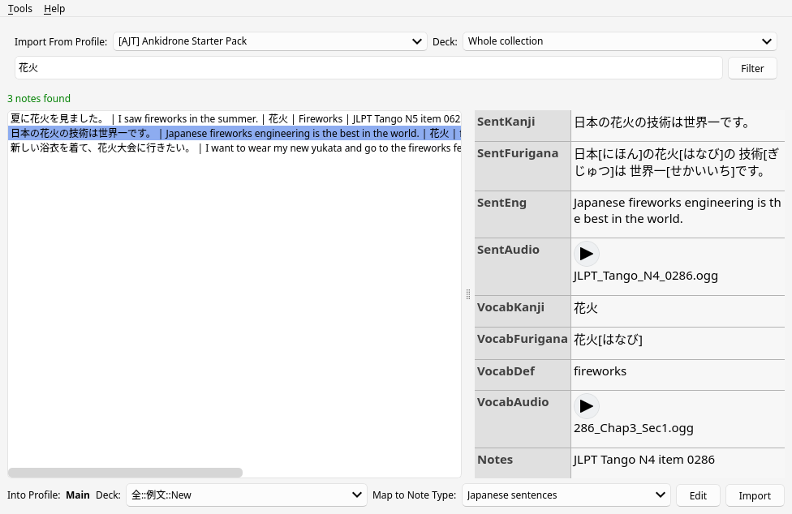
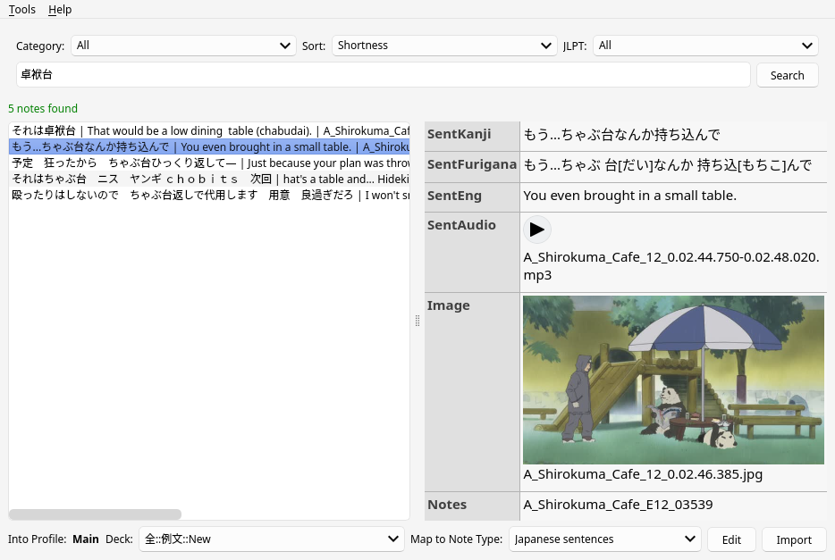

The [Cross Profile Search and Import](https://ankiweb.net/shared/info/1772763629) add-on
is a tool that helps you maintain a neat,
uncluttered main profile while still having access to an extensive sentence bank.
This tool allows you to store your sentence bank
in a separate profile which is not synchronized with AnkiWeb,
and then easily search and import cards into your main profile when required.
In doing so,
it keeps your main profile tidy
while sparing AnkiWeb servers from hefty media uploads.

****

## Prerequisites

Before proceeding, ensure that you have installed Anki.
Follow [this guide](setting-up-anki.html) to set it up.

## Installation

The first step is to install the **Cross Profile Search and Import** add-on.
Follow standard procedures for adding extensions onto Anki.

1) Open the "Install Add-on" dialog by selecting "Tools" > "Add-ons" > "Get Add-ons..." in Anki.
2) Input `1772763629` into the text box labeled `Code` and press the OK button to proceed.
1) Restart Anki when prompted to do so in order to complete the installation.

## Sentence banks

There is software to automatically create flashcards from whole series of TV shows with subtitles,
such as [subs2srs](our-immersion-learning-toolset.html#subs2srs).
It creates a large “sentence bank”,
which you can then use to select cards to study
by searching for words that you want to learn.
Sentence banks are useful when there's a word you want to learn,
but you don't have a [1T](one-target-sentences.html) example sentence
to create a [targeted sentnece card](discussing-various-card-templates.html#targeted-sentence-cards).
You then use the bank to find a suitable sentence.

## Setup

You need at least one extra Anki profile to get started.
Open Anki,
go to "File" > "Switch Profile" > "Add" and create the profile to store your sentence bank.
Then you need to **fill** the profile with decks that you generate
from anime, movies and TV shows you have watched or plan to watch.
You can also keep premade decks in your sentence bank.

Typically, the size of a decent sentence bank reaches several GiB,
so you don't want to keep it in your main Anki profile that you sync with AnkiWeb.
That would cause unnecessary long sync times
and irrational utilization of the AnkiWeb disk space.

## Decks from the Internet

To expand your sentence bank further, download decks from the Internet.
There are many shared folders where people upload their sentence banks.
You can find some of them in Resources below.

* [Anki decks](resources.html#anki-decks)
* [Sentence banks](resources.html#sentence-banks)

Decks from different people will inevitably have different formatting.
Convert all of them [to one note type](how-to-change-note-types.html)
in order to make working with the bank easier.

## Configuration

Once you have Cross Profile Search and Import installed,
navigate through "AJT" > "Cross Profile Search and Import" > "Tools" > "Add-on options".
There you can change a number of settings to suit your needs.
Each setting can be hovered over in order to show a tooltip that explains what does.

## Usage

- Select the source profile (import from profile) and deck to search in.
- Select the destination deck and the Note Type to map the new notes to.
- Use the search bar for querying specific words or phrases.
- Choose notes that cater exactly to what you need and hit "Import".

<i>Screenshot.</i>

## Web search

The add-on lets you search cards on the Internet.
To do so it will connect to a remote server that contains a relatively large public sentence bank
and send your search queries there.
The server that the add-on connects to is not affiliated with Ajatt-Tools.

Press "Tools" > "Search the web" to enable the feature.

<i>Web search.</i>

## Keyboard Shortcuts

* <kbd>Alt</kbd>+<kbd>T</kbd> Tools menu.
* <kbd>Alt</kbd>+<kbd>H</kbd> Help menu.
* <kbd>Ctrl</kbd>+<kbd>K</kbd> Focus the search bar.
* <kbd>Ctrl</kbd>+<kbd>L</kbd> Focus the list of notes.
* <kbd>Ctrl</kbd>+<kbd>I</kbd> Import.

## Conclusion

The Cross Profile Search and Import add-on is a versatile tool
for working with sentence banks.
With its user-friendly interface,
customizable settings,
and web search capabilities,
this add-on
greatly simplifies the process of moving targeted sentence cards
and makes studying more efficient and effective.
