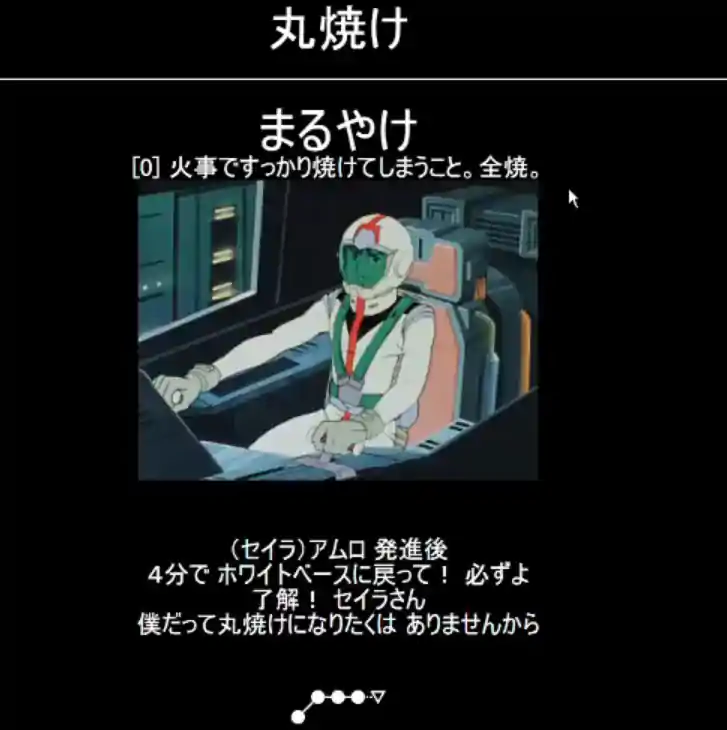
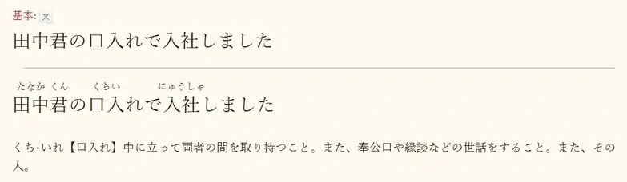
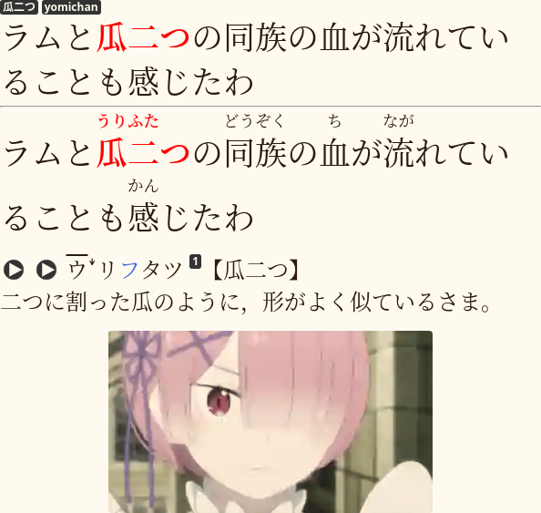
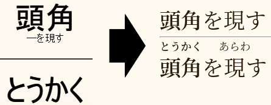
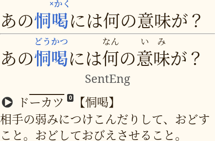
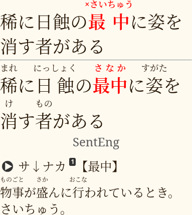
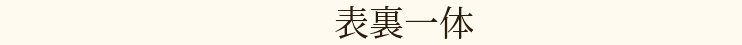

<p align="center"></p>

Many learners agree that the most effective way to acquire Japanese
is to combine the SRS with immersion.
After finishing learning
[kana](learning-kana-in-two-days.html) and [kanji](jp1k-anki-deck.html)
you're going to continue to use Anki
in your study time to memorize vocabulary.
When memorizing new vocabulary, there are various card templates you can choose from.

Card templates are differentiated by what you put on the front of the card.
There are two major card templates that people tend to use: `sentence cards` and `word cards`.
Both have their variations depending on what other information they contain.

This article covers **recognition** cards.
Production cards are covered [here](writing-japanese.html).

****

## How cards are created

In Anki, the user creates *notes* that store information the user intends to remember.
A note is divided into fields, and each field can store some text.
The simplest note has only two fields, "Question" and "Answer", or "Front" and "Back".
Anki generates *cards* from the notes the user has made using *card templates*.
A *card template*, or *card type* is an HTML and CSS template that defines how a card will look.
You can have several cards per note, depending on the card templates you have created.
For example, each sentence item would have
a card to test reading and a card to test writing by hand.

## Various card templates

The division of card templates is arbitrary.
We introduce it because from the perspective of language learning
it is important what we test ourselves on.
Here, a card template is characterized by the field of the note
that is placed on the front.
The fields on the back of the card are less significant.
Their purpose is to help increase your understanding of what is on the front.

* **Word Cards** test your reading comprehension of a single word.
  * **[Simple Word Cards](#simple-word-cards)** contain the minimum of information necessary to understand the word.
  * **[Word Context Cards](#word-context-cards)** must additionally have an example sentence on the back of the card.
* **[Sentence Cards](#sentence-cards)** test your reading comprehension of a sentence or a part of a sentence.
* **[Targeted Sentence Cards](#targeted-sentence-cards)** test your reading comprehension of a single word in context.
* Other types of cards are rarely used, including cards with audio on the front.

We approach card templates based on the idea that
your practice in Anki should mimic real world situations.
In other words, you should *practice how you play*.
And in real world we read sentences, and we write sentences.
So the preference is given to card formats that have sentences in them.
Having said that, word cards have their place in your SRS.
They are very effective for studying concrete nouns.

Regardless of the card template,
you create your cards from words and sentences you encounter while consuming Japanese.
Learners utilize Yomichan, mpv scripts, Qolibri and other software
to make card creation faster and easier.

## Simple word cards

By simple word cards I mean a word in the target language on the front of the card
and a definition and usually audio and a picture on the back.
No context is present on this type of cards.

<p align="center"></p>

<p align="center"><i>A simple word card.</i></p>

SWCs are the easiest to make and the fastest to review.

### How to review SWCs

1) Read the target word.
2) Recall the meaning and the reading of the word.

Pass the card if you understand the meaning and the reading of the target word.
Otherwise, choose `Again` to review the card again sooner.

### Pros and cons of SWCs

As mentioned in the beginning of this article,
simple word cards are very powerful when learning concrete nouns.
A *concrete noun* is a noun that you can see or touch.
The nouns `phone`, `dog`, `car` are concrete nouns.
If a word is not a concrete noun,
learning it through a simple word card is not going to be effective.
For example, words like <span title="ふっかつ ー restore, revive">復活</span>
or <span title="はしる ー to run">走る</span> require context to understand their meaning and usage.
Without it, you will almost certainly misunderstand the meaning
and won't know which grammar constructions should be used with the word.

But because most concrete nouns
have clear meanings,
are used similarly
and are surrounded by similar grammar patterns
that can be easily picked up from repeated exposure
providing context is completely unnecessary in my opinion.
Often you can understand the meaning of a concrete noun even without a dictionary.
To understand what <span title="ねこ ー a cat">猫</span> means,
it's enough to look at a photo of it.

The time saved by using SWCs for nouns outweighs the benefits of using sentence cards
because one can add many more SWCs than sentence cards
and can rep them much more quickly as well without thinking about context.
By simply thinking of the reading and the meaning of a word you're making SWCs very low effort.

I would argue that word cards should comprise around 15% of your total number of cards.

## Word context cards

WCCs contain the target word on the front.
The front of the card sometimes also contains hints
that disambiguate certain aspects of the target word.

The back of the card contains everything you need to understand the target word:

* Readings and pitch accents
* Example sentence
* Definitions
* Audio
* and so on.

<p align="center"></p>

<p align="center"><i>A word context card.</i></p>

### How to review word context cards

WCCs test your reading comprehension of a single word.
Similarly to SWCs,
press `Good` only if you understand how the word is read and what it means.

The first time that you learn a new card,
you read the sentence on the back of the card and listen to the audio
to understand the usage of the word.
After that whenever the card comes up for review
you see the isolated word on the front,
recall the meaning,
and if you are able to recall the meaning well
then you move on to the next card
without listening to the audio
or reading the sentence on the back.

When using this card template you can go through the reviews extremely quickly
because unless you forget the word,
you don't need the sentence,
and you don't force yourself to read it.
You can just skip the sentence and go to the next card.

### Pros and cons of WCCs

Like SWCs, WCCs should work great for concrete nouns.
If you happen to find a concrete noun in context,
mining a WCC would be a natural choice.
The cons present themselves when learning other types of speech.

WCCs take more time to make than SWCs.
Some extra time is needed to add the context (sentence, image, audio) to the card.
However, there are tools that can automate this process.
For example, mpv scripts.

WCCs should be as fast to review as SWCs.
All you need to do is recall what the target word means.
For words other than concrete nouns WCCs could take additional time to recall the meaning.
If the word is abstract,
it can be hard to tell whether you understand the meaning or not
without context on the front.

WCCs strip the context information from the front of the card
forcing you to recall the meaning and the reading regardless of the context.
This makes cards harder to learn and review.

* Because words other than concrete nouns are rarely seen in isolation,
  such practice is unnatural.
* Because the piece of knowledge you're testing yourself on is so small,
  it is difficult to associate the word directly to its meaning.
* You spend more time and effort recalling the meaning
  compared to a card with context on the front.
  It is easier to read an example sentence and understand the word in a sentence.
* If you can remember the meaning of an isolated word,
  that doesn't necessarily mean that when you read the word in a sentence
  you're going to understand the sentence.

Because the context is missing on the front
there's often a need to rely on additional field
that serves to reduce memory interference &mdash; the hint field.
The hint field is needed when a word has multiple meanings.
For such word you can't recall the right meaning without looking at an example.
A WCC with context on the front in essence turns into a type of sentence card.
In this case I would definitely choose to create a targeted sentence card instead.

If you choose to use them,
Word Context Cards, much like Simple Word Cards,
can be useful,
but I wouldn't recommend using them as your primary card template.

## Sentence cards

A [sentence card](http://www.antimoon.com/how/usingsm-makeitems-sentence.htm)
is an SRS card with a sentence in the question field.
The sentence has **one** unknown word or phrase.

Some people might make cards with multiple unknowns,
but it comes at the expense of harder reviews.
If you have a sentence card that tests two (or more) words at the same time,
you will need to make repetitions
that are frequent enough to keep the more difficult word in memory.

On the back you find readings and dictionary definitions.
Optimally you also want to add audio for the entire sentence and/or the target word,
pitch accent information
and a picture if the sentence comes from a video.

<p align="center"></p>

<p align="center"><i>A sentence card.</i></p>

### How to review sentence cards

The algorithm is
[explained](https://web.archive.org/web/20081122063325/http://www.alljapaneseallthetime.com/blog/10000-sentences-how/)
on the AJATT site.
I simplified it a bit, below are the main steps:

1) You read the full sentence.
2) Know the meaning of every word in the sentence.
3) Understand the meaning of the entire sentence.

If the above requirements are satisfied, press `Good`.
Otherwise, choose `Again` so that you will see the card sooner.

There are other steps and nuances described on the AJATT site
but most sentence cards users skip them.
In particular, I don't think many people read sentences out loud
or copy them by hand onto a piece of paper.
These are not helpful and only make reviews longer.

### Pros and cons of sentence cards

The first advantage of sentence cards is that they are easy to remember.
You have a whole sentence as context shown to you.
The context helps your brain remember what the target word means.
If you just have a word on the front,
especially if it's a word with a more abstract meaning,
it can be hard to tell whether you understand the meaning or not.

Sentence cards are natural and organic.
What I mean by this is that
the practice of reading sentences closely resembles real world situations.
It's more akin to what you're doing in real life when reading a book.
The target word is embedded in a context that helps make the meaning of the word clear.

But they have certain weaknesses, the main being **review time**.
On a sentence card the target word is not emphasized in any way.
As a result during each rep you have to read the whole sentence
and essentially test yourself on every word in it.
On average, it takes 20 seconds to answer a sentence card.
This is a lot of time compared to reading and recalling just the target word.
Thankfully, there are some tricks to do reps faster, which are described in the TSC section.

Sentence cards are criticized a lot
because they can create context-dependent memories.
If you always recall the meaning of a word
when that word is contained within a certain sentence,
sometimes you end up just memorizing that sentence instead of the target word.
Then when you see that target word out of context or in a different context
you're not able to draw the connection and recall what the word means
or even realize that you learned that word.
To a lesser extent this also happens with word cards
because having no context is a type of context in itself.
When seeing the word in immersion,
one might be unable to draw the connection and recall it.
It is likely that context-dependent memories can form when using any type of card templates.
To combat context-dependent memories, immersion is key.
The knowledge of a word internalizes
after seeing it enough times in different contexts in the wild.

Sometimes you see people say that by reviewing sentences
you will build internal grammar and remember word usages,
which is helpful in your output.
I think it comes from a misunderstanding of the AJATT site.
There's an embedded assumption that
SRS can be used to learn how to output.
In reality the role of the SRS is to aid comprehension
by helping you memorize meanings and readings of words.
Output can only come from lots of exposure and seeing words in different contexts.
Reading sentences in the SRS can only play a minor role.

Nevertheless, there is some truth to the statement.
Though according to Wozniak passive recognition doesn't guarantee active recall,
reading the same piece many times has an effect similar to TV commercials.
You sometimes can recite them from memory just from repeated exposure.
You can expect to memorize many sentences this way,
but you will almost certainly not memorize all of them.
I must point out that it's a mere side effect
and shouldn't be treated as an advantage of using sentence cards.

## Targeted sentence cards

TSCs are like sentence cards, but you always make sure to highlight the target word.
This is done by selecting the word and pressing <kbd>Ctrl</kbd>+<kbd>B</kbd> in Anki, nice and simple.
Yomichan can do it too if its settings are tweaked in a certain way.

<p align="center"></p>

<p align="center"><i>A targeted sentence card.</i></p>

TSCs are very flexible and give their users a lot of choices of how to review them.
Depending on your liking, you can:

* Rep them as regular sentence cards.
  You read the full sentence
  and decide whether you understood all bits and pieces.
* Read the whole sentence but only test yourself on the target word.
  This has a positive effect of lifting the mental burden of testing yourself
  on too many things at the same time.
* Only read the target word, and probably a few words surrounding it.
  This way of reviewing TSCs is close to WCCs and SWCs and can save a lot of review time.
  If a sentence is too long,
  I usually start reading a few words behind the target word
  and stop as soon as I've understood the clause.
  Grade yourself on the target word only, don't penalize yourself for failing other words.

When you learn a sentence for the first time,
make sure to read and understand it fully,
even if you don't want to read it every time the card comes up.
Understanding the context greatly helps in understanding of the target word.

It is also important that you already know all the words besides the target word.
You don't want to stumble upon words you haven't learned each time you review the card.
This concept is called "one target sentences" and is discussed later on this site,
in the articles about making your own cards.

Follow [this link](setting-up-anki.html#import-an-example-mining-deck) to download
a deck with example Targeted Sentence Cards.

### Make Yomichan highlight the target word for you

I recommend setting up Yomichan to mark the target word automatically when a new card is made.
This saves you the extra step
that you'd otherwise have to take every time you make a new targeted sentence card.
[mpvacious](https://github.com/Ajatt-Tools/mpvacious)
is aware of this setting and preserves highlighted words when updating sentences.

Go to Yomichan Settings > "Anki" > "Configure Anki card format…".

<p align="center"></p>

<p align="center"><i>Yomichan settings.</i></p>

**Note:** All Yomichan settings are covered in [Setting up Yomichan](setting-up-yomichan.html#anki-settings) later.

### Why TSCs?

* **TSCs are stress-free.**
  Because you do not have to read the entire sentence for every single card,
  you can review TSCs much faster.
  But at the same time you always have access to the full sentence on the front,
  so you can read it if you want,
  or skip reading if you don't have time to spend on your reviews.
  Drop the weight quickly and go back to the fun stuff.
* **TSCs are easy to make.**
  You can use mpv scripts such as [mpvacious](https://github.com/Ajatt-Tools/mpvacious)
  to make each card in just a few seconds.
  When you're reading a novel, Yomichan alone can handle everything.
* **Context is always there.**
  You don't deprive yourself of the full sentence, and it makes your reviews easier.
* **You see how the word is used.**
  Because words are rarely found outside of sentences,
  you ensure that your practice in Anki closely resembles reading out in the wild.
  Even if you test yourself just on the target word,
  the information on the card should help you understand its usage.
* **Eliminate the fatigue.**
  You don't have to test yourself on every word.
  If you think that sentence cards test you on too many items at the same time
  which causes you to burn out mentally,
  then evaluate yourself only on the target word.
  TSCs give you the freedom of choice.
* **TSCs are forgiving to beginners.**
  When I just started learning sentence items,
  the ability to test myself only on the target word saved me lots of gray hair
  because I didn't have to recall meanings and readings of all the other words in a sentence
  that I still knew poorly or didn't know at all yet.
* **Save yourself decisions when creating cards.**
  You don't need to choose between various card templates because TSCs
  fuse *word cards* and *sentence cards* together in their own unique way.
* **Any length will do.**
  TSCs free you from the need to mine shorter sentences.
  Often short sentences lack enough context.
  Sentence cards users have to seek shorter sentences in order to shorten the reviews.
  You don't have to keep things short for the sake of quicker reps.
  At the same time long sentences won't overwhelm you because you aren't obliged to read them.
* **Stay on target.**
  Due to the format of the card template and the combination of the note fields
  TSCs always have only one target word per card,
  but they can contain more than one unknown word total.
  Adding only one-target sentences to the SRS is a good practice,
  it guarantees that all cards in the collection have similar intrinsic difficulties
  which makes reviews smooth and effortless.
  On the other hand,
  if you have to make a TSC with many unknown words,
  it does not become a burden
  &mdash; when grading yourself you skip everything but the main target.
* **Keep your cards.**
  There's an idea in the community that cards should get deleted or suspended
  after they reach a certain interval.
  The idea is justified by an assumption that immersion alone is enough
  to keep any word in memory after it's been acquired.
  I think it's just a cope invented to deal with the fact
  that sentence cards take forever to finish one's daily reviews.
  If you're a TSC user, your reviews are quick,
  so don't buy into deleting all your old cards.

### Are TSCs too easy?

Since TSCs allow you to look at the context,
they are easier than word cards, but it's a good thing.

On the contrary,
by reviewing words in isolation you basically create unnecessary difficulty for yourself.
You also violate the *practice how you play* principle
by testing yourself on something that is rarely seen in real life.

> But what if I memorize the meaning of the sentence as a whole,
> and become unable to recognize or understand the target word in other contexts?

First you won't be able to read very well at all
until you actually practice reading and put in the hours.
The SRS can only help a little.
Second, it doesn't happen often.
Yes, sometimes you will form context-dependent memories.
To fully acquire a word
and transfer the knowledge from being context-dependent to context-independent
it has to be seen a few times in the wild.
Most of the time it happens quickly.

The reality is that the SRS doesn't guarantee that you will remember a word 100% anyway.
You could make a **word card** for it
only to find yourself not being able to recall it in the right time
because of the flaw in the algorithm
or because the memory of the word is still context-dependent.
This can even happen to the cards that you nail every time in the SRS.

Thankfully, most words according to Krashen are encountered in **friendly contexts**.
It is actually less likely that you will fail to understand the meaning of a word
when you read Japanese content
so don't worry about being unable to recall what you've learned in the SRS.

Lastly, the biggest problem Japanese learners face when learning how to read
is remembering kanji readings.
For most people failed attempts to recall readings comprise the majority of lapses in Anki,
but meanings often come for free
thanks to friendly contexts and **semantic hints** that kanji provide.

### Performance gains

Time-wise you can expect the following gains:

* When you read the full sentence,
  you can rep TSCs up to 2 times faster compared to sentence cards.
  This is achieved by using
  [Speed Focus Mode](useful-anki-add-ons-for-japanese.html#speed-focus-mode)
  Anki add-on.
  You might as well only test yourself on the target word
  to speed up reviews a bit more.
* When you rep TSCs by only reading the target word,
  you are able to do it up to 4 times faster compared to sentence cards.
  This is achieved simply by skipping everything but the target word.
  You're still going to hear the sentence's audio (if provided)
  or read the sentence once the back of the card is revealed,
  but it's totally optional.

For many years I studied with sentence cards.
Although I achieved great results,
my time investments were far from optimal.
After you've seen a card enough times
you don't need to continue reading the whole sentence
every time it comes up.
You can skip to the target word if you want.
But with regular sentence cards **you don't know what the target word was**
until you reveal the answer.
With TSCs you highlight the target word when you create a card.
Then, when the card comes up for review,
you always have a choice to read just the target word.

Keep in mind that any time you spend in the SRS is time you can't spend on immersion.
So the purpose of these tips is to reduce the time spent reviewing
and leverage the mental load of SRSing.
By applying them you slightly reduce the benefits of using sentence cards,
but I think that ultimately any technique that helps you stay in the game is a good trade-off.
If you keep unhealthy relations with the SRS
it is easy to start hating it and quit completely,
which is the worst outcome compared to forgetting some words here and there.

You can review TSCs really quickly,
and you can either learn more cards in the same amount of time
or just learn the same number of cards in less time and then have more time for immersion.

It is also important to note that
the SRS helps you keep mental dictionary entries for the words you put in.
Even if you don't remember the exact meaning of a word,
having a mental dictionary entry allows your brain to
more successfully notice it in your immersion
and store any new information about that word.

### Can the hint field save the day?

Users of WCCs employ a 'hint' field to disambiguate the correct readings
and pinpoint one of the possible meanings in some words.
I don't think it's a good idea.
The need to create a separate field is far from the best solution, and it feels like a crutch.
First for any card you review you have to identify
that you're unable to grasp the meaning without a hint.
Then you have to copy a part of the sentence to the hint field.
Finally, when you review the card you have to read the target word
and then jump to the hint and read it too.

Because TSCs put sentences first, you are given all the tools to disambiguate
both kanji readings and multiple meanings for free, and you don't need to invent anything.
Reading phrases is easier than reading separate words with some text at the bottom,
and it more closely resembles the way we read actual books.

#### Distinguishing meanings

Some words only appear in certain expressions.
Some can have multiple meanings.
The good news is that you don't have to worry about it when reviewing TSCs.
The context on the front helps you identify the right meaning.
You can also make a second card for another meaning if you want.

<p align="center"></p>

<p align="center"><i>TSCs provide a natural alternative to the hint field.</i></p>

> What if an expression does not have an entry in a Japanese to Japanese dictionary?

It most certainly has. If you can't find it in a Yomichan dictionary,
look it up on
[www.weblio.jp](https://www.weblio.jp/)
or use the web search.
For example, [here](https://www.weblio.jp/content/%E9%A0%AD%E8%A7%92%28%E3%81%A8%E3%81%86%E3%81%8B%E3%81%8F%29%E3%82%92%E7%8F%BE%28%E3%81%82%E3%82%89%E3%82%8F%29%E3%83%BB%E3%81%99)
you can find a definition for 「頭角を現す」.

> What if it's not voiced in the Yomichan audio?

It's not a big deal,
but you can try searching on
[Forvo](https://forvo.com/word/%E9%A0%AD%E8%A7%92%E3%82%92%E7%8F%BE%E3%81%99/#ja).
If you have added audio for the sentence,
adding audio for the target expression is not necessary.

#### Distinguishing readings

If a word has many readings,
or if you want to avoid failing a card due to a common reading mistake you tend to make,
TSCs let you use furigana on top to pinpoint the correct one.

Make sure that your front template allows displaying furigana:
```
{{furigana:SentKanji}}
```
And to add furigana on the front you simply specify it in square brackets as usual:
```
稀に日蝕の 最中[×さいちゅう]に姿を消す者がある
```
<p align="center"></p>

<p align="center"><i>A way to prevent yourself from repeating the same mistake.</i></p>

<p align="center"></p>

<p align="center"><i>Point to the right reading.</i></p>

### Fallback cards

The idea behind fallback cards is similar to that of targeted sentence cards
but the front side is different.
When a fallback card comes up for review, it looks like a regular **word card**,
but you can hover over the target word to reveal the full sentence.
Fallback cards basically give their users all the benefits of targeted sentence cards
but are designed for people who worry about forming context-dependent memories.

<p align="center"></p>
<p align="center"><i>Front side of a fallback card.</i></p>

One disadvantage is that this card template is somewhat tricky to make yourself.
You have to play around with css and html of your cards
to make the context appear when you hover over the word.

A DJT user shared his card template on [Pastebin](https://pastebin.com/pAVvqLPd),
take a look if you need help setting up fallback cards.
The template configures the **shift** key to toggle sentence visibility,
you may want to install the
[Refocus Card when Reviewing](https://ankiweb.net/shared/info/1642550423)
Anki add-on to be able to use it.

From
[here](https://github.com/Ajatt-Tools/AnkiNoteTypes/tree/main/templates/Japanese%20fallback)
you can download the Japanese fallback Note Type made by ﾌｪﾘﾍﾟ.

## Conclusion

The lack of context makes word cards harder to learn,
but they are quick to review and are effective for concrete nouns.

Sentence cards take longer to complete your daily reviews
but because the target word has context it makes meaning and usage of the word clear.

Targeted sentence cards take the speed of word cards
and combine it with the effectiveness of in-context learning with sentence cards,
which makes them the best card template.
