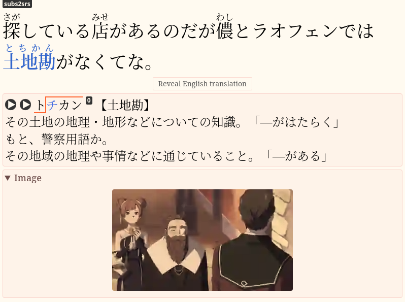
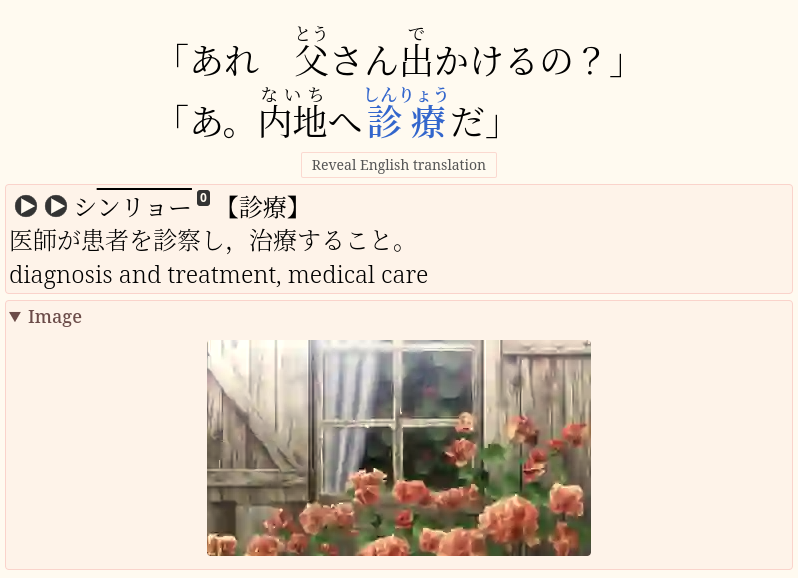

So far,
you have been relying on bilingual dictionaries to learn new words.
For those studying Japanese,
JMdict is a frequently used resource,
offering Japanese-to-English translations.
Going monolingual means moving from bilingual to monolingual dictionaries.
It is an important step forward in your language acquisition journey.
This shift is crucial for achieving long-term success and mastering the language.

In this article,
we will explore how to transition from bilingual to monolingual dictionaries effectively.

****

## What is a Monolingual Dictionary?

A monolingual dictionary is a dictionary that explains the language through itself.
For instance, German-German.
These dictionaries are designed for native speakers of your target language.
They define words in the TL.
For example,
`大辞林`, `明鏡`, and `新明解` are
monolingual Japanese dictionaries.

In English,
you can find monolingual learner's dictionaries.
[Longman](https://www.ldoceonline.com/dictionary/)
and [Cambridge](https://dictionary.cambridge.org/us/dictionary)
are such dictionaries.
They provide definitions using a restricted vocabulary,
helping non-native English speakers understand meanings easily.

## What does it mean to Go Monolingual?

"Going monolingual" refers to the transition process
from using bilingual dictionaries to exclusively utilizing monolingual dictionaries.
During this process,
you may use various tools and techniques,
including bilingual dictionaries,
as an aid.

Once you fully go monolingual,
whenever you stumble upon an unknown word during immersion,
you look up its meaning in a monolingual dictionary
and add only the monolingual definition to your Anki card.
You want to avoid bilingual definitions
because they often fail to correctly express the real meanings of words.

<p align="center"></p>
<p align="center"><i>Example Anki card.</i></p>

## Why Go Monolingual?

The shift towards exclusive use of monolingual dictionaries yields two main advantages.

1. Greater exposure to your target language and increased immersion time.
   When reading bilingual definitions,
   you **pause** immersion to read in your native language.
   Using a monolingual dictionary **keeps** you immersed in the target language,
   reducing reliance on your native language.
   As a result, you learn faster.
3. More precise understanding.
   Words rarely have direct equivalents between languages,
   unless the languages are closely related,
   like English and Dutch.
   Bilingual definitions provide rough translations
   that often lead to incorrect assumptions and incomplete understanding.
   Monolingual dictionaries describe words in greater detail,
   cultivating a deeper understanding of nuances.

Using a monolingual dictionary helps you learn the true meanings of words
and avoid false associations between your native language
(e.g. English) and target language (e.g. Japanese).
Learning a word bilingually creates a false
association you'll have to correct later, wasting time.
The monolingual definition gives you a better sense of the word's meaning,
shortening the time it takes to acquire it.
Comprehending definitions in the target language also
expedites your brain's adjustment to that language.

Moreover,
learning words monolingually mirrors how native speakers acquire vocabulary.
For them,
there is no other language in which to learn new words.
Going monolingual eliminates another distinction between you and native speakers,
enabling you to comprehend and explain words as they do,
fostering a more authentic understanding and use of the language.

## What you need to Go Monolingual

You don't need much &mdash; just the desire to build a new habit
and access to quality monolingual dictionaries.
Use apps like GoldenDict, Qolibri, and Rikaitan, or online dictionaries like Weblio.

The prerequisites are that you're already doing [AJATT](whats-ajatt.html),
spending multiple hours a day immersing,
and are past the complete beginner stage.
You also need to know how to use the [SRS](spaced-repetition.html)
and how to [mine sentences](sentence-mining.html).

## When to Go Monolingual

While there's no one-size-fits-all answer,
there are [some guidelines](when-should-i-make-the-monolingual-transition.html)
to help you decide.

* After you've [mined](sentence-mining.html)
  at least 2,000-4,000 unique Anki notes from native material.
* When you know at least 3,000 words.
  This is higher than mined notes
  since people learn words from premade decks or without Anki too.
* Around 3-4 months after starting AJATT.

The idea is to start early but not too early,
so you aren't overwhelmed trying to understand monolingual definitions as a beginner.
Dictionary definitions are not like slice of life manga.
They are dense and contain unfamiliar words.

## Obtain dictionaries

Any resource or app that supports monolingual Japanese dictionaries is sufficient for the task.
Some options that have been covered on this site are listed below.

* [GoldenDict](setting-up-goldendict.html).
  Download and import monolingual dictionary files.
* [Qolibri](setting-up-qolibri.html).
  Download and import monolingual dictionary files.
* [Rikaitan](setting-up-yomichan.html).
  Download monolingual dictionary files.
  Go to "Settings" > "Dictionaries" and import them.
* [Online dictionaries](resources.html#online-dictionaries).
  Use a [plumber](plumbing-for-language-learners.html) for quick access.
* In [LibreWolf](https://librewolf.net/)
  add [search shortcuts](https://support.mozilla.org/en-US/kb/assign-shortcuts-search-engines)
  for online dictionaries you use often.

  When visiting an online dictionary website,
  click on the search bar and choose
  "[Add a keyword for this search](img/librewolf-add-keyword-for-this-search.webp)".
  Or click on the address bar and choose "Add".

## Dictionary files

In real life,
monolingual dictionaries are thick paper books.
As we are striving for efficiency and ease of use,
we are going to use [digital versions](yomichan-and-epwing-dictionaries.html) of the paper dictionaries.
Regardless of the specific dictionary program you choose to install,
the names of the dictionary files are generally consistent,
although the file types may vary.

Here is a brief list of dictionaries
frequently recommended within the AJATT community:

* `大辞林`
* `新明解`
* `大辞泉`
* `明鏡`
* `広辞苑`

These are more or less generic names.
Often,
a single dictionary may have multiple versions,
resulting in varying names.
For example,
you might encounter
`大辞林` and `スーパー大辞林`,
or `大辞泉` and `デジタル大辞泉`.
Feel free to pick the version that suits your preferences.

Both `大辞林` and `大辞泉` are quite similar to each other,
offering comprehensive definitions and a vast number of entries.
Prefer `デジタル大辞泉` over the original `大辞泉`
as it contains even more entries.

`明鏡` and `新明解` use easy language and are considered beginner-friendly.

`新明解` has fewer entries compared to others
and features a slightly convoluted definition structure
that includes numerous redirections marked with `△` and `（）`
which force the learner to jump back and forth when parsing the definitions.
But mostly it's very good.

`大辞林` and `新明解` provide pitch accent information,
so you may want to install them first.
Pitch accent is a topic that is given significant attention among Japanese learners.

## Looking up unknown words

When you find a new unknown word during immersion,
look it up in a **monolingual** dictionary and try to understand the definition.
Copy the definition and add it to an Anki card.
If you don't understand the definition,
look up any unfamiliar words within it.
If you still don't understand,
copy a definition from a bilingual dictionary as a last resort.

When you read monolingual definitions,
it is inevitable that you'll be coming across unknown words within them.
Let's say you read the following definition and the word `幼虫` is new to you.

```
うじ-むし [2] 【蛆虫】
（１）ハエ・ハチなどの幼虫。うじ。
（２）〔蛆のようにつまらない嫌な奴，の意〕
人をののしっていう語。「この―どもめ」
```

You're going have to pause and look up that word first.
And you probably want to make a card for it too.
So in total there's going to be **two** words to mine.

When handling unfamiliar words within monolingual definitions,
there are two common strategies:

1. Recursive lookups.
   More hardcore.
   Look up unknown words by searching for their definitions in a monolingual dictionary.
   This can send you down a rabbit hole of lookups.
2. Fall back to bilingual definitions.
   More mainstream.
   Look up unknown words in a bilingual dictionary.

The recursive lookup algorithm:

1) Read the monolingual definition (e.g. `蛆虫`).
1) Spot a new word (e.g. `幼虫`).
1) Look the new word in a **monolingual** dictionary.
1) See that `幼虫` is defined as `陸生節足動物の幼生に対する呼び方。特に，完全変態するものに限られることが多い。`
1) Read that definition.
   Chances are, it will contain unfamiliar words as well.
   You look them up in a monolingual dictionary and go to the first step.

As you can probably see,
it is easy to bury yourself under a pile of monolingual definitions
when going down the recursive path.
For advanced learners it is not a problem
because they don't have to look up that many words to begin with.
But for a beginner it will definitely be a challenge at first.
Thankfully,
GoldenDict allows you to create tabs, so you can organize your lookups.
But there comes a point where you have to stop
searching words within definitions in a monolingual dictionary
and consult an English dictionary instead,
or you will never see the end.

The simpler fallback algorithm goes like this:

1) Read the monolingual definition (e.g. `蛆虫`).
1) Spot a new word (e.g. `幼虫`).
1) Look the new word in a **bilingual** dictionary.
1) Done.

Both methods work.
I did a combination of both.
At first use bilingual dictionaries more.
As you progress, do more recursive monolingual lookups.
The end goal is to minimize your reliance on English as much as possible.

## Adding both types of definitions

Before going monolingual,
your cards had only bilingual definitions.
Now, add **both** monolingual and bilingual definitions
to make the transition smoother and aid comprehension.
Don't omit bilingual definitions on your cards just yet.
Spend a few weeks adding both types to your cards.

<p align="center"></p>
<p align="center"><i>Example Anki card.</i></p>

The downside is that
this technique may lead to being too lazy to read the Japanese definition during review sessions.
But it's better than adding no Japanese definition at all.
And it is only temporary.
Try not to skip the monolingual definition when you forget a card.

Sometimes people add an extra field to their note types just for bilingual definitions.
Later this field can be removed from the note type,
erasing all bilingual definitions in one click.
Personally, I don't like adding more fields to my note type.
I prefer tossing all definitions into one field,
usually breaking them up with newlines.

## The Process

Here's a breakdown of the process of going monolingual.

First,
[start copying monolingual definitions](monolingual-definitions-early.html)
to your Anki cards, **in addition** to bilingual definitions.
Do it for some time.
You don't have to perfectly understand the monolingual definitions yet.
Just make an effort to read them when adding and reviewing targeted sentence cards.

Next,
when making cards,
spend more time deliberately trying to understand the monolingual definitions.
If you encounter unfamiliar words in the definitions,
put them aside.
Come back and learn the words after you make your regular cards.
You may need to find example sentences for these words.
Monolingual dictionaries typically provide examples for the words they define.
Alternatively,
you can utilize various [sentence banks](resources.html#sentence-banks).
During this phase,
you can use **bilingual** definitions to learn unknown words in monolingual definitions.

If you have trouble with the readings of words in the definitions,
use [AJT Japanese](anki-japanese-support.html) to **add furigana** to them.
There's an option in the right-click context menu called "Furigana for selection".
Although you don't want to put furigana on the front,
It is **okay** to have furigana **on the back** of your cards.
Any information on the back should help you understand the target word and not be in the way.
At this point, inability to read the back of the card will hinder the learning process.

The final stage is when while looking up new words
you properly read every monolingual definition
and use **monolingual** dictionaries
to learn unknown words that may come up inside definitions.
Start doing recursive lookups.
Recursive lookups don't need to be too deep at first,
but as you're trying to move away from bilingual definitions
you need to go deeper as you progress and become more comfortable with monolingual dictionaries.

The hardest part of making the monolingual transition
is being able to parse the abstract and self-referential Japanese definitions.
This skill is what comes with practice.
Memorizing the vocabulary used in definitions might be tedious,
but the process is dead simple (add to Anki and review).

## Learn cards

When you learn monolingual [TSC](discussing-various-card-templates.html#targeted-sentence-cards)s,
your objective is to be able to recall
how to read the target word (the kana reading) and what it means.
Essentially it's the same as when learning bilingual TSCs.
As [with bilingual cards](basic-vocabulary.html#how-to-review),
you don't have to memorize the exact definition on the back.
Trying to memorize monolingual definitions word-for-word is a monstrous task.
The definition is provided on the back to help you understand the word.
You aim at intuitive understanding, not conscious learning.

## Multiple meanings

When a word has only one meaning, you simply copy the full definition to Anki.
However,
if there are multiple meanings,
there are two approaches for including definitions on Anki cards:

* Including the entire list of monolingual definitions.
* Including only the single definition that fits the specific use in the example sentence.

For instance,
if you want to learn the word `垂涎`,
this is the list of definitions that `大辞林` will show you:

```
すい ぜん ０【垂▼涎】
① よだれをたらすこと。
② ある物をしきりに欲しがること。「一同は巨額の賞金に━して／八十日間世界一周忠之助」
```

While it's okay to copy only the relevant definition (1 or 2),
including all the definitions is preferable
as it provides a more enriching understanding of the word.
Seeing all the definitions together allows you to
understand connections between different meanings.
There's no need to go out of your way and delete valuable information.
Instead,
you can use bold font on the card to highlight the part of the definition
that is relevant to the example sentence.

You shouldn't try to memorize the exact definition on the back.
The purpose of the definition is simply to help you understand the target word.
Therefore,
you don't lose anything by having more information on the back of the card.
Knowing that a word can have different meanings will help you
if you come across another meaning during immersion.
Rather than being confused by an unfamiliar usage of the word,
you will instantly link the new usage to the fact that the word can have another meaning,
even if you don't recall that specific meaning.

## Defining vocabulary

One of the reasons why people find it hard to go monolingual is *defining vocabulary*.

In English,
monolingual dictionaries use a limited list of common words
for writing simple definitions of every word in the dictionary.
The list is called "[defining vocabulary](https://en.wikipedia.org/wiki/Defining_vocabulary)".
How many words are on the defining vocabulary list?
Longman uses defining vocabulary of just 2,000 words in its definitions.
Macmillan writes the definitions using a defining vocabulary of 2,500 words.
Oxford uses around 3,000 words.
You have to know those words to read the monolingual definitions well.

The situation is more complicated in Japanese
(and apparently in every other language besides English).
We don't know whether monolingual Japanese dictionaries
even try to stick to a predefined list of words in their definitions.

Unlike monolingual English dictionaries,
monolingual Japanese dictionaries are **not** made for learners
but rather for native speakers.
But
it is noticeable that
certain words appear more frequently in monolingual Japanese definitions
than in everyday Japanese.
While this phenomenon resembles defining vocabulary,
I wouldn't rely on it when learning Japanese.
Japanese learners don't try to learn defining vocabulary in advance
since it is hard to compile such a list.
From the past attempts of other people we know that
the list might be too large (more than 5,000 words)
and vary significantly between dictionaries.
Additionally,
each [language domain](language-domains.html) in Japanese
has its own set of defining vocabulary.
So,
it is better to just practice reading monolingual definitions,
learning new words as you come across them,
and eventually you'll end up with enough defining vocabulary learned.

The bright side is that by reading monolingual Japanese dictionaries
you're immersing in content made by natives for natives,
which is not true for some monolingual English dictionaries.
It is more difficult in the beginning, but more effective in the long run.
Ultimately,
immersing in authentic content is what makes the AJATT method so powerful.

## Editing your old bilingual cards

Should you retroactively add monolingual definitions to your old bilingual cards?
I wouldn't bother going back and changing your old cards
because it's not going to be worth all the time and effort.
You already know what those words mean anyway,
and those cards already have intervals to them,
so you're only going to be seeing them once a month,
once every six months,
once every year.
And so it's not going to be worth the time and effort to go back and change them.
I would say don't worry about the old cards
and just start adding monolingual definitions to your new cards.

The time you would spend editing old cards
can instead be better spent immersing yourself in the language and learning new things.

## My experience learning English

When I learned English,
I didn't know anything about AJATT,
and I didn't do anything said in this article.
So, for many years I just used Google Translate as a bilingual dictionary
to translate things I didn't understand.

Eventually, when I found out about the input hypothesis and immersion learning,
I switched to Eng-Eng dictionaries overnight.
There was no transition period because my comprehension was already high enough.
This shows that if for some reason you don't want to go monolingual early,
postponing it will make the switch easier when you finally do it.

If you immerse every day,
eventually you will become able to read monolingual dictionaries.
Immersion will eventually prepare you.
But remember that the downside of prolonged bilingual dictionary use is that
you might not learn exact, correct meanings of some words,
only their rough translations that might be wrong and take time to correct through immersion.

## My experience learning Japanese

Going monolingual in Japanese didn't feel difficult for me.
I was more lazy about it than I think you should.
And I started several months later than other AJATTers.
At first, I started adding monolingual definitions to my cards
together with English definitions as I was making them.
I didn't pay too much attention to them.
Over time, I started trying to read them more closely.
All monolingual definitions on my cards had furigana.
After some time I started to add furigana only for certain words.
Then I stopped adding English definitions.
And then I stopped adding furigana.
It was a gradual process.

## Get good

How to become comfortable with monolingual dictionaries?
Read more. Ranobe, Manga, even anime with Japanese subtitles.

## Conclusion

Going monolingual is a significant step in mastering a new language.
By immersing yourself in the target language
and utilizing monolingual dictionaries,
you can accelerate your learning
and gain a deeper understanding of the language's nuances.
