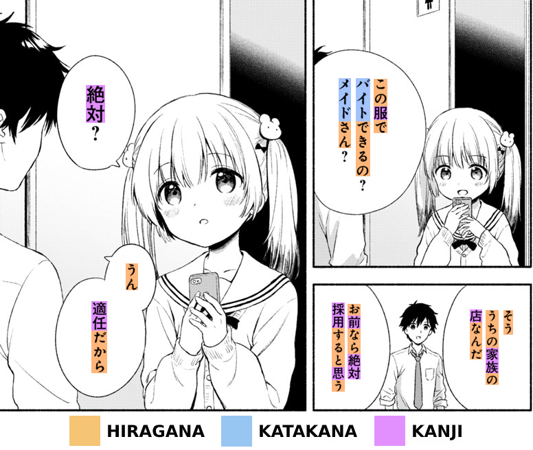
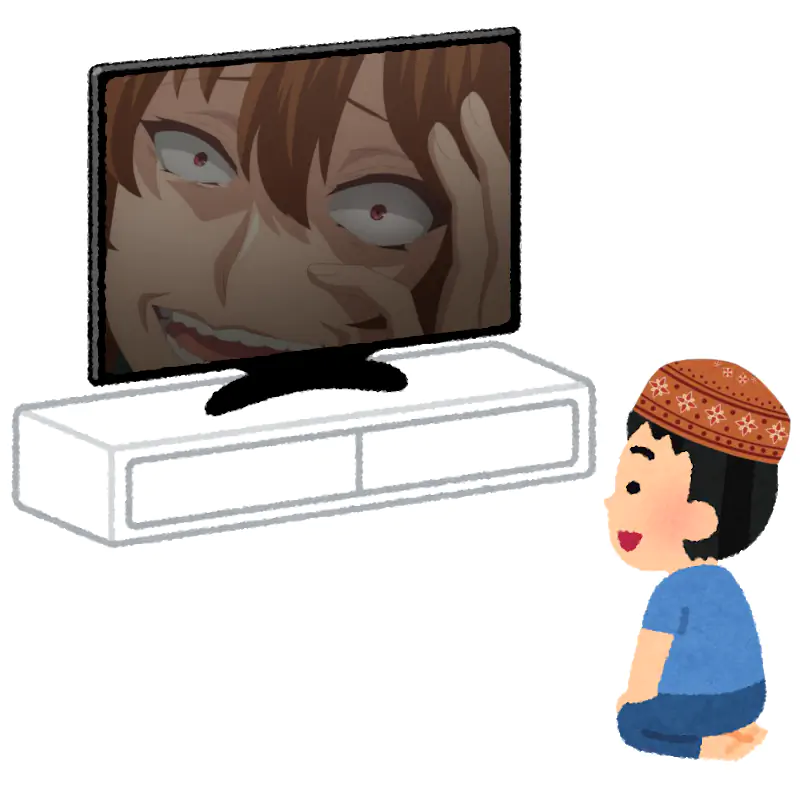

Below is a quick rundown of a typical Japanese learning journey
that should get you to basic fluency in less than two years.
We've designed the method for people
who want to learn Japanese efficiently through self-study
and are interested in Japanese media such as movies, TV shows or novels.

If you have any questions,
you can [ask them in the Starting Lounge](join-our-community.html) of the Matrix space,
and people will help you.
There are thousands people learning Japanese, and you should be part of it.

****

## The right mindset

> I'm just one person who took ideas from other people,
> applied them systematically and found success with it.
>
> *― Khatzumoto*

Consuming the language is how you learn the language.
You know, babies can only cry and poop their pants
but within the first few years from birth they learn to speak their first language.
They quickly absorb complicated grammatical principles
and soon can speak with accurate grammar and near perfect pronunciation.
It happens because they listen to people around them, especially parents,
and they slowly begin to understand what is being said.
Our brain is built to do that instinctively.

Traditional language learners say that as you grow up
the part of your brain responsible for language acquisition dies, and you lose access to it.
They insist that adults have to learn languages the same way you learn math or science:
with your rational, logical brain; by consciously memorizing rules and drilling exercises.
This has proven to be untrue.

According to Stephen Krashen,
humans acquire language when they understand messages.
Krashen calls it [comprehensible input](what-is-comprehensible-input.html).
The process of acquiring a second language
is similar to the process that children undergo when learning their native language.
You can do it no matter [how old you are](im-not-a-kid-anymore-am-i-too-old-to-learn-a-language.html).

We're not babies, we're smarter, and we can learn faster.
Any adult with some help of technology can aquire a language through input,
by immersing themselves in the language.
Language acquisition can't be substituted with *learning* a language,
e.g. taking classes or buying textbooks.
Immersion is the most crucial ingredient of the entire process.

### How to immerse

No, you're not going to [go to the country](https://www.antimoon.com/other/myths-country.htm)
and ask a Japanese person to speak to you.
[Immersion](whats-immersion.html)
refers to any form of listening or reading in your target language.
The best type of content to use is anything you're interested in.
As long as it's **by natives for natives**, it's fine.

The process is divided into two steps.

1) Watch a movie or a TV-show in Japanese.
   The visual component will help you understand what's going on.
   Use Japanese subtitles, if available, to look up unknown words and grammar.
   If not, you might be surprised at how much you can learn
   from simply watching *raw*, with no subtitles.
   This is called **active immersion**.
2) Reuse what you've watched for **passive immersion**.
   Passive immersion is when you have audio playing in the background
   while you're doing something else.
   A popular practice among people doing AJATT
   is to take an episode of a TV show they have watched,
   extract the audio track and add it to a playlist.
   I am going to tell you how to do it in the article about
   [passive listening](passive-listening.html).

As for reading, the above applies if for a book you read you find the corresponding audiobook.
If not, just read it and skip the second step.

It is reasonable to ask
how you're supposed to learn from native content if you still understand nothing.
It is true that actively consuming native media,
looking up words and trying to learn them
is an immense task for a beginner.
You're going to spend your first weeks learning the basics of the language.
Your active study time during this stage will include
learning the alphabets, kanji, basic vocabulary and grammar.
Nonetheless, you have to do immersion from day one.
What I recommend you do at this stage is watch easy anime without subtitles.
Instead of looking up words rely on imagery and context to infer what's going on in the show.
You can start using Japanese subtitles once you have a foundation in the Japanese writing systems.
Passively listen to each episode after you complete it to maximize time spent immersing.
By simply listening, your brain will slowly get better at parsing and understanding the language.
Listening a lot is going to eventually enable you
to understand spoken language,
be it a conversation or your favorite anime.

Once you learn the basic vocabulary,
nothing stops you from learning just from immersion.
Don't wait for too long.
There are people who trap themselves into thinking,
"I'm going to start watching raw anime when I'm good",
"I don't immerse because I don't understand Japanese yet".
This is a very dangerous pattern.
You start wearing skates before you know how to skate.
You start watching without subs before you understand.

For passive listening try to choose the material
that you previously actively watched and comprehended.
The quality of passive immersion is lower if you don't actively work with it beforehand.
Avoid listening to "white noise",
you only really make gains when you understand the language you are consuming.
You won't be able to comprehend everything right away,
but as you learn new words from your immersion,
expect your comprehension to quickly grow within the first few months.
You have to make effort to make the content comprehensible.
Look up words, rely on the imagery, choose material with simpler language.

Slice of life anime is the easiest genre to learn from in the beginning.
To find easy anime you can [search MAL](what-good-things-are-there-to-watch-for-a-complete-beginner.html).
Additionally, the ixrec website has a page with
[media recommendations](https://ixrec.neocities.org/immersion/).

The more *language-dense* your immersion content is, the better.
It's a good idea to choose content where people talk a lot, with some caveats.

* In general podcasts and radio are more challenging for beginners,
  and they rarely have transcriptions.
  Learning from such content is harder than, say, anime,
  where you can open a subtitle file and look up unknown words.
  I recommend podcasts for intermediate learners and above.
* [Songs](is-music-a-good-way-to-learn-japanese.html)
  contain unnatural sentence structures, grammar, word choice.
  They tend to use more "poetic", uncommon words.
  Sometimes if a word can be read many ways,
  they choose to sing the less common version.

  It's hard to hear the lyrics through music.
  Even in our native language we often fail to hear or make sense of some parts of songs.
  Instead of listening to songs for the sake of immersion,
  it's better to choose a more comprehensible material.

  But music is fun.
  Reading song lyrics is a fun way to find new, often cool and rare words.
  Give it a try once you're advanced.

I hope you'll find an immersion routine that suits your life.
If you think you can't do it, don't worry.
Even Khatz, the AJATT founder, said in his blog that he wasn't always able to immerse all day.
He still tried to do as much as he could,
while having a job and studying at a university at the same time.
AJATT has existed for years, many people went through the program and achieved fluency.

### Outputting

**Shut up before you hurt yourself.**
Your goal is to understand Japanese.
If you can't understand it,
there is no way you will be able to successfully communicate with others
even if you memorize basic phrases from a textbook.
[Premature speaking](can-i-speak-early.html) has other negative effects.
It can mess up your accent and solidify your mistakes.
Traditional language learners often demonstrate the effect in their speech.

* It takes time to train your listening
  until you can hear native speech at natural speed and comprehend it.
  If you can't hear the sounds yet, there's no way you can repeat them
  without a strong foreign accent.
  Traditional language learners start speaking very early, from day one.
  As they speak, they get used to pronouncing words incorrectly.

  Think about Japanese people. After getting crippled by the school system
  that doesn't and can't offer enough listening practice
  they confuse the `l` and `r` sounds when they try to speak English.

  A lot of people think, "I'll have native speakers correct me and tell me where I'm off".
  Imagine a blind person trying to draw a self-portrait and someone telling them,
  "oh, the nose is a little bigger".
  That's not going to help them too much.

  If you want good pronunciation,
  you need to rely on your own ability to correct yourself.
  You need to develop a good listening ability before you start speaking.
* Mistakes are bad because they [become habits](http://www.antimoon.com/how/mistakes-damage.htm).
  If you make a mistake,
  you are more likely to say the same construction the next time.
  Don't hope that a native speaker will correct your mistakes.
  Unless the other party didn't understand you at all,
  they are not going to point out where you're off.
  Even if you ask them to correct all your mistakes,
  there's no guarantee that you'll be able to apply the corrections.

**Go through a silent period.**
A very popular community guideline is to avoid speaking to anyone in Japanese
for the first 1.5-2 years of learning.

**Output comes naturally.**
Once you get a few thousand hours of input,
your speaking ability is going to emerge gradually.
Forcing it usually doesn't work.
Again, remember how small children learn to speak their native language.
Their output ability emerges as a result of immersion.

## Software overview

We're going to use various programs to help us with Japanese.
Since this is an intro article, you don't have to install everything right now.
It's just an outline.
The most important tools will be described in [Our Immersion Learning Toolset](our-immersion-learning-toolset.html).
Afterwards, you'll be presented with articles that teach comprehensively how to use the tools.
Additionally, we have more suggestions in [Resources](resources.html)
and throughout the rest of the guide.

### Desktop

  * Install Japanese fonts.
    I suggest
    [noto-fonts-cjk](https://archlinux.org/packages/?name=noto-fonts-cjk).
    Refer to
    [Japanese fonts](japanese-fonts.html)
    for detailed instructions.
  * Install and configure
    [Fcitx](https://wiki.archlinux.org/index.php/Fcitx)
    to type in Japanese.
    The Fcitx guide can be found [here](how-to-type-in-japanese.html).
    The input method I use is
    [fcitx-kkc](https://archlinux.org/packages/?name=fcitx-kkc)
    but other options are also available.
  * For passive immersion use [mpd](https://wiki.archlinux.org/index.php/Music_Player_Daemon)
    together with
    [ncmpcpp](https://wiki.archlinux.org/index.php/Ncmpcpp).
    Keep your immersion material in a separate folder, for example `~/Music/immersionpod`.
  * *Condense* your immersion with [impd](https://github.com/Ajatt-Tools/impd).
    Condensing takes a video file with subtitles and removes all parts where no one is speaking,
    producing an audio file with increased language density for passive listening.
  * The most recommended video player is [mpv](https://wiki.archlinux.org/index.php/Mpv).
    It supports [add-ons](https://github.com/mpv-player/mpv/wiki/User-Scripts) (user-scripts)
    many of which can be used to make language learning easier.
  * Install and [set up](setting-up-anki.html) Anki.
    It's a flashcard program used to memorize words, phrases and sentences.
  * The most popular offline dictionaries are:
    1) [qolibri](setting-up-qolibri.html).
    1) [GoldenDict](setting-up-goldendict.html)
    1) [Tagaini Jisho](https://www.tagaini.net/)
  * When you read in your browser, use
    [Rikaitan](setting-up-yomichan.html)
    to discover meanings of unknown words.

### Mobile

  * Install [Mozc for Android](https://f-droid.org/en/packages/org.mozc.android.inputmethod.japanese/)
    to be able to type in Japanese.
    Because Android lacks free/libre keyboards,
    you can also use `Gboard` if you want, but make sure
    to completely block it from accessing the Internet.
  * [AntennaPod](https://f-droid.org/en/packages/de.danoeh.antennapod/)
    is a great app for playing podcasts.
    [This list](https://t.me/ajatt_tools/80) of podcasts is a good starting point.
  * Get [AnkiDroid](https://f-droid.org/en/packages/com.ichi2.anki/).
    It doesn't require any specific steps to set it up
    other than entering your AnkiWeb credentials to sync with the desktop.
  * Offline Japanese dictionaries available are
    [Sumatora](https://f-droid.org/en/packages/org.happypeng.sumatora.android.sumatoradictionary/),
    [jiten](https://github.com/obfusk/jiten)
    or anything else you find on F-Droid.

### Do not use

  * [Machine translators](could-machine-translation-be-useful-to-language-learners.html).
    Every translation differs from the original thought
    because no word has an exact equivalent in another language.
    Japanese honorifics, levels of politeness, and other things
    don't exist in English and get lost in translation.

    In order to truly understand anything in your target language,
    you have to understand it in the target language the first time.
    To achieve this,
    the goal is to receive thousands of hours of comprehensible input
    and acquire the necessary vocabulary and grammar.

    Machine translations are often unnatural, wrong, or misleading.
    While they may provide a general idea of what's being said,
    they cannot convey the full meaning and all the details of the original message.
    It is acceptable to use machine translations for individual words,
    although it is safer to consult a dictionary instead.

    Google Translate is good at recognizing drawn characters.
    You can use it to transcribe a kanji character that cannot be copy-pasted
    (when reading manga, for example)
    and in situations where <abbr title="Optical Character Recognition">OCR</abbr>
    software fails to do so.
  * Paid software.
    For language learning there is no paid software
    that offers any unique functionality
    that isn't available in the free alternatives
    or isn't useless from our point of view.
    Besides, if you're going to spend 10 years learning Japanese,
    do you really want to continue paying all that time?
  * Proprietary software.
    Most [proprietary software is malware](https://www.gnu.org/proprietary/),
    that's just the reality we live in.

## Writing systems

The three writing systems used in Japanese today are hiragana, katakana and kanji.
Hiragana and katakana are two phonetic scripts, each containing 46 characters.
Kanji come from Chinese and are complex characters that represent concepts.

### Kana

Have a look at the Wikipedia pages on
[Hiragana](https://wikiless.org/wiki/Hiragana?lang=en)
and
[Katakana](https://wikiless.org/wiki/Katakana?lang=en)
to understand what you're dealing with.
Together they're referred to as the [kana](https://wikiless.org/wiki/Kana?lang=en).
The key points to take away:

* The two alphabets represent the same sounds.
  Katakana is mostly used to write loan words and onomatopoeia,
  Hiragana for everything else not written in kanji.
* Due to its purpose, katakana is not used as often as hiragana,
  as you will notice once you start reading.
* They are very easy. Each can be learned in a day.
* Any Japanese text not aimed at preschoolers contains kanji,
  so learning only the kana won't cut it.

In the article about learning kana (later in this guide)
I recommend using a training app or a premade Anki deck.
Either way should take you two days or so to complete, and no more than a week if you're lazy.

### Kanji

[Kanji](https://wikiless.org/wiki/Kanji?lang=en)
were imported from China a long time ago.
They are logo-graphic characters used to write words and parts of words.
To truly learn kanji you need to read native Japanese texts for thousands of hours.
Kanji study is meant to prime your brain for recognizing the characters
and make transition to reading easier.

The most recent method for learning kanji is referred to as
[JP1K](learning-kanji.html#jp1k-method).
In essence, it's a specifically preformatted Anki deck.
The deck contains around 1,000 cards, thus the name JP1K.
There's a specific studying technique associated with the format of the deck.
Once you learn all cards from the deck,
it gives you the ability to recognize the most common kanji characters
together with words that represent them.
On this site you'll find links to premade JP1K decks
as well as instructions on how to convert any vocabulary deck into the JP1K format.

Other methods that I'd like to give special attention to:

* [Kanjidamage+](https://mega.nz/file/CQg0SKyI#Ufho0RKmmW8P6XRx8KiDY1JeAXoGOgmjrEscayil8cA).
  You recognize kanji using premade mnemonic stories.
  One flashcard per kanji.
  For each kanji the story includes its most common reading.
* [RTK](https://ankiweb.net/shared/decks/rtk).
  Similar to KanjiDamage.
  You study kanji in isolation using the order presented in a book called "Remembering the Kanji".
  Depending on the Anki deck you download,
  you are given premade mnemonics, or you're encouraged to make them yourself.
  Kanji readings are not taken into account,
  instead the method insists on learning them in the wild from native content.

Choose only one of the above methods.
No matter what option you pick, don't bother learning to write the characters just yet.
To learn how to write by hand you need to be able to read some Japanese first.
There are better ways to learn to write which are going to be
[discussed](writing-japanese.html)
later on this site.

<i>Japanese writing systems.</i>

You can totally skip the kanji phase and move straight to learning basic vocabulary.
If you choose to do so, you're going to memorize words as is, with the kanji.
For each word just try to remember how it looks, what it means and how it sounds.
Treat kanji like pictures and memorize kanji compounds as single units.
No doubt it is more difficult, but it works for many people.

## Basic vocabulary

After getting familiar with the writing systems,
use a premade Anki deck to build up the basic vocabulary.
Completing this step makes learning from input easier,
you won't have to struggle looking up every word on each page.

Download [Ankidrone Starter Pack](basic-vocabulary.html)
and learn one or two thousand cards from it.
You are free to continue learning new cards from the deck,
but don't get stuck on this step and move to [sentence mining](sentence-mining.html) (covered later) as soon as possible.

Each card in Ankidrone Starter Pack has a sentence at the front.
The target word of the card is shown in bold.
The information needed to understand the sentence and the target word is provided at the back,
it includes a rough translation and kanji readings.
Your goal is to understand the target word.
If you want, you can even skip reading the sentence,
but neglecting the word's context can make the reviews harder.

## Grammar

[Choose a grammar guide](learning-grammar.html) and read it.
It is the only *textbook* that you're really going to need through your AJATT journey.
When I learned Japanese, I chose Tae Kim.
Khatz used "[All About Particles](all-about-particles.html)".

Combining grammar study with the SRS can help you understand the grammar better.
Put the example sentences in Anki if you like.
Highlight the grammar point in the sentence to mark it the target
([targeted sentence cards](discussing-various-card-templates.html#targeted-sentence-cards),
covered later).
If you decide not to bother with Anki at this point,
make sure to at least read through the whole grammar guide and pay attention to examples.

Don't waste your time memorizing conjugation tables.
The grammar is a tool to aid comprehension, and knowing the rules won't help you output.
By the time you recall a grammar rule and apply it to your thoughts,
your conversation partner will be long gone.

A guide like Tae Kim doesn't cover everything.
Even certain grammar in the advanced section can be considered pretty basic.
As you continue to immerse,
look up and when necessary make Anki cards
for the rest of the grammar not covered in the grammar guide.
The process is no different from making cards for regular words.

## Create your own mining deck

The process of making sentence cards (or targeted sentence cards)
for the words you don't know
is called [sentence mining](sentence-mining.html) (or sentence picking).

Premade Anki decks might seem convenient, but they can't teach you everything,
so making your own cards is essential to long term success with Japanese.
Continue to immerse, read and listen to content created by native speakers for native speakers,
use [dictionaries](resources.html#dictionaries)
to look up new words and mine sentences.

Don't make too many single word flashcards.
They're fine for nouns representing concrete objects but bad for other types of speech.
Do not translate sentences, understand them instead.

There's a popular goal in the community to make 10,000 flashcards in the first 18 months.
This number is nothing special, but it's more fun to have a goal to work towards to.
I managed to learn 10,000 sentence cards in 11 months.
Try this challenge too, but remember that Anki is just a supplement for immersion learning.

## Summary

In the following articles you'll find out how to go through the learning steps.
Continue reading this site for detailed instructions.
Below is a quick overview.

1) Build a Japanese immersion environment.
   Start consuming native Japanese content actively and passively.
   This is the first and the most important part.
1) Quickly learn the Japanese alphabets with a drilling app or an Anki deck.
1) The basics.
   * Do KanjiTransition or an isolated kanji deck.
   * Immerse in Japanese media.
   * While doing KanjiTransition, find a grammar guide you like and read it.
     Dedicate a short period of time every day, 30 minutes to an hour, to study grammar.
   * Create your own mining deck.
     You will be adding everything else you don't know to this deck.
     You may add example sentences from the grammar guide to your mining deck.
   * Do Ankidrone Starter Pack. This step is optional.
1) Continue immersing and making Anki cards.

<i>Watch anime.</i>

