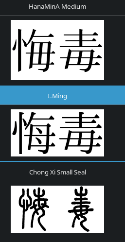

On a freshly installed GNU/Linux distro
Japanese characters may not look pretty.
This can be fixed by installing
[Japanese fonts](https://wiki.archlinux.org/title/Localization/Japanese#Fonts)
and creating a proper
[Fontconfig](https://wiki.archlinux.org/title/Font_configuration)
configuration file.

****

## Chinese glyphs

> Unicode is a retarded pile of crap maintained by morons.
>
> *― A comment on Ask Ubuntu*

One thing to beware of is Chinese glyphs.
Unicode uses a unified database for CJK characters called Unihan.
Unfortunately, kanji characters in Chinese and Japanese don't look the same.
Depending on the font used,
a single Unicode character may be represented by different glyphs.
If your system prioritizes Chinese fonts over Japanese fonts,
it will display kanji with a Chinese font instead of a Japanese one,
and it's not what you want.
No matter what OS or device you use, you may be affected if your settings are off.

Certain kanji characters may look drastically different if a Chinese font is used.
A prominent example is `直`.
This kanji is quite common and can be seen in words like `正直` or `直ぐ`.

<p align="center"></p>
<p align="center"><i>Noto Serif CJK SC vs Noto Serif CJK JP.</i></p>

If `直` renders without the vertical line on the left side,
your browser is using Chinese fonts for Japanese.
You need to install Japanese fonts and change your system settings.

## Locale

First and foremost, ensure that you have [generated the Japanese locale](japanese-locale.html).
You may have font-rendering issues if you don't do that.

## Installing fonts

Essential fonts are
[otf-ipafont](https://archlinux.org/packages/community/any/otf-ipafont/)
or
[noto-fonts-cjk](https://archlinux.org/packages/extra/any/noto-fonts-cjk/).
I also recommend installing Noto fonts for non-Asian languages and the Noto Emoji font.

On Arch-based distros you can do everything with this command:

```
$ sudo pacman -S --needed ipa-fonts noto-fonts noto-fonts-cjk noto-fonts-emoji
```

In [Resources](resources.html#fonts) you will find other fonts I recommend.
For example, `花園明朝` is a good fallback font.
It supports over 100,000 characters.

If you're installing fonts manually,
they need to be saved in a directory known to Fontconfig.
This is either `~/.local/share/fonts` or `/usr/share/fonts/`.

To list installed fonts, run `fc-list`.
To update the font cache, run `fc-cache -fv`
(usually unnecessary as software using the fontconfig library does this).

## Managing fonts



Install [font-manager](https://archlinux.org/packages/community/x86_64/font-manager/)
to preview and manage fonts.
This program lets you compare fonts side by side which is really useful.
To compare two or more fonts,
press the *three-dots* button in the topleft corner of the window and select "compare".

## Fontconfig

Fontconfig affects what fonts are used system-wide.
By applying Fontconfig settings you can kill all birds with one stone,
bypassing the need to individually configure each program you use.
This applies to fonts in your browser, Yomichan popups, Anki, etc.

Create a config file `~/.config/fontconfig/conf.d/99-japanese-fonts.conf`.
The name of the file should always start with a two-digit number.
Applications automatically find and read this file
to discover available fonts and how they get rendered.
After you make changes to it,
you may need to restart the applications to load the new configuration.
In a web browser, it is usually sufficient to reload a page.

Below you can find a recommended configuration file to render Japanese fonts.

<p align="center"><a class="download_button" href="https://github.com/tatsumoto-ren/dotfiles/blob/main/.config/fontconfig/conf.d/99-japanese-fonts.conf">Download</a>

Without the settings, Japanese text looks pixelated.
Truly a nightmare.

<p align="center"></p>
<p align="center"><i>A file manager app before and after applying Fontconfig settings.</i></p>

## Disable text glowing

With sub-pixel rendering
[set to "rgb"](https://wiki.archlinux.org/title/Font_configuration#Pixel_alignment),
text glows and becomes hard to read.
Chances are, your system enables it by default.

To disable sub-pixel RGB rendering with fontconfig,
remove the corresponding config file from `/etc/fonts/conf.d`.

```
sudo rm -- /etc/fonts/conf.d/10-sub-pixel-rgb.conf
```

Copy (or symlink) the file that disables sub-pixel RGB rendering
from `/usr/share/fontconfig/conf.avail`
to `/etc/fonts/conf.d` or `~/.config/fontconfig/conf.d`.

```
cp -- /usr/share/fontconfig/conf.avail/10-no-sub-pixel.conf ~/.config/fontconfig/conf.d
```

In case this file is not available in your system,
[get it from my dotfiles](https://github.com/tatsumoto-ren/dotfiles/blob/main/.config/fontconfig/conf.d/10-no-sub-pixel.conf).

**Tip:** Install `etckeeper` to see when software updates mess with with your `/etc` directory.

## Bitmap fonts

According to Arch Wiki,
bitmap fonts are sometimes used as fallbacks for missing fonts,
which may cause text to be rendered pixelated.
If you think you need them, open `99-japanese-fonts.conf` and set `embeddedbitmap` to `true`.
Otherwise, set it to `false`.

```
<match target="font">
	<edit name="embeddedbitmap" mode="assign">
	    <bool>true</bool>
	</edit>
</match>
```

## Fonts in GTK apps

Install [lxappearance](https://archlinux.org/packages/?name=lxappearance).
The program lets you change various font settings.
In the "Widget" tab select a font that can display Japanese characters.
For example, "Noto Sans CJK JP".
Antialiasing and hinting aren't too noticeable,
feel free to experiment for yourself.
I just leave them on.

<p align="center"></p>

The setting that does noticeably affect how text looks is sub-pixel geometry.
If it's set to "RGB", the text turns into a rainbow, so I recommend keeping it at "none".

<p align="center"></p>
<p align="center"><i>RGB on and off.</i></p>

Some applications ignore Fontconfig settings.
You can work around this by using
[X resources](https://wiki.archlinux.org/title/X_resources).
Below is a snippet from my `~/.Xresources` file.

```
Xft.antialias:	1
Xft.autohint:	0
Xft.dpi:	96
Xft.hinting:	1
Xft.hintstyle:	hintslight
Xft.lcdfilter:	lcddefault
Xft.rgba:	none
```

**Note:** Make sure that you load the X resources file on login.
If it doesn't happen automatically, you need to edit your `.xinitrc` file or change other settings.
Refer to Arch Wiki for instructions.

## i3wm

To render Japanese characters in window titles and in the bar,
[i3wm](https://i3wm.org/) users can specify Japanese fonts in the config file.

Edit `~/.config/i3/config` and define a list of fonts separated by commas.
Font size is added once at the end of the line.
Here's an example:

```
font pango: Hack, IPAPGothic, Noto Sans Mono CJK JP, FontAwesome, Hack Nerd Font Mono 9
```

* My `i3` config can be found [in my dotfiles](https://github.com/tatsumoto-ren/dotfiles/blob/main/.config/i3/config).
* [i3 config reference](https://i3wm.org/docs/userguide#fonts).

## Firefox

Firefox should automatically pick up your Fontconfig settings.
If it doesn't, go to "Settings" > "Fonts and Colors" and set the fonts there.

It is a good idea to disable the
"Allow pages to choose their own fonts instead of your selections above" setting.
It can interfere with the fonts set with fontconfig.

## Yomichan

Likewise, no special configuration required.
If you wish to specify a different font, edit the Popup CSS.

Go to Yomichan Settings > "Appearance" > "Configure custom CSS...".
Use the browser's "Inspect" feature to find out CSS class names you want to apply font settings to.
For example, the content of dictionary definitions
can be styled by editing rules for `.gloss-content`.
Alternatively, you can apply settings to `body` to change the font of the entire Popup.

```
.gloss-content {
   font-family: Yu Mincho;
}
```

## Anki

Anki has a feature that allows you to store font files in the `collection.media` folder
and sync them with all your devices, including mobile.
The purpose of this feature is not to enable Anki to display the right fonts,
they should work properly as long as you've completed the steps above.
It is to let you have the same fonts on all your devices
without the need to install them on each device separately.

The
[recommended example deck](setting-up-anki.html#import-an-example-mining-deck)
comes with built-in Japanese fonts, no additional action is needed.
If you wish to use a different deck, follow the steps below.

1) Copy the font file of your choice to `~/.local/share/Anki2/PROFILE/collection.media`,
where `PROFILE` is your profile name.
The filename must start with `_` or Anki will delete the file if you run "Tools" > "Check media".
For this example I'm going to use a font called `_yumin.ttf`.
2) Open your Note Type settings.
Go to "Tools" > "Manage Note Types" > choose your Note Type > "Cards" > "Styling".
3) Paste the following CSS to tell Anki to load the font when you open the Reviewer.

	```
	@font-face {
		font-family: "My Yu Mincho";
		src:
			local("Yu Mincho"),
			local("游明朝"),
			url("_yumin.ttf");
	}
	```

	The `local` setting makes sure the font doesn't get loaded
	if it's already installed system-wide.
	Mind what name you specify for the font.
	It is better if you make it unique because on certain systems you may run into a bug
	that prevents different weights of the same font from loading
	if a locally installed font has been found.
4) Scroll down to `.card` class and change or append the font's name to `font-family`.

	```
	.card {
		font-family: "My Yu Mincho";
	}
	```

If you review on Android,
note that there's a bug that causes AnkiDroid to run out of memory
and crash when using fonts stored in `collection.media`.
If this happens to you,
consider installing a different WebView implementation or not using custom fonts at all.

## Android

If you happen to see Chinese fonts on Android,
simply add Japanese to the list of system languages.
To do so, go to "Settings" > "System" > "Language and input".

<p align="center"></p>
<p align="center"><i>A list of system languages.</i></p>

## Conclusion

Now that you've configured Japanese fonts, you're ready to learn Japanese.
You won't accidentally learn Chinese versions of kanji
because your computer refuses to render them with Japanese glyphs.

<p align="center"></p>
<p align="center"><i>How Japanese looks on my computer.</i></p>

Now I hope you see why GNU/Linux is the best OS for learning Japanese.
On Windows, fonts look like shit no matter what you do to fix them.
They're pixelated, and they literally glow.

<p align="center"></p>
<p align="center"><i>How fonts typically look on Windows.</i></p>
