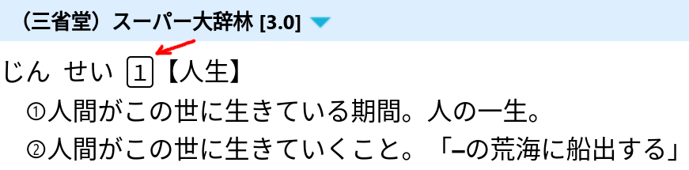
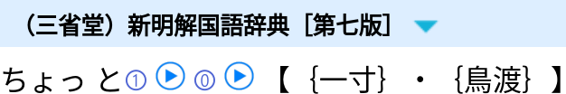
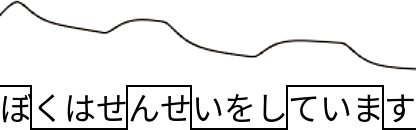
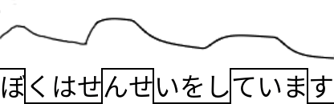

Correctly accenting Japanese words when you speak is essential
for sounding like a native speaker,
and in some situations essential for communication.
In this article, we will introduce you to the way accents work in Japanese,
help you understand how to determine the correct accents of words and sentences,
show you some commonly confused word groups,
and explain how to look up accents in Japanese dictionaries.

****

## Preparations

Ensure that you have installed
[GoldenDict](setting-up-goldendict.html),
[Qolibri](setting-up-qolibri.html),
or that you have imported monolingual dictionaries into
[Rikaitan](setting-up-yomichan.html).

You need access to monolingual dictionaries
because they provide information about the pitch accents of words.
In particular,
`大辞林` (or `スーパー大辞林`), `新明解`, and `NHK日本語発音アクセント辞典`
contain pitch accent information,
so you need to import them.
Downloads are listed [here](yomichan-and-epwing-dictionaries.html).

## What are pitch accents?

Japanese is a pitch-accented language.
Slight differences in the pitch of sounds are used to differentiate words
and convey sentence structure.
This is different from a stress-accented language such as English,
where certain sounds are emphasized by changing both the pitch and the duration.
In Japanese,
the duration of each sound that makes up a word (known as a 'mora') remains consistent,
and only the pitch varies.

As a result of this rhythmic consistency,
it is sometimes inaccurately claimed that Japanese does not have accents.
However,
this is not true.
The pitch does vary within words and sentences.
If you do not reproduce this accurately when speaking,
your Japanese will not sound natural.
In some cases,
multiple words use the same sounds but **differ** in pitch,
so you may actually be hard to understand if your pitch is incorrect.

## Intonation

In Japanese,
pitch accent is correctly referred to as
[高低アクセント](https://ja.wikipedia.org/wiki/%E9%AB%98%E4%BD%8E%E3%82%A2%E3%82%AF%E3%82%BB%E3%83%B3%E3%83%88).
However,
casually,
Japanese speakers may mistakenly call it イントネーション.
While this is incorrect,
when a native Japanese speaker who is not a linguist tells you that your *intonation* is bad,
they most likely mean that you need to work on your pitch accent.

## Do I need to learn pitch accent?

Having correct pitch accent improves your speaking
and allows you to sound native or almost native.
If you're doing [AJATT](whats-ajatt.html),
you've been listening to Japanese a lot,
and your listening ability and phonetic awareness is really strong.
Having great listening skills thanks to AJATTing
leads to naturally acquiring a significant portion of native pitch accent,
much like native speakers who never consciously study pitch accent.
You will never confuse 橋 with 箸, or 神 with 髪.
You will be better than 90% of gaijin out there.

However,
based on our observations,
even AJATTers typically **do not** achieve native-level pitch accent
through immersion alone.
Their pitch accent is usually only 50%, maybe 60% correct.
So they still make lots of mistakes when they speak.
Because we [read](why-does-premature-reading-cripple-phonetic-awareness.html) a lot,
use text-based flashcards, and use dictionaries,
we progress faster in acquiring the language and achieving literacy,
but we also damage our pitch accent and pronunciation.
Avoiding this issue is hard
because the alternative would be learning Japanese **entirely** through listening,
identical to how infants learn.
Obviously,
it will take much longer to become fluent this way.
And it's impossible to sell this approach to beginners
who initially feel overwhelmed
by their inability to understand anything during immersion
and will refuse to listen to *white noise* for many months.
So,
most AJATTers learn the usual way,
by utilizing reading, dictionaries, and text-based flashcards to speedup acquisition.

To sum it up,
if you want to narrow the gap between yourself and native speakers
in terms speaking ability,
studying pitch accent is a good idea.
If not, it's perfectly fine not to learn it.
That said,
every once in a while you run into situations
where understanding pitch accent is necessary for comprehension.
Some jokes in Japanese involve pitch accent as well.
Even if you don't want to live in Japan and speak to natives,
knowing a little about pitch accent can improve your immersion experience.

## Mora

When you read about Japanese pitch accents,
you will often come across the term
"[mora](https://ja.wikipedia.org/wiki/%E3%83%A2%E3%83%BC%E3%83%A9)",
which is a linguistic term used to refer to a single "unit" of sound in a language.

**Note:**
"mora" is singular,
while the plural form is usually "moras" in modern English.
But since it is derived from a Latin word, "morae" is also acceptable.

A mora can be defined as a single kana character
excluding small kana (`ゃ`,`ゅ`,`ょ` but not `っ`),
optionally followed by a small kana.
Each mora is given **the same** amount of time when pronounced.

**Examples:**

* `にゃ` is one mora.
* `あ` is one mora.
* `ー` (long vowel mark) and small `っ` each count as one mora.
* `東京(とうきょう)` has 4 moras: `と`, `う`, `きょ` and `う`.

## Mora vs syllable

In English,
we use the term "syllable" to describe the sounds that make up a word.
Although the terms "syllable" and "mora" are sometimes used interchangeably,
they have slightly different meanings.
Both syllables and moras refer to the sounds that make up words in a language.
In a language such as English,
which is not a rhythmic or timed language,
the sounds that make up a word may have different durations.
Thus, the standard "unit" of sound is a syllable.
In contrast,
Japanese is a rhythmic language
where each consecutive sound has the same duration.
Therefore,
the standard unit of sound is a mora.

## Pitch number

Japanese dictionaries utilize **pitch number** notation to define pitch accents.
This notation is used in
[monolingual dictionaries](understanding-monolingual-definitions.html#understanding-pitch-accent)
and provides the shortest way for readers to understand the accent of a word.
If you know the number, you know the accent.
For more details, see the linked article.

The pitch accent **number** indicates the position of a mora
after which the tone of voice **drops** from high to low.
The first mora has number `1`,
the second mora has number `2`,
and so on.
`0` is used to indicate that there is no downstep.

<i>Look up 人生 in スーパー大辞林</i>

<i>Look up 生活 in スーパー大辞林</i>

In order to use this notation,
just count the number of moras in the word.
Remember that small kana symbols (except for `っ`) are included with the previous character.
So, `きよ` is two moras, but `きょ` is only one.
When the pitch of a compound word is based on the pitch of the words it comes from,
the pitch of each word is shown joined by a hyphen (`-`).

## Dialects

This guide explains the pitch accents of words in 標準語 (ひょうじゅんご),
or "Standard Japanese",
which is the form of Japanese taught in schools and used by NHK announcers.
In the real world,
accents vary significantly across Japan,
meaning that a single word can be pronounced differently depending on the region.
Even in Tokyo,
the way people speak differs from Standard Japanese
despite the fact that 標準語 is often referred to as "Tokyo dialect".

## Words with Multiple Pitch Accents

There are cases where even in 標準語
one word can have several different pronunciations.
Where that happens,
Japanese dictionaries display each of the possible options,
with the most common listed first.
When you look up such a word,
you will see several pitch accent numbers.
For example,
ちょっと (a little) has two accents, `1` and `0`.

<i>Look up ちょっと in 新明解国語辞典.</i>

In real life one of the accents is usually more common than the others,
but you cannot trust the dictionary 100%
to determine which pronunciation is most commonly used by native speakers.
To tell which accent is dominant and how you should say the word correctly,
you need to listen to native speakers and find out how they say it.

## Accent patterns for Japanese words

All Japanese words follow one of just 4 pitch accent patterns.
If you ensure that your speech always uses one of the four patterns,
you will sound natural 90% of the time,
even if you occasionally use the wrong pattern.
The most "unnatural"-sounding Japanese comes from using a pitch pattern
that does not actually exist in Japanese,
because it is a mistake that no native speaker would ever make.
Let's take a look at these patterns one by one.

## Heiban

The term 平板 (へいばん) literally means "flat board",
so this accent pattern is generally understood to mean "accentless",
or a *flat* pitch pattern.
In any 平板 word with more than one mora,
the first mora is pronounced with a low pitch,
while all subsequent moras are pronounced with a high pitch.
Any particle that follows the word is also pronounced with a high pitch.

Since the pitch does not drop in heiban words,
in monolingual dictionaries all 平板 words are represented by a `0`.

**Examples:**

1) 気 (spirit; mind).
   * In isolation: き
     <audio controls>
     <source src="aud/ki-spirit.ogg" type="audio/ogg" />
     <source src="https://tatsumoto-ren.github.io/blog/aud/ki-spirit.ogg" type="audio/ogg" />
     </audio>
   * With a particle: きが
     <audio controls>
     <source src="aud/kiga-spirit.ogg" type="audio/ogg" />
     <source src="https://tatsumoto-ren.github.io/blog/aud/kiga-spirit.ogg" type="audio/ogg" />
     </audio>
1) 国 (country).
   * In isolation: くに
     <audio controls>
     <source src="aud/kuni.ogg" type="audio/ogg" />
     <source src="https://tatsumoto-ren.github.io/blog/aud/kuni.ogg" type="audio/ogg" />
     </audio>
   * With a particle: くにが
     <audio controls>
     <source src="aud/kuniga.ogg" type="audio/ogg" />
     <source src="https://tatsumoto-ren.github.io/blog/aud/kuniga.ogg" type="audio/ogg" />
     </audio>
1) 時間 (time).
   * In isolation: じかん
     <audio controls>
     <source src="aud/jikan.ogg" type="audio/ogg" />
     <source src="https://tatsumoto-ren.github.io/blog/aud/jikan.ogg" type="audio/ogg" />
     </audio>
   * With a particle: じかんが
     <audio controls>
     <source src="aud/jikanga.ogg" type="audio/ogg" />
     <source src="https://tatsumoto-ren.github.io/blog/aud/jikanga.ogg" type="audio/ogg" />
     </audio>

## Atamadaka

頭高 (あたまだか) means "head high".
In this pattern,
the first mora is high,
and then all subsequent moras are pronounced with a low pitch.
The drop in pitch is more pronounced than the slight rise in pitch we see at the beginning of 平板 words.
Any particle following the word is also pronounced with a low pitch.
Essentially,
頭高 is the opposite of the 平板 pattern.

Since the pitch drops after the first mora,
in monolingual dictionaries all 頭高 words are represented by a `1`.

**Examples:**

1) 何時 (いつ, when).
   * In isolation: いつ
     <audio controls>
     <source src="aud/itsu.ogg" type="audio/ogg" />
     <source src="https://tatsumoto-ren.github.io/blog/aud/itsu.ogg" type="audio/ogg" />
     </audio>
   * With a particle: いつが
     <audio controls>
     <source src="aud/itsuga.ogg" type="audio/ogg" />
     <source src="https://tatsumoto-ren.github.io/blog/aud/itsuga.ogg" type="audio/ogg" />
     </audio>
1) 天気 (weather).
   * In isolation: てんき
     <audio controls>
     <source src="aud/tenki.ogg" type="audio/ogg" />
     <source src="https://tatsumoto-ren.github.io/blog/aud/tenki.ogg" type="audio/ogg" />
     </audio>
   * With a particle: てんきが
     <audio controls>
     <source src="aud/tenkiga.ogg" type="audio/ogg" />
     <source src="https://tatsumoto-ren.github.io/blog/aud/tenkiga.ogg" type="audio/ogg" />
     </audio>
1) 毎日 (every day).
   * In isolation: まいにち
     <audio controls>
     <source src="aud/mainichi.ogg" type="audio/ogg" />
     <source src="https://tatsumoto-ren.github.io/blog/aud/mainichi.ogg" type="audio/ogg" />
     </audio>
   * With a particle: まいにちが
     <audio controls>
     <source src="aud/mainichiga.ogg" type="audio/ogg" />
     <source src="https://tatsumoto-ren.github.io/blog/aud/mainichiga.ogg" type="audio/ogg" />
     </audio>

## Nakadaka

中高 (なかだか) means "middle high",
and the key characteristic of this pattern is that
the pitch drops from high to low
at some point within the word.
The first mora is low,
and any particle following the word is also pronounced with a low pitch.
Similar to 平板 words,
the rise in pitch at the beginning of the word is smaller
than the drop in pitch that occurs later.
All 中高 words have at least three moras.

Since the pitch drops somewhere before the end of a word,
in monolingual dictionaries 中高 words are represented by numbers such as `2`, `3`, `4`, `5`, etc.
However, the pitch number cannot be equal to the number of moras.
There is another pattern name for those words.

**Examples:**

1) 一つ (one). Accent: 2.
   * In isolation: ひとつ
     <audio controls>
     <source src="aud/hitotsu.ogg" type="audio/ogg" />
     <source src="https://tatsumoto-ren.github.io/blog/aud/hitotsu.ogg" type="audio/ogg" />
     </audio>
   * With a particle: ひとつが
     <audio controls>
     <source src="aud/hitotsuga.ogg" type="audio/ogg" />
     <source src="https://tatsumoto-ren.github.io/blog/aud/hitotsuga.ogg" type="audio/ogg" />
     </audio>
1) スポーツ (sports). Accent: 2.
   * In isolation: スポーツ
     <audio controls>
     <source src="aud/supootsu.ogg" type="audio/ogg" />
     <source src="https://tatsumoto-ren.github.io/blog/aud/supootsu.ogg" type="audio/ogg" />
     </audio>
   * With a particle: スポーツが
     <audio controls>
     <source src="aud/supootsuga.ogg" type="audio/ogg" />
     <source src="https://tatsumoto-ren.github.io/blog/aud/supootsuga.ogg" type="audio/ogg" />
     </audio>
1) 工場 (factory). Accent: 3.
   * In isolation: こうじょう
     <audio controls>
     <source src="aud/koujou.ogg" type="audio/ogg" />
     <source src="https://tatsumoto-ren.github.io/blog/aud/koujou.ogg" type="audio/ogg" />
     </audio>
   * With a particle: こうじょうが
     <audio controls>
     <source src="aud/koujouga.ogg" type="audio/ogg" />
     <source src="https://tatsumoto-ren.github.io/blog/aud/koujouga.ogg" type="audio/ogg" />
     </audio>

**Note:**
In Japanese,
the use of 'う' to lengthen the 'お' sound is primarily a written convention.
For instance,
When pronouncing a word such as 工場(こうじょう), the こ sound is simply extended,
resulting in こお (or 'こー' as they also spell it).
The 'う' is not pronounced.
Listen to the example above to understand it better.

## Odaka

尾高 (おだか) means "tail high".
In this pattern,
the first mora is low (unless the word only has a single mora),
then the pitch rises and remains high until the end of the word.
Any particle following the word has a low pitch.

Since the pitch drops immediately after the end of odaka words,
in monolingual dictionaries the pitch number of an 尾高 word is equal
to the total number of moras in it.

**Examples:**

1) 木 (tree). Accent: 1.
   * In isolation: き
     <audio controls>
     <source src="aud/ki-tree.ogg" type="audio/ogg" />
     <source src="https://tatsumoto-ren.github.io/blog/aud/ki-tree.ogg" type="audio/ogg" />
     </audio>
   * With a particle: きが
     <audio controls>
     <source src="aud/kiga-tree.ogg" type="audio/ogg" />
     <source src="https://tatsumoto-ren.github.io/blog/aud/kiga-tree.ogg" type="audio/ogg" />
     </audio>
1) 川 (river). Accent: 2.
   * In isolation: かわ
     <audio controls>
     <source src="aud/kawa.ogg" type="audio/ogg" />
     <source src="https://tatsumoto-ren.github.io/blog/aud/kawa.ogg" type="audio/ogg" />
     </audio>
   * With a particle: かわが
     <audio controls>
     <source src="aud/kawaga.ogg" type="audio/ogg" />
     <source src="https://tatsumoto-ren.github.io/blog/aud/kawaga.ogg" type="audio/ogg" />
     </audio>
1) 二つ (two). Accent: 3.
   * In isolation: ふたつ
     <audio controls>
     <source src="aud/futatsu.ogg" type="audio/ogg" />
     <source src="https://tatsumoto-ren.github.io/blog/aud/futatsu.ogg" type="audio/ogg" />
     </audio>
   * With a particle: ふたつが
     <audio controls>
     <source src="aud/futatsuga.ogg" type="audio/ogg" />
     <source src="https://tatsumoto-ren.github.io/blog/aud/futatsuga.ogg" type="audio/ogg" />
     </audio>

## Kifuku

You may encounter the term 起伏式 (きふく‐しき) describing pitch accent patterns.
起伏式 literally means "undulating form",
and it is a collective term representing the three patterns 頭高, 中高 and 尾高.
Another way to understand these accent patterns is that 平板 starts low and stays high,
whereas each of the other patterns starts low, goes high, and then goes low again
(in other words, undulates).

Since this is just an umbrella term, kifuku is not one of the 4 pitch accent patterns.

* Flat accent.
  じかんが
  <audio controls>
  <source src="aud/jikanga.ogg" type="audio/ogg" />
  <source src="https://tatsumoto-ren.github.io/blog/aud/jikanga.ogg" type="audio/ogg" />
  </audio>
* Undulating accent.
  ひとつが
  <audio controls>
  <source src="aud/hitotsuga.ogg" type="audio/ogg" />
  <source src="https://tatsumoto-ren.github.io/blog/aud/hitotsuga.ogg" type="audio/ogg" />
  </audio>

## Rules for determining pitch accents

### Rule 0. Any word that is not a particle has a fixed pitch accent.

The pitch accent will remain the same whenever you encounter the word.
If you learn the pitch accent of a particular word (and pitch accent rules),
that's all you need to accent it correctly.
However,
you may not always remember the pitch of a word.
Below
we will cover some rules that will help you guess correctly most of the time.

### Rule 1. If the first mora is low, the second is high, and vice versa.

If you look at the four basic patterns,
you'll notice they all have something in common.
If the first mora has a high pitch, the second has a low pitch.
Conversely,
if the first mora has a low pitch, the second mora has a high pitch.

The pitches of the first and second moras in a standalone word are always different.
It is impossible for every mora in a word to be either entirely high or entirely low.

* Low to high.
  くに
  <audio controls>
  <source src="aud/kuni.ogg" type="audio/ogg" />
  <source src="https://tatsumoto-ren.github.io/blog/aud/kuni.ogg" type="audio/ogg" />
  </audio>
* High to low.
  いつ
  <audio controls>
  <source src="aud/itsu.ogg" type="audio/ogg" />
  <source src="https://tatsumoto-ren.github.io/blog/aud/itsu.ogg" type="audio/ogg" />
  </audio>

### Rule 2 Once pitch drops, it stays low.

We can see something else from our 4 patterns.
Once the pitch of a word goes low,
it remains low until the end of the word.
No matter how long a word is,
there will only ever be at most three pitches (low, then high, then low again).

**Note:**
This rule does not apply to particles or all inflected forms.
We'll cover that in [Particles](#particles) below.

* 一つ (one).
  ひとつ
  <audio controls>
  <source src="aud/hitotsu.ogg" type="audio/ogg" />
  <source src="https://tatsumoto-ren.github.io/blog/aud/hitotsu.ogg" type="audio/ogg" />
  </audio>
* スポーツ (sports).
  スポーツ
  <audio controls>
  <source src="aud/supootsu.ogg" type="audio/ogg" />
  <source src="https://tatsumoto-ren.github.io/blog/aud/supootsu.ogg" type="audio/ogg" />
  </audio>
* お母さん (mother).
  おかあさん
  <audio controls>
  <source src="aud/okaasan.ogg" type="audio/ogg" />
  <source src="https://tatsumoto-ren.github.io/blog/aud/okaasan.ogg" type="audio/ogg" />
  </audio>
* お巡さん (policeman).
  おまわりさん
  <audio controls>
  <source src="aud/omawarisan.ogg" type="audio/ogg" />
  <source src="https://tatsumoto-ren.github.io/blog/aud/omawarisan.ogg" type="audio/ogg" />
  </audio>

### Rule 3. If in doubt, guess 平板.

If you are not sure about the correct accent of a word,
this rule will be particularly useful.
Among the 10,000 most commonly used words in Japanese,
the 平板 pattern is used about 55% of the time.
Therefore,
if you are completely unsure of a word's accent,
guess 平板 (start low, then go high and stay high).
You will be correct more often than not.

If you have any reason to believe a word is *not* 平板,
the next most common pattern is 頭高,
which is used in about 25% of the 10,000 most useful words.
In this case, start high, then drop to low on the second mora and stay low.

After 平板 and 頭高, the next most common is 中高,
which is used about 15% of the time.
However,
it is hard to guess where pitch drops in 中高 words
because the 中高 pattern covers all words which go low *at some point* in the middle of the word.
The classification alone does not give you enough information
to determine *where* in the word you should go low.

### Additional Considerations

There are two more points to keep in mind when you are trying to determine pitch accent.

First,
the accent of a word may change if the word is incorporated into a larger word.
We will cover this in [Caveats](#caveats) below.
For example,
when two heiban nouns form a compound word,
they become nakadaka,
and the drop occurs after the first mora of the second word.
If you combine 携帯
けいたい (0)
and 電話
でんわ (0),
the result will be 携帯電話
けいたいでんわ (5).

Second,
when combining words into sentences,
you need to understand how to address the pitch of particles
and how to handle the overall pitch of the sentence.
We will cover this in [Pitch accents in sentences](#pitch-accents-in-sentences) below.
The pitch can be modified based on the other words in the sentence and the applicable rules.
For example,
odaka nouns followed by the particle の become heiban.
If you take the phrase 部屋の中, it will be pronounced as
へやのなか.

There are countless pitch accent rules like these.

## Commonly confused words

Most of the time,
if you get the pitch accent of a word wrong,
your Japanese will sound a little odd,
but it will be perfectly understandable.
However,
in certain situations,
it could lead to an unfortunate miscommunication.
Some Japanese words which use the same sounds
(known as 'homonyms')
are distinguished by their pitch accent.
Therefore,
if you use the incorrect accent,
you are actually using the incorrect word!
Below are a few of the most common and important examples.

1) ひ.
   * 日 (day). Accent: 0.
     ひが
     <audio controls>
     <source src="aud/hi-day.ogg" type="audio/ogg" />
     <source src="https://tatsumoto-ren.github.io/blog/aud/hi-day.ogg" type="audio/ogg" />
     </audio>
   * 火 (fire). Accent: 1.
     ひが
     <audio controls>
     <source src="aud/hi-fire.ogg" type="audio/ogg" />
     <source src="https://tatsumoto-ren.github.io/blog/aud/hi-fire.ogg" type="audio/ogg" />
     </audio>
1) き.
   * 木 (tree). Accent: 1.
     きが
     <audio controls>
     <source src="aud/kiga-tree.ogg" type="audio/ogg" />
     <source src="https://tatsumoto-ren.github.io/blog/aud/kiga-tree.ogg" type="audio/ogg" />
     </audio>
   * 気 (spirit). Accent: 0.
     きが
     <audio controls>
     <source src="aud/kiga-spirit.ogg" type="audio/ogg" />
     <source src="https://tatsumoto-ren.github.io/blog/aud/kiga-spirit.ogg" type="audio/ogg" />
     </audio>
1) いち.
   * 一 (one). Accent: 2.
     いちが
     <audio controls>
     <source src="aud/ichiga-one.ogg" type="audio/ogg" />
     <source src="https://tatsumoto-ren.github.io/blog/aud/ichiga-one.ogg" type="audio/ogg" />
     </audio>
   * 位置 (position). Accent: 1.
     いちを
     <audio controls>
     <source src="aud/ichiwo-position.ogg" type="audio/ogg" />
     <source src="https://tatsumoto-ren.github.io/blog/aud/ichiwo-position.ogg" type="audio/ogg" />
     </audio>
1) かみ.
   * 紙 (paper). Accent: 2.
     かみが
     <audio controls>
     <source src="aud/kamiga-paper-hair.ogg" type="audio/ogg" />
     <source src="https://tatsumoto-ren.github.io/blog/aud/kamiga-paper-hair.ogg" type="audio/ogg" />
     </audio>
   * 髪 (hair). Accent: 2.
     かみが
     <audio controls>
     <source src="aud/kamiga-paper-hair.ogg" type="audio/ogg" />
     <source src="https://tatsumoto-ren.github.io/blog/aud/kamiga-paper-hair.ogg" type="audio/ogg" />
     </audio>
   * 神 (god). Accent: 1.
     かみを
     <audio controls>
     <source src="aud/kamiwo-god.ogg" type="audio/ogg" />
     <source src="https://tatsumoto-ren.github.io/blog/aud/kamiwo-god.ogg" type="audio/ogg" />
     </audio>
1) はな.
   * 花 (flower). Accent: 2.
     はなを
     <audio controls>
     <source src="aud/hanawo-flower.ogg" type="audio/ogg" />
     <source src="https://tatsumoto-ren.github.io/blog/aud/hanawo-flower.ogg" type="audio/ogg" />
     </audio>
   * 鼻 (nose). Accent: 0.
     はなを
     <audio controls>
     <source src="aud/hanawo-nose.ogg" type="audio/ogg" />
     <source src="https://tatsumoto-ren.github.io/blog/aud/hanawo-nose.ogg" type="audio/ogg" />
     </audio>
1) あさ.
   * 朝 (morning). Accent: 1.
     あさを
     <audio controls>
     <source src="aud/asawo-morning.ogg" type="audio/ogg" />
     <source src="https://tatsumoto-ren.github.io/blog/aud/asawo-morning.ogg" type="audio/ogg" />
     </audio>
   * 麻 (cannabis, flax). Accent: 2.
     あさを
     <audio controls>
     <source src="aud/asawo-cannabis.ogg" type="audio/ogg" />
     <source src="https://tatsumoto-ren.github.io/blog/aud/asawo-cannabis.ogg" type="audio/ogg" />
     </audio>
1) ようい.
   * 用意 (use). Accent: 1.
     ようい
     <audio controls>
     <source src="aud/youi-use.ogg" type="audio/ogg" />
     <source src="https://tatsumoto-ren.github.io/blog/aud/youi-use.ogg" type="audio/ogg" />
     </audio>
   * 容易 (ease). Accent: 0.
     ようい
     <audio controls>
     <source src="aud/youi-ease.ogg" type="audio/ogg" />
     <source src="https://tatsumoto-ren.github.io/blog/aud/youi-ease.ogg" type="audio/ogg" />
     </audio>
1) おもい.
   * 重い (heavy). Accent: 0.
     おもい
     <audio controls>
     <source src="aud/omoi-heavy.ogg" type="audio/ogg" />
     <source src="https://tatsumoto-ren.github.io/blog/aud/omoi-heavy.ogg" type="audio/ogg" />
     </audio>
   * 思い (thought). Accent: 2.
     おもい
     <audio controls>
     <source src="aud/omoi-thought.ogg" type="audio/ogg" />
     <source src="https://tatsumoto-ren.github.io/blog/aud/omoi-thought.ogg" type="audio/ogg" />
     </audio>
1) かう.
   * 買う (to buy). Accent: 0.
     かう
     <audio controls>
     <source src="aud/kau-to-buy.ogg" type="audio/ogg" />
     <source src="https://tatsumoto-ren.github.io/blog/aud/kau-to-buy.ogg" type="audio/ogg" />
     </audio>
   * 飼う (to have a pet). Accent: 1.
     かう
     <audio controls>
     <source src="aud/kau-to-own.ogg" type="audio/ogg" />
     <source src="https://tatsumoto-ren.github.io/blog/aud/kau-to-own.ogg" type="audio/ogg" />
     </audio>
1) はし.
   * 橋 (bridge). Accent: 2.
     はしを
     <audio controls>
     <source src="aud/hashiwo-bridge.ogg" type="audio/ogg" />
     <source src="https://tatsumoto-ren.github.io/blog/aud/hashiwo-bridge.ogg" type="audio/ogg" />
     </audio>
   * 端 (edge). Accent: 0.
     はしを
     <audio controls>
     <source src="aud/hashiwo-edge.ogg" type="audio/ogg" />
     <source src="https://tatsumoto-ren.github.io/blog/aud/hashiwo-edge.ogg" type="audio/ogg" />
     </audio>
   * 箸 (chopsticks). Accent: 1.
     はしを
     <audio controls>
     <source src="aud/hashiwo-chopsticks.ogg" type="audio/ogg" />
     <source src="https://tatsumoto-ren.github.io/blog/aud/hashiwo-chopsticks.ogg" type="audio/ogg" />
     </audio>
1) かた.
   * 肩 (shoulder). Accent: 1.
     かたを
     <audio controls>
     <source src="aud/katawo-shoulder.ogg" type="audio/ogg" />
     <source src="https://tatsumoto-ren.github.io/blog/aud/katawo-shoulder.ogg" type="audio/ogg" />
     </audio>
   * 型 (type). Accent: 2.
     かたを
     <audio controls>
     <source src="aud/katawo-type-person.ogg" type="audio/ogg" />
     <source src="https://tatsumoto-ren.github.io/blog/aud/katawo-type-person.ogg" type="audio/ogg" />
     </audio>
   * 方 (person). Accent: 2.
     かたを
     <audio controls>
     <source src="aud/katawo-type-person.ogg" type="audio/ogg" />
     <source src="https://tatsumoto-ren.github.io/blog/aud/katawo-type-person.ogg" type="audio/ogg" />
     </audio>

## Particles

Particles don't really have their own standalone pitch accent
in the same way that other parts of speech do.
The pitch of a particle is determined by the accent type of the word it follows.
For 平板 words,
the pitch of the particle is high.

* 会社 (company). Accent: 0.
  かいしゃが
  <audio controls>
  <source src="aud/kaishaga-company.ogg" type="audio/ogg" />
  <source src="https://tatsumoto-ren.github.io/blog/aud/kaishaga-company.ogg" type="audio/ogg" />
  </audio>

For 頭高, 中高 and 尾高 words, the particle pitch is low.

* 世界 (world). Accent: 1.
  せかいが
  <audio controls>
  <source src="aud/sekaiga-world.ogg" type="audio/ogg" />
  <source src="https://tatsumoto-ren.github.io/blog/aud/sekaiga-world.ogg" type="audio/ogg" />
  </audio>
* 日本 (Japan). Accent: 2.
  にほんが
  <audio controls>
  <source src="aud/nihonga-japan.ogg" type="audio/ogg" />
  <source src="https://tatsumoto-ren.github.io/blog/aud/nihonga-japan.ogg" type="audio/ogg" />
  </audio>
* 言葉 (word). Accent: 3.
  ことばが
  <audio controls>
  <source src="aud/kotobaga-word.ogg" type="audio/ogg" />
  <source src="https://tatsumoto-ren.github.io/blog/aud/kotobaga-word.ogg" type="audio/ogg" />
  </audio>

## Polite forms of verbs

When ます attaches to any verb,
it overrides the verb's original pitch accent.
The original accent of the verb does not matter.

1) ます. Drop after ま.
   * 行く. Accent: 0.
     いきます
   * 見る. Accent: 1.
     みます
   * 食べる. Accent: 2.
     たべます
1) ました. Drop after ま.
   * 行く. Accent: 0.
     いきました
   * 見る. Accent: 1.
     みました
   * 食べる. Accent: 2.
     たべました
1) ません. Drop after せ.
   Also applies to …ませんでした.
   * 行く. Accent: 0.
     いきません
   * 見る. Accent: 1.
     みません
   * 食べる. Accent: 2.
     たべません

For other forms, the pitch depends on the category of verb.

## Heiban verbs

**Note**: Most Japanese words are 平板,
and this is especially true for verbs.
Nearly 65% of the most useful 1,000 verbs in Japanese are 平板.

When a 平板 verb is inflected,
most inflections retain the 平板 pattern.

**Inflections of 平板 verbs with the 平板 pattern:**

1) Plain. 言う (say).
   いう
   <audio controls>
   <source src="aud/iu-say.ogg" type="audio/ogg" />
   <source src="https://tatsumoto-ren.github.io/blog/aud/iu-say.ogg" type="audio/ogg" />
   </audio>
1) Plain negative. 言わない (does not say).
   いわない
   <audio controls>
   <source src="aud/iwanai-doesntsay.ogg" type="audio/ogg" />
   <source src="https://tatsumoto-ren.github.io/blog/aud/iwanai-doesntsay.ogg" type="audio/ogg" />
   </audio>
1) Past. 言った (said).
   いった
   <audio controls>
   <source src="aud/itta-said.ogg" type="audio/ogg" />
   <source src="https://tatsumoto-ren.github.io/blog/aud/itta-said.ogg" type="audio/ogg" />
   </audio>
1) "Te form". 言って (saying).
   いって
   <audio controls>
   <source src="aud/itte-saying.ogg" type="audio/ogg" />
   <source src="https://tatsumoto-ren.github.io/blog/aud/itte-saying.ogg" type="audio/ogg" />
   </audio>
1) Potential. 言える (can say).
   いえる
   <audio controls>
   <source src="aud/ieru-cansay.ogg" type="audio/ogg" />
   <source src="https://tatsumoto-ren.github.io/blog/aud/ieru-cansay.ogg" type="audio/ogg" />
   </audio>
1) Passive. 言われる (is said).
   いわれる
   <audio controls>
   <source src="aud/iwareru-issaid.ogg" type="audio/ogg" />
   <source src="https://tatsumoto-ren.github.io/blog/aud/iwareru-issaid.ogg" type="audio/ogg" />
   </audio>
1) Causative. 言わせる (make say).
   いわせる
   <audio controls>
   <source src="aud/iwaseru-makesay.ogg" type="audio/ogg" />
   <source src="https://tatsumoto-ren.github.io/blog/aud/iwaseru-makesay.ogg" type="audio/ogg" />
   </audio>

The following inflections of 平板 verbs do not follow the 平板 pattern,
and these inflections do not have the same pattern in non-平板 verbs.

**Inflections of 平板 verbs with the 中高 pattern:**

1) Past negative. 言わなかった (did not say).
   いわなかった
   <audio controls>
   <source src="aud/iwanakatta-didnotsay.ogg" type="audio/ogg" />
   <source src="https://tatsumoto-ren.github.io/blog/aud/iwanakatta-didnotsay.ogg" type="audio/ogg" />
   </audio>
1) Conditional. 言えば (if I say).
   いえば
   <audio controls>
   <source src="aud/ieba-ifisay.ogg" type="audio/ogg" />
   <source src="https://tatsumoto-ren.github.io/blog/aud/ieba-ifisay.ogg" type="audio/ogg" />
   </audio>
1) Volitional. 言おう (want to say).
   いおう
   <audio controls>
   <source src="aud/iou-wanttosay.ogg" type="audio/ogg" />
   <source src="https://tatsumoto-ren.github.io/blog/aud/iou-wanttosay.ogg" type="audio/ogg" />
   </audio>

## Non-heiban verbs

Verbs that are not 平板 are either 頭高 or 中高.
There are no 尾高 verbs.
Almost all of the 頭高 verbs have only two moras.
Most non-negative inflections of 頭高 verbs are also 頭高.

**Inflections of 頭高 verbs:**

1) Plain. 見る (see).
   みる
   <audio controls>
   <source src="aud/miru-see.ogg" type="audio/ogg" />
   <source src="https://tatsumoto-ren.github.io/blog/aud/miru-see.ogg" type="audio/ogg" />
   </audio>
1) Past. 見た (saw).
   みた
   <audio controls>
   <source src="aud/mita-saw.ogg" type="audio/ogg" />
   <source src="https://tatsumoto-ren.github.io/blog/aud/mita-saw.ogg" type="audio/ogg" />
   </audio>
1) Te. 見て (seeing).
   みて
   <audio controls>
   <source src="aud/mite-seeing.ogg" type="audio/ogg" />
   <source src="https://tatsumoto-ren.github.io/blog/aud/mite-seeing.ogg" type="audio/ogg" />
   </audio>
1) Conditional. 見れば (if I see).
   みれば
   <audio controls>
   <source src="aud/mireba-ifisee.ogg" type="audio/ogg" />
   <source src="https://tatsumoto-ren.github.io/blog/aud/mireba-ifisee.ogg" type="audio/ogg" />
   </audio>

中高 verbs are a little more difficult to predict,
but some generalizations do exist.

The downstep in the plain form always occurs before the final mora.

1) Plain. 食べる (eat).
   たべる
   <audio controls>
   <source src="aud/taberu-eat.ogg" type="audio/ogg" />
   <source src="https://tatsumoto-ren.github.io/blog/aud/taberu-eat.ogg" type="audio/ogg" />
   </audio>

For the past, -te, and conditional forms, the downstep is on the third-to-last mora.

1) Past. 食べた (ate).
   たべた
   <audio controls>
   <source src="aud/tabeta-ate.ogg" type="audio/ogg" />
   <source src="https://tatsumoto-ren.github.io/blog/aud/tabeta-ate.ogg" type="audio/ogg" />
   </audio>
1) Te. 食べて (eating).
   たべて
   <audio controls>
   <source src="aud/tabete-eating.ogg" type="audio/ogg" />
   <source src="https://tatsumoto-ren.github.io/blog/aud/tabete-eating.ogg" type="audio/ogg" />
   </audio>
1) Conditional. 食べれば (if I eat).
   たべれば
   <audio controls>
   <source src="aud/tabereba-ifieat.ogg" type="audio/ogg" />
   <source src="https://tatsumoto-ren.github.io/blog/aud/tabereba-ifieat.ogg" type="audio/ogg" />
   </audio>

For negative forms of both 頭高 and 中高 verbs,
the downstep comes on the mora before the な.
So, for two-mora verbs such as 見る,
negative forms are also 頭高,
and for longer verbs,
they are 中高.

1) Plain negative. 見ない (doesn't see).
   みない
   <audio controls>
   <source src="aud/minai-doesntsee.ogg" type="audio/ogg" />
   <source src="https://tatsumoto-ren.github.io/blog/aud/minai-doesntsee.ogg" type="audio/ogg" />
   </audio>
1) Past negative. 見なかった (didn't see).
   みなかった
   <audio controls>
   <source src="aud/minakatta-didntsee.ogg" type="audio/ogg" />
   <source src="https://tatsumoto-ren.github.io/blog/aud/minakatta-didntsee.ogg" type="audio/ogg" />
   </audio>

The remaining common forms of both 頭高 and 中高 verbs are 中高.

1) Potential / passive. 見られる (is seen / be able to see).
   みられる
   <audio controls>
   <source src="aud/mirareru-isseen.ogg" type="audio/ogg" />
   <source src="https://tatsumoto-ren.github.io/blog/aud/mirareru-isseen.ogg" type="audio/ogg" />
   </audio>
1) Causative. 見させる (make see).
   みさせる
   <audio controls>
   <source src="aud/misaseru-makesee.ogg" type="audio/ogg" />
   <source src="https://tatsumoto-ren.github.io/blog/aud/misaseru-makesee.ogg" type="audio/ogg" />
   </audio>
1) -nagara. 見ながら (while seeing).
   みながら
   <audio controls>
   <source src="aud/minagara-whileseeing.ogg" type="audio/ogg" />
   <source src="https://tatsumoto-ren.github.io/blog/aud/minagara-whileseeing.ogg" type="audio/ogg" />
   </audio>

## Adjectives

The vast majority of 形容詞 (い-adjectives) are 中高 with the downstep occurring before the い.
In most cases,
any conjugated form shifts the downstep one mora back.

1) Plain. 暑い (hot).
   あつい
   <audio controls>
   <source src="aud/atsui-hot.ogg" type="audio/ogg" />
   <source src="https://tatsumoto-ren.github.io/blog/aud/atsui-hot.ogg" type="audio/ogg" />
   </audio>
1) Past. 暑かった (was hot).
   あつかった
   <audio controls>
   <source src="aud/atsukatta-washot.ogg" type="audio/ogg" />
   <source src="https://tatsumoto-ren.github.io/blog/aud/atsukatta-washot.ogg" type="audio/ogg" />
   </audio>
1) Te. 暑くて (hot...).
   あつくて
   <audio controls>
   <source src="aud/atsukute-hot.ogg" type="audio/ogg" />
   <source src="https://tatsumoto-ren.github.io/blog/aud/atsukute-hot.ogg" type="audio/ogg" />
   </audio>

Negative forms of い-adjectives are one of the rare exceptions
to the 'once you go low, stay low' rule.
Negative forms function as if they are a combination
of the pitch pattern of the く form of the adjective,
plus a suitably conjugated form of the 頭高 word ない (in other words, the な is high).

1) Plain. 暑くない (not hot).
   あつくない
   <audio controls>
   <source src="aud/atsukunai-nothot.ogg" type="audio/ogg" />
   <source src="https://tatsumoto-ren.github.io/blog/aud/atsukunai-nothot.ogg" type="audio/ogg" />
   </audio>
1) Past. 暑くなかった (was not hot).
   あつくなかった
   <audio controls>
   <source src="aud/atsukunakatta-wasnothot.ogg" type="audio/ogg" />
   <source src="https://tatsumoto-ren.github.io/blog/aud/atsukunakatta-wasnothot.ogg" type="audio/ogg" />
   </audio>

形容動詞 (な-adjectives)
can be 頭高 or 中高 (most 2-mora and 3-mora words)
or 平板 (most 4-mora words consisting of kanji only).

1) 静か (quiet). Accent: 1.
   しずかな
   <audio controls>
   <source src="aud/shizuka-quiet.ogg" type="audio/ogg" />
   <source src="https://tatsumoto-ren.github.io/blog/aud/shizuka-quiet.ogg" type="audio/ogg" />
   </audio>
1) 安全 (safe). Accent: 0.
   あんぜんな
   <audio controls>
   <source src="aud/anzen-safe.ogg" type="audio/ogg" />
   <source src="https://tatsumoto-ren.github.io/blog/aud/anzen-safe.ogg" type="audio/ogg" />
   </audio>
1) 賑やか (lively). Accent: 2.
   にぎやかな
   <audio controls>
   <source src="aud/nigiyaka-lively.ogg" type="audio/ogg" />
   <source src="https://tatsumoto-ren.github.io/blog/aud/nigiyaka-lively.ogg" type="audio/ogg" />
   </audio>

Negative forms of な-adjectives are also exceptions to the 'once you go low, stay low' rule.
Negative forms function as if they are a combination of the dictionary form of the adjective,
plus では with low pitch,
plus a suitably conjugated form of the 頭高 word ない.

1) Plain. 静かではない (not quiet).
   しずかではない
   <audio controls>
   <source src="aud/shizukadehanai-notquiet.ogg" type="audio/ogg" />
   <source src="https://tatsumoto-ren.github.io/blog/aud/shizukadehanai-notquiet.ogg" type="audio/ogg" />
   </audio>
1) Past. 静かではなかった (was not quiet).
   しずかではなかった
   <audio controls>
   <source src="aud/shizukadehanaatta-wasnotquiet.ogg" type="audio/ogg" />
   <source src="https://tatsumoto-ren.github.io/blog/aud/shizukadehanaatta-wasnotquiet.ogg" type="audio/ogg" />
   </audio>

## Sentence-ending words

Many common sentence-ending words,
such as だ, です, でしょう, だろう, みたい, etc.,
follow a simple pattern:
if the last mora of the previous word is low,
they start low and stay low.
If the last mora of the previous word is high,
they start high and go low after the first mora.

1) 秋です (is autumn, it is autumn).
   あきです
   <audio controls>
   <source src="aud/akidesu-isautumn.ogg" type="audio/ogg" />
   <source src="https://tatsumoto-ren.github.io/blog/aud/akidesu-isautumn.ogg" type="audio/ogg" />
   </audio>
1) 学生です (is a student, I'm a student).
   がくせいです
   <audio controls>
   <source src="aud/gakuseedesu-isastudent.ogg" type="audio/ogg" />
   <source src="https://tatsumoto-ren.github.io/blog/aud/gakuseedesu-isastudent.ogg" type="audio/ogg" />
   </audio>

## Pitch accents in sentences

So now we are well equipped to pronounce individual words correctly,
but what happens when we put words together in sentences?
How do things change?
What does the overall pitch pattern of a sentence look like?
We can determine sentence-level pitch by thinking of it as a combination of three rules.

### Rule 1. Pitch stays high across word boundaries until it reaches a downstep.

When a word that ordinarily has a low pitch on the first mora
(such as 中高 or 平板 words with 2 and more moras)
follows a mora with high pitch,
the pitch remains high on the first mora of the word.

Let's use this sentence as an example:

私は日本語を勉強しています。 (I am studying Japanese.)

Looking at the words individually, we would expect the following pattern:

わたしは
にほんごを
べんきょう
して
います
<audio controls>
<source src="aud/watashiha-nihongowo-benkyoo-shite-imasu.ogg" type="audio/ogg" />
<source src="https://tatsumoto-ren.github.io/blog/aud/watashiha-nihongowo-benkyoo-shite-imasu.ogg" type="audio/ogg" />
</audio>

When we combine the words,
we stay high until the first downstep,
which occurs when we reach the ま of います.
So the lower pitch at the start of にほんご, べんきょう, して and います is omitted,
and the pitch stays high:

わたしはにほんごをべんきょうしています
<audio controls>
<source src="aud/watashihanihongowobenkyooshiteimasu.ogg" type="audio/ogg" />
<source src="https://tatsumoto-ren.github.io/blog/aud/watashihanihongowobenkyooshiteimasu.ogg" type="audio/ogg" />
</audio>

### Rule 2. After a downstep, the next rise in pitch is not as high as the downstep.

This pattern is known as 'terracing',
because it creates a pitch pattern that looks like a series of steps going down from left to right.
In fact,
the whole pitch of a sentence starts high and gradually shifts downwards.

Let's use this sentence as an example:

僕は先生をしています。 (I am a teacher.)

Unlike our first example,
we now have three separate downsteps: in 僕, 先生 and しています.
So,
looking at the words individually, we expect to see this:

ぼくは
せんせいを
して
います
<audio controls>
<source src="aud/bokuha-senseiwo-shite-imasu.ogg" type="audio/ogg" />
<source src="https://tatsumoto-ren.github.io/blog/aud/bokuha-senseiwo-shite-imasu.ogg" type="audio/ogg" />
</audio>

Applying our first rule, we would expect to see something like this:

ぼくはせんせいをしています

In fact, this is basically correct.
But simply alternating between two levels of pitch sounds unnaturally robotic,
and rule 2 tells us that the high pitch of ぼ is a little higher than the high pitch of んせ,
which in turn is a little higher than the high pitch of ています.
Here's a diagram generated by the [OJAD tool](https://www.gavo.t.u-tokyo.ac.jp/ojad/phrasing/).

<audio controls>
<source src="aud/bokuhasenseiwoshiteimasu_gradual.ogg" type="audio/ogg" />
<source src="https://tatsumoto-ren.github.io/blog/aud/bokuhasenseiwoshiteimasu_gradual.ogg" type="audio/ogg" />
</audio>

**Note:**
OJAD is not perfect and makes many mistakes,
but it is sufficient in this example.
You don't really need OJAD that much,
and it is not particularly useful because,
essentially,
either you already understand all the pitch accent rules at play,
and you don't need the answer,
or you don't know some of the rules.
In that case,
this site won't be very helpful
because it doesn't actually explain the rules.
It only gives you the final answer.

### Rule 3. Words you want to emphasize should have a somewhat higher pitch.

The pitch pattern of the word to be emphasized does not change,
but its overall pitch relative to its neighbors is somewhat higher.
Using the same example as Rule #2,
let's say we want to emphasize the fact that we are a *teacher*
(as opposed to an astronaut).
In English, we would do this by stressing the word 'teacher'.
In Japanese, we do it by giving the word せんせい relatively higher pitch.

<audio controls>
<source src="aud/bokuhasenseiwoshiteimasu_emphasis.ogg" type="audio/ogg" />
<source src="https://tatsumoto-ren.github.io/blog/aud/bokuhasenseiwoshiteimasu_emphasis.ogg" type="audio/ogg" />
</audio>

Notice how the overall rise-fall pattern is the same,
but now the word せんせい has the highest pitch.

## Prosody

You will often encounter the term 'prosody' in connection with pitch accents.
Prosody refers to the elements of real speech
that convey meaning over and above the words themselves.
A great example of prosody would be using rising pitch
to indicate a question in a sentence that would otherwise be a statement.
Looking at the sentence written down,
you may not realize it is a question,
but if you heard it spoken aloud,
the prosody would make it obvious.
In Japanese,
prosody typically refers to changes in pitch at the sentence level,
as described in the sections above.

## Caveats

Japanese pitch accents are relatively straightforward, but as we have seen,
they are not completely regular.
Until [repeated exposure](mass-immersion.html) trains your ear naturally,
trying to remember the rules that govern accents can seem overwhelming.
Try not to be discouraged.
Correct accents can make you sound much more natural,
but they are generally not vital for communication.

As we have seen, most words in Japanese are 平板,
and this is especially true for verbs.
The 平板 pattern does not exist in English,
so the most common mistake beginners make is
imposing an English accent pattern on Japanese 平板 words.
In American English,
words are most commonly accented on their second syllable,
which corresponds most closely to a 中高 2 pattern,
where the downstep occurs after the second mora of a word.
Consider the word "America":
Americans pronounce the *ME* with a slightly higher pitch
and a slightly longer duration: a-ME-ri-ca.
While this pattern does exist in Japanese,
it is not the most common one,
so you will often sound unnatural if you use it constantly.

One thing to be aware of is that numbers and counters are quite irregular.
For example:

* 一つ (one) is 2
* 二つ (two) is 3
* 三つ (three) is 3
* 四つ (four) is 3
* 五つ (five) is 2
* 六つ (six) is 3
* 七つ (seven) is 2
* 八つ (eight) is 3
* 九つ (nine) is 2

The pitch accent of compound words is usually the combination
of the pitch accents of the individual words.
However, it is not uncommon for words to change their pattern
when they are absorbed into larger words.
For example:

1) 日本 (Japan). Accent: 2.
   にほん
   <audio controls>
   <source src="aud/nihon-japan.ogg" type="audio/ogg" />
   <source src="https://tatsumoto-ren.github.io/blog/aud/nihon-japan.ogg" type="audio/ogg" />
   </audio>
1) 日本語 (Japanese language). Accent: 0.
   にほんご
   <audio controls>
   <source src="aud/nihongo-japaneselang.ogg" type="audio/ogg" />
   <source src="https://tatsumoto-ren.github.io/blog/aud/nihongo-japaneselang.ogg" type="audio/ogg" />
   </audio>
1) 日本人 (Japanese person). Accent: 4.
   にほんじん
   <audio controls>
   <source src="aud/nihonjin-japaneseperson.ogg" type="audio/ogg" />
   <source src="https://tatsumoto-ren.github.io/blog/aud/nihonjin-japaneseperson.ogg" type="audio/ogg" />
   </audio>
1) 日本海 (Japan Sea). Accent: 2.
   にほんかい
   <audio controls>
   <source src="aud/nihonkai-japansea.ogg" type="audio/ogg" />
   <source src="https://tatsumoto-ren.github.io/blog/aud/nihonkai-japansea.ogg" type="audio/ogg" />
   </audio>

Ultimately,
you have to memorize pitch accent of each individual word you care about.
We think that [learning pitch accents](how-should-i-grade-cards-once-i-add-pitch-accent.html)
of the most common 2,000 words would be enough for most learners.

## How to learn pitch accents

Congratulations!
If you have read this far,
you have already taken the most important step
in mastering pitch accents by familiarizing yourself
with the categories and the basic conventions.

The next step is to [train your ear](pitch-accent-perception.html)
to recognize these categories when you hear them.
If you do that,
your brain will start to classify words into the correct categories automatically
as you hear words in context.
You will find that this "automatic learning"
will significantly reduce the amount of rote memorization you need to do.

However,
some rote memorization will still be necessary,
in particular for the easily confused words mentioned above.
Study those carefully and test yourself on them.

Finally,
it is important to confirm that you can reproduce the correct accent even when you know it.
There is no better technique for that than mimicking correct pronunciation.
You can record yourself and then listen to yourself alongside the original
to identify where you need to improve.

## Resources

In [Resources](resources.html#pronunciation-and-pitch-accent)
you can find resources for studying pitch accents and Japanese pronunciation in depth.

For a definitive written guide,
you can't do better than one or both of these books:

* The NHK accent dictionary 「NHK日本語発音アクセント新辞典」.
* The Shin Meikai accent dictionary 「新明解日本語アクセント辞典 第２版」.

You can find both books in [Resources](resources.html#pronunciation-and-pitch-accent),
on Torrents,
or in Zlibrary.
