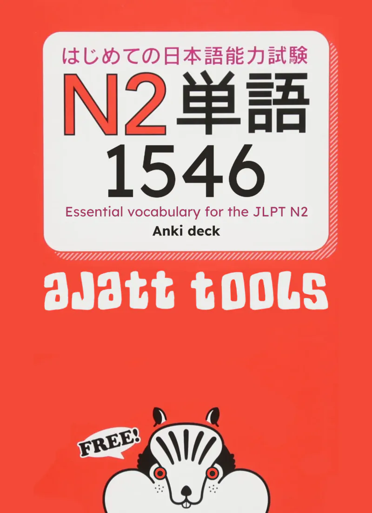
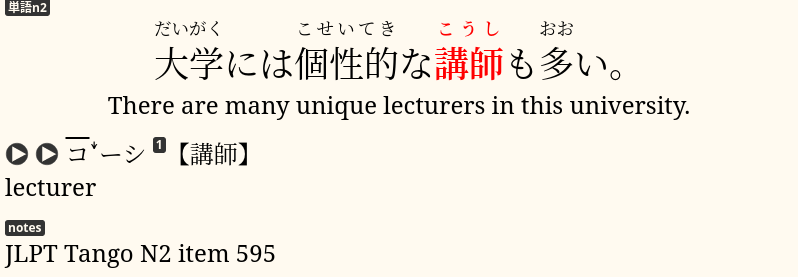

2500 Essential Vocabulary for the JLPT N2,
also known as JLPT Tango N2,
is a textbook to prepare for the JLPT N2.
It contains ~1,500 Japanese sentences and their English translations.
The book includes vocabulary found commonly on the JLPT and often used in everyday life.

With the help of our chat members,
we have created an Anki deck specifically for the JLPT Tango N2.
We took sentences from the book,
downloaded audio from the publisher's website
and combined them to make this Anki deck.

****

## Anki deck

This deck is meant to be used with the
[AJATT method](table-of-contents.html)
of language learning.
It assumes that you are immersing in Japanese media,
mining sentences
and studying Japanese grammar
on your own.
We recommend this deck if you want to learn vocabulary for the JLPT N2,
frontload basic vocabulary
to increase your comprehension or to aid the process of [sentence mining](sentence-mining.html).

The deck has cards formatted as bilingual
[targeted sentence cards](discussing-various-card-templates.html#targeted-sentence-cards).
A sentence is shown on the front,
the target word on the front is highlighted.
Readings, translation, word meanings and audio are on the back.
Refer to the linked article if you don't know how to review TSCs.

Each card also comes with a `MakeProductionCard` field that,
when filled, turns the card into a
[production TSC](writing-japanese.html#writing-kanji).
On a production TSC the target word is spelled in kana, and you have to recall how to write it in kanji.

As it should be obvious by its title,
the book was designed with the Japanese Language Proficiency Test in mind.
However, we were interested in the book for quite different purposes.
You can download audio recordings
for all the sentences in the book from the publisher's website.
By combining audio with the sentences extracted from the book
we were able to create a **high quality TSC deck**.

## Download

To download the deck, get [Ankidrone Starter Pack](basic-vocabulary.html) version 6 or later.

## The Rest of the Tango Series

The JLPT Tango N2 book is actually one in a series of JLPT prep books.
There are five books in total, one for each level of the JLPT.
Prior to starting this deck I advise you to complete Tango N5, N4 and N3 decks.
They are available as a part of Ankidrone Starter Pack.

## How To Study

If you follow the method of language learning described on this site,
by the time you start this deck,
you should already be doing [sentence mining](sentence-mining.html).
While you go through the cards in the deck,
delete the ones you already know.

We recommend continuing to sentence mine
while learning cards from the deck.
Learn between 10~30 cards a day total.
Keep in mind that the more new cards you learn each day,
the more daily reviews you'll have in the long term.

For more detailed instructions
see [How to review](how-to-review.html).

## Can I pass JLPT N2 if I finish this deck?

If you're doing AJATT, passing N2 shouldn't be a problem for you, even without this deck.
If you're not an ajatter,
most likely you have to study more and use a variety of resources in order to pass.
We made this deck because we wanted to help people learn basic vocabulary
and understand more immersion,
we didn't concern ourselves with whether it helps passing a certain test.

## Kana words

Because the JLPT Tango N2 was originally a JLPT prep book,
it only uses kanji that are tested on the JLPT.
This means that lots of words that are usually written in kanji in real life
show up written with kana in the book.
Because this deck was designed for people who are doing AJATT
and thus naturally have a strong foundation in kanji,
we went over the cards and converted kana words to kanji.

## Additional information

* Furigana was mass-generated using the
[AJT Furigana](https://ankiweb.net/shared/info/1344485230)
add-on.
If you notice that the machine-generated readings contain errors,
please report them in our chat.
* On cards where vocabulary definitions didn't make much sense
we replaced them with definitions from JMdict.
* To obtain the images some cards were merged with cards from
[this deck](https://ankiweb.net/shared/info/451845258),
using the
[MergeNotes](https://ankiweb.net/shared/info/1425504015)
add-on.
* Images were converted to webp with the
[Paste Images As WebP](https://ankiweb.net/shared/info/1151815987)
add-on.
* The number 2500 that you see in the original book
does not represent the number of vocabulary in it.
The actual number of sentence items is 1546.
In this Anki deck we decided to remove or split certain cards, so the final number also differs.

## Feedback

We'd love to hear from you!
DJT space has a Tango deck feedback room to give feedback on the deck.
If you have any questions, ideas, or errors to report, please
[join us](join-our-community.html).

## Credits

1) Tatsumoto made cards 1-250, 1151-1250 and 1401-1500.
1) [ﾌｪﾘﾍﾟ](https://matrix.to/#/@f3l1p3_4:midov.pl) made cards 622-700 and 1501-1546.
1) Wisketchy Dobrov made cards 751-1000 and 1301-1400.
1) [Ras](https://t.me/contonru) made cards 501-621.
1) [Froas](https://t.me/froas) made cards 1001-1150.
1) [fakana357](https://t.me/fakana357) made cards 1251-1300.
1) Anonymous made cards 251-500.
