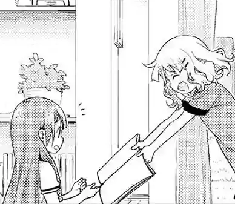

The most important part of learning Japanese with the
[AJATT](whats-ajatt.html)
method
is to enjoy native content
and be able to grow your understanding of the language entirely through immersion
by picking up new words from the media you read, watch or listen to.
To transition towards learning directly from Japanese media,
first you need to level up your comprehension.

*Ankidrone Foundation*
is an Anki Deck for newcomers to Japanese based on the JP1K method.
If you want to learn the theory behind this deck, please read
[this article](learning-kanji.html).

****

## About

The deck is designed to teach you how to recognize kanji
along with the most common 1,000 words used in everyday Japanese conversations.
Once you finish this deck,
you should be able to understand enough Japanese
to start learning directly from your immersion.



Prior knowledge of [kana](learning-kana-in-two-days.html) is required
but there is no need to do any isolated kanji study
before starting this deck.
You're going to learn kanji and vocabulary at the same time.

If you have already learned [basic vocabulary](basic-vocabulary.html) through a premade deck
like *Core10k* or *Ankidrone Essentials*
and know more than 1,000 words,
or have gone through [isolated kanji study](learning-kanji.html#isolated-kanji-study.html)
with a book like RTK,
you are unlikely to benefit from the deck.
People who know more than 1,000 words are advised to do [sentence mining](sentence-mining.html) instead,
if they haven't started doing it already.
However, if your vocabulary is below 1000 words,
I recommend that you give *Ankidrone Foundation* a try.

The vocabulary used in the deck was taken from [Ankidrone Essentials](ankidrone-essentials.html)
and other premade Anki decks.
It consists of words commonly used in everyday life in Japan.
Most cards in the deck have example sentences.
Cards are presented relatively in the [1T](one-target-sentences.html) order.
Each sentence in the deck tries to introduce only one unknown word or structure.
Each word along with each sentence has native audio and an English translation.

## JP1K method

The JP1K method is a powerful technique
that can help you effectively learn kanji readings while building your vocabulary.
I explain the method in more detail [here](learning-kanji.html#jp1k-method).
This approach allows you to gradually improve your reading skills as a beginner
and learn words
while not letting difficult kanji characters slow you down as much.

The core idea behind the JP1K method is that
you try to actively recall kanji readings when you review the cards from this deck,
but you **don't take** them into account when grading yourself.

When a flashcard appears,
try to recall the reading of the target word.
Use your mouse to **hover over** the word to reveal its reading (pronunciation).
After seeing the reading,
try to recall the meaning of the word.
Next,
flip the card over to **reveal the back side**
and check if your guess was correct.
Listen to the audio and try to understand the example sentence, if available.
If you've successfully recalled the **meaning** of the target word,
pass the card (press "Good").
If not, click "Again" to review it later.

**Note:**
You can press the <kbd>x</kbd> key on the keyboard to reveal the English translation.

It is important that you try to recall the **reading** of the target word
every time you see the card.
By doing so, you engage in deliberate practice,
which should help you eventually remember the reading.
Deliberate practice helps gradually build the neural pathways necessary to remember the reading.
However,
don't penalize yourself for being unable to do recall readings.
Don't press "Again" if you recalled the meaning but forgot the reading.
As a beginner,
it's already quite difficult to memorize Japanese words,
and you don't want to add another level of complexity just yet.

Once you've completed *Ankidrone Foundation*,
you'll start using regular
[Targeted Sentence Cards](discussing-various-card-templates.html#targeted-sentence-cards).
When reviewing TSCs,
you'll need to accurately recall **both** the reading and meaning to pass each card.
But the difference is that when doing *Ankidrone Foundation*,
knowing the readings is **not necessary**,
as you're still in the process of adapting to reading native Japanese sentences.

By understanding the JP1K method and consistently applying it when studying this deck,
you'll be well on your way to mastering kanji and expanding your vocabulary.

## Downloads

Download the folder below to get the deck.

<p align="center">
<a target="_blank" class="download_button" href="https://disk.yandex.com/d/N2gncNlCP0tBiA">Download</a>
</p>
<p align="center">
<a target="_blank" href="https://ankiweb.net/shared/info/917377946">Mirror</a>
</p>

The following sections explain what these decks are.

## Anki deck

At [AJATT](whats-ajatt.html),
we believe that the most effective way to learn vocabulary is through
[targeted sentence cards](discussing-various-card-templates.html#targeted-sentence-cards).
The target word on the cards is highlighted.
You decide if you want to read the whole sentence or just the word.
This deck contains **modified** targeted sentence cards.
They differ from regular TSCs.
The difference is that if a word contains kanji,
you can view the furigana reading by hovering over the word with your mouse or clicking on it.
This is an aid for beginners who don't know any Japanese yet.
In normal TSCs this is not allowed.

On the front there's an example sentence.
The target word appears highlighted.
When reviewing the cards you can decide whether you want to read the whole sentence or not.
When you hover over each word, a furigana reading appears on top.

**Note:**
You can press the <kbd>p</kbd> key on the keyboard to immediately reveal all kanji readings.

<p align="center"></p>
<p align="center"><i>An example TSC from Ankidrone Foundation.</i></p>

When trying to read sentences while reviewing,
prior knowledge of some grammar might be necessary.
The deck explains certain grammar points and particles,
but it is not enough to replace a proper grammar guide.
Refer to one of the
[recommended grammar guides](learning-grammar.html#grammar-guides)
when there's a sentence you don't grasp fully.

## Extra

The "[Extra](https://disk.yandex.com/d/N2gncNlCP0tBiA/Extra)" folder in the linked archive
contains JP1K-style decks shared by our community members.

## Q&A

> I downloaded the example deck a while ago and got the *Japanese sentences* note type.
> Then I downloaded the Ankidrone deck and got a new *Japanese sentences\+* note type.
> What happened?

Anki automatically adds a '+' to the name of a note type
if another note type with the same name already exists.
Ideally,
these note types should be merged since they are essentially the same
(we use one note type across [all our decks](ankidrone-decks.html)),
but Anki cannot detect this.
It checks the note type IDs and changes the name if the ID is different.
You can either choose to ignore the "+"
or convert the notes to one of the note types and delete the duplicate note type.

> The deck doesn't work properly in AnkiDroid on Android.
> The .webp files and the .ogg files do not load properly.

1) Update AnkiDroid [to the latest Alpha version](https://github.com/ankidroid/Anki-Android/releases/).
1) Media sync can take a while. You need to sync with AnkiWeb and wait for it to finish.

> How many kanji are taught through the deck?

There are `776` unique kanji used in the deck.

> After importing the deck I only got 50 notes or so.

Anki doesn't import notes that are already present in your collection.
If you have prevously downloaded [Ankidrone Essentials](ankidrone-essentials.html) (covered later),
you already have got all the cards from this deck.
You don't need to import this deck and can continue learning new cards from Ankidrone Essentials.
The only difference is that this deck utilizes a note type designed to work with the JP1K method.
On the other hand, Ankidrone Essentials is designed for people
who either have already completed Ankidrone Foundation or decided to skip it.

> The deck contains some words that I don't think will be useful for me.

The main source of words in the deck is a book called
1000 Essential Vocabulary for the JLPT N5.
It contains a number of pretty obvious katakana words
and a short list of country names.
If you don't want to learn them, press `@` to suspend such cards.

> Do I really need to learn kanji spellings of words normally written in kana?

If you feel intimidated by them, it's okay to suspend the cards.
I like to [always learn kanji versions](should-i-learn-kanji-forms-of-words-usually-written-in-kana.html)
because even if you see a word in its kana reading most of the time,
there's a chance that you eventually encounter the kanjified version.
You want to be prepared when it happens.

> I have poor retention.

This is natural if you're a beginner,
and your brain isn't used to memorizing Japanese yet.
At first some words just won't stick,
in which case try getting more immersion.
The words and phrases in the deck are very common,
and you'll be hearing them more frequently.
If you find yourself failing cards over and over,
install [Mortician](https://ankiweb.net/shared/info/1255924302),
and it will bury them for you automatically.
Usually the buried words become easier after you get some rest.
If not, suspend the cards.

> Sometimes I forget the meaning of the target word
but still remember the meaning of the whole sentence,
therefore I can infer the meaning of the target word.
Is it alright to do that?

[Yes](i-can-only-recall-kanji-when-in-the-context-of-the-specific-sentence.html).
Sentence cards tend to form context-dependent memories,
but eventually knowledge transfers from being context-dependent to context-independent.

> When I review the cards, I can't recall the meaning of a word until I hover over the reading.
Seeing the reading allows me to recall the meaning of the target word.
Should I try to recall the meaning and the reading at the same time?

This is the review order according to the JP1K method.

1) If shown the word, can I recall the reading?
2) If shown the reading, can I recall the meaning?

If you are able to pass both steps correctly in this order,
that's great because it guarantees that if shown the word in your immersion,
you can look at the word and recall what it means
by going through the steps in your head.

If not, you grade the card "good" if you've passed the second step.
You are not grading yourself on your ability to recognize the kanji,
but you're trying to do it every time you see the card.
That makes it a deliberate practice,
that's what helps you transition to reading kanji once you graduate from this deck.

By doing the two steps separately
you learn the meanings of words through their readings,
and this process is not affected by your performance in memorizing kanji.
When you hear a word in your immersion, you'll be able to recognize it.

Because you're still new to kanji,
trying to recognize the meaning and the reading at the same time is going to be more difficult.
You can try doing it anyway, but this is **not** what the JP1K method was intended for.

> What to do next?

If you try the deck out,
please put any feedback or corrections you have in [the chat](join-our-community.html).

After you complete the deck,
you are free to start mining sentences on your own.
If you still need a sentence pack to help you out, refer to [basic vocab](basic-vocabulary.html).

## Convert any deck to the JP1K format

If you don't like this deck,
the good news is that making your own JP1K-style deck is very easy.
All you need to do is take any premade deck
and change the card template a bit.
Explore our
[resources section](resources.html#vocabulary)
or
[AnkiWeb](https://ankiweb.net/shared/decks/japanese)
for premade Anki decks.

First, open the Card Types settings
by clicking "Tools" > "Manage Note Types" > "Cards...".
In the HTML templates
find the tag that refers to target word or sentence.
Let's say for the sake of this example that the field's name is `Word`.

```
<div>{{Word}}</div>
```

Then replace `{{Word}}` with the corresponding field that contains furigana
and add `furigana:` before its name to tell Anki
that the field should be rendered with readings shown above the kanji.
If your premade deck doesn't have a furigana field, you have to add it to the Note Type
and mass-generate readings with the Japanese support add-on.

```
<div>{{furigana:WordFurigana}}</div>
```

Now to make the furigana hidden by default add a class name or id
to the tag around the target word.
The class name will be used to refer to the tag.

```
<div class="question">{{furigana:WordFurigana}}</div>
```

Finally, you need a CSS rule that tells Anki to keep the furigana hidden by default,
and a second rule that tells to make it visible on hover.

```
.question ruby rt { visibility: hidden; }
.question ruby:hover rt { visibility: visible; }
```

This should be it. Enjoy your own JP1K deck.

## Feedback

The deck still has room for improvement.
Please share any feedback, suggestions, or corrections you have in our chat.
[Join us](join-our-community.html).
