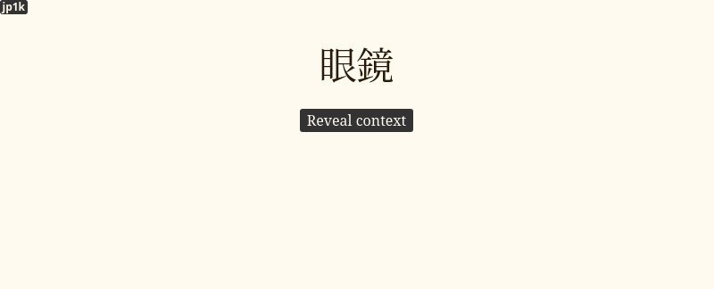

The most important part of learning Japanese with the
[AJATT](faq.html#whats-ajatt)
method
is to enjoy native content
and be able to grow your understanding of the language entirely through immersion
by picking up new words from the media you read, watch or listen to.
To transition towards learning directly from Japanese media,
first you need to level up your comprehension.

**KanjiTransition deck**
is an Anki Deck for newcomers to Japanese based on the JP1K method.
If you want to learn the theory behind this deck, please read
[this article](learning-kanji.html).

The deck is designed to teach how to recognize Kanji
along with the most common 1000 words used in everyday conversations.
Once you finish this deck, you should be able to understand enough Japanese
to start learning directly from your immersion.

Prior knowledge of [kana](learning-kana-in-two-days.html) is required
but there is no need to do any isolated kanji study.

If you have already learned basic vocabulary through a premade deck like Core or Tango
and know more than 1000 words
or have gone through isolated kanji study with a book like RTK,
you are unlikely to benefit from the deck.
However, if your vocabulary is below 1000 words,
I recommend that you give the KanjiTransition deck a try.

The vocabulary used in the deck was taken from [Ankidrone Starter Pack](basic-vocabulary.html)
and consists of words commonly used in everyday life in Japan.
Each sentence in the deck tries to introduce only one unknown word or structure.
Each word along with each sentence has native audio and an English translation.

****

## JP1K method

I explain the method in more detail [here](learning-kanji.html#jp1k-method).

The idea behind the JP1K method is that
you try to recall kanji readings when you review the cards,
but you **don't take** them into account when grading yourself.

When a flashcard pops up,
try to recall the reading of the target word,
then use your mouse to **hover over** the word to see how it's read.
After you have seen the reading, try to recall the meaning of the word.
Afterwards reveal the back side of the card and see if your memory is correct.
Listen and try to understand the example sentence, if available.
Pass the card if you've correctly recalled the **meaning** of the target word.
Otherwise, hit "Again".

It is important that you try to recall the reading of the target word every time you see the card.
By doing so, you engage in deliberate practice,
which should help you eventually remember the reading.
However, don't penalize yourself for being unable to do recall readings.
As a beginner, it's already quite difficult to remember Japanese words,
and you don't want to add another level of complexity just yet.

## Anki deck

We have prepared two versions of the deck.
One for people who prefer
[TSC](discussing-various-card-templates.html#targeted-sentence-cards-or-mpvacious-cards)
card format and another for people who like
[WCC](discussing-various-card-templates.html#word-context-cards)
more.

Download the folder below to get the decks.
Choose to study only one deck.

<p align="center">
<a class="download_button" href="https://disk.yandex.com/d/N2gncNlCP0tBiA" target="_blank">Download</a>
</p>
<p align="center">
<a href="https://t.me/ajatt_tools/72" target="_blank">Mirror</a>
</p>

The following sections explain what these decks are.

### TSCs deck

At AJT we believe that
the most effective way to learn vocabulary is through targeted sentence cards.
This version of the deck is what I personally recommend.

On the front there's an example sentence.
The target word appears highlighted.
When reviewing the cards you can decide whether you want to read the whole sentence or not.
When you hover over each word, a furigana reading appears on top.
You can also press the `p` key on your keyboard to immediately reveal all kanji readings.

<p align="center"></p>
<p align="center"><i>An example TSC from KanjiTransition.</i></p>

If you're going to read the full sentence every time you rep a card,
prior knowledge of some grammar might be necessary.
The deck explains certain grammar points and particles,
but it is not enough to replace a proper grammar guide.
Refer to
[Tae Kim guide](http://www.guidetojapanese.org/learn/grammar)
when there's a sentence you don't grasp fully.

If a word contains kanji,
you can view the furigana reading by hovering over it with your mouse.

### WCCs deck

If you think that word cards suit you better, try this version of the deck.
Each card has only the target word on the front.
An example sentence is hidden behind the "Reveal context" button.
Similarly to the TSC deck, you can reveal furigana by pressing the `p` button on the keyboard.
The content on the back is identical to the TSC deck.

<p align="center"></p>
<p align="center"><i>An example WCC from KanjiTransition.</i></p>

### Extra

The "Extra" folder contains JP1K-style decks shared by our community members.

## Q&A

> How many kanji are taught through the deck?

There are `776` unique kanji used in the deck.

> The deck contains some words that I don't think will be useful for me.

The main source of words in the deck is a book called
1000 Essential Vocabulary for the JLPT N5.
It contains a number of pretty obvious katakana words
and a short list of country names.
If you don't want to learn them, press `@` to suspend such cards.

> Do I really need to learn kanji spellings of words normally written in kana?

If you feel intimidated by them, it's okay to suspend the cards.
I like to always learn kanji versions
because even if you see a word in its kana reading most of the time,
there's a chance that you eventually encounter the kanjified version.
You want to be prepared when it happens.

> I have poor retention.

This is natural if you're a beginner,
and your brain isn't used to memorizing Japanese yet.
At first some words just won't stick,
in which case try getting more immersion.
The words and phrases in the deck are very common,
and you'll be hearing them more frequently.
If you find yourself failing cards over and over,
install [Mortician](https://ankiweb.net/shared/info/1255924302),
and it will bury them for you automatically.
Usually the buried words become easier after you get some rest.
If not, suspend the cards.

> Sometimes I forget the meaning of the target word
but still remember the meaning of the whole sentence,
therefore I can infer the meaning of the target word.
Is it alright to do that?

Yes.
Sentence cards tend to form context-dependent memories,
but eventually knowledge transfers from being context-dependent to context-independent.

> When I review the cards, I can't recall the meaning of a word until I hover over the reading.
Seeing the reading allows me to recall the meaning of the target word.
Should I try to recall the meaning and the reading at the same time?

This is the review order according to the JP1K method.

1) If shown the word, can I recall the reading?
2) If shown the reading, can I recall the meaning?

If you are able to pass both steps correctly in this order,
that's great because it guarantees that if shown the word in your immersion,
you can look at the word and recall what it means
by going through the steps in your head.

If not, you grade the card "good" if you've passed the second step.
You are not grading yourself on your ability to recognize the kanji,
but you're trying to do it every time you see the card.
That makes it a deliberate practice,
that's what helps you transition to reading kanji once you graduate from this deck.

By doing the two steps separately
you learn the meanings of words through their readings,
and this process is not affected by your performance on memorizing kanji.
When you hear a word in your immersion, you'll be able to recognize it.

Because you're still new to kanji,
trying to recognize the meaning and the reading at the same time is going to be more difficult.
You can try doing it anyway, but this is not what the JP1K method was intended for.

> What to do next?

If you try the deck out,
please put any feedback or corrections you have in [the chat](join-our-community.html).

After you complete the deck,
you are free to start mining sentences on your own.
If you still need a sentence pack to help you out, refer to [basic vocab](basic-vocabulary.html).

## Convert any deck to the JP1K format

If you don't like this deck,
the good news is that making your own JP1K-style deck is very easy.
All you need to do is take any premade deck
and change the card template a bit.
Explore our
[resources section](resources.html#vocabulary)
or
[AnkiWeb](https://ankiweb.net/shared/decks/japanese)
for premade Anki decks.

First, open the Card Types settings
by clicking "Tools" > "Manage Note Types" > "Cards...".
In the HTML templates
find the tag that refers to target word or sentence.
Let's say for the sake of this example that the field's name is `Word`.

```
<div>{{Word}}</div>
```

Then replace `{{Word}}` with the corresponding field that contains furigana
and add `furigana:` before its name to tell Anki
that the field should be rendered with readings shown above the kanji.
If your premade deck doesn't have a furigana field, you have to add it to the Note Type
and mass-generate readings with the Japanese support add-on.

```
<div>{{furigana:WordFurigana}}</div>
```

Now to make the furigana hidden by default add a class name or id
to the tag around the target word.
The class name will be used to refer to the tag.

```
<div class="question">{{furigana:WordFurigana}}</div>
```

Finally, you need a CSS rule that tells Anki to keep the furigana hidden by default,
and a second rule that tells to make it visible on hover.

```
.question ruby rt { visibility: hidden; }
.question ruby:hover rt { visibility: visible; }
```

This should be it. Enjoy your own JP1K deck.
