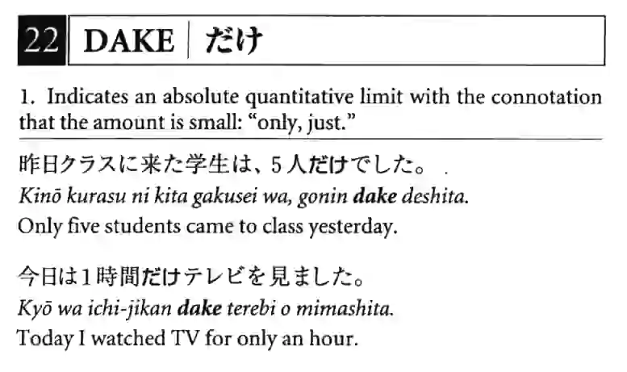
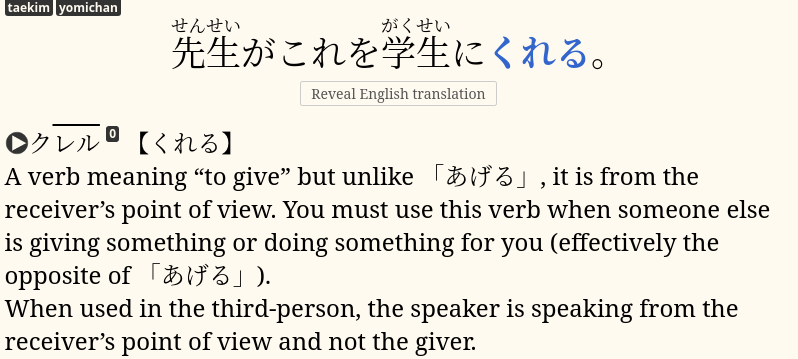

# Learning grammar

What's grammar?
Should you learn grammar?
How to learn grammar?
Let's answer these question in this article.

****

## What is grammar

In essence grammar is a set of specific words or phrases
that don't bear any meanings themselves,
but are used to connect and define relations between adjacent words.
For example, the particle `は`, commonly referred to as the "topic particle",
connects the topic of a sentence with the rest of the sentence that describes it.
By itself it means nothing.

Some grammar points are regular Japanese words with special usages.
For example,
<abbr title="to give, to rise">あげる</abbr>,
<abbr title="to give">くれる</abbr>
and <abbr title="to receive">もらう</abbr>
are verbs used to express giving and receiving,
but unlike most words
they are bound by certain rules that describe how they must be used.

Grammar rules tell us how to arrange and inflect words to make proper sentences.
Obviously, the rules weren't created in advance, before the language was spoken,
therefore it's better to think of them as
"common speech patterns that native speakers find acceptable."
Besides, no language is fixed, and all languages change over time,
and the rules may change too.

## The role of grammar study

> Grammar guides are for making it easier to understand things, not to learn how to say them.

It is possible to completely skip formal grammar study
and learn grammar points from immersion alone.
Arguments for grammar study are very similar to
why we normally recommend studying basic vocabulary from a premade deck, &mdash;
it is going to give you a head start and increase your comprehension of real Japanese
while you're still a beginner.

Language courses that aren't based on AJATT
may suggest that you study grammar to learn to speak your target language.
They tell you to memorize some grammar, vocabulary
and then learn to combine them together to form sentences.
This approach never works, because:
* Language is highly specific and unpredictable.
You have to know ahead of time how certain thoughts are expressed in your target language,
not invent language on the spot.
Invented language almost always sounds unnatural.
* Consciously thinking about grammar rules while speaking is so slow,
you won't have enough time to use that knowledge.
By the time you construct a grammatically correct sentence,
your conversation partner will be long gone.
* It's impossible to memorize every rule and exception.

Output ability is the result of subconscious acquisition.
The only true way to acquire grammar
in order to use it in your speech
is by immersing in the target language,
seeing the grammar being used in the wild many times
until your brain internalizes it.

## When to study grammar

There's no discrete stage where you should learn grammar.
Since grammar connects words together,
basic grammar and basic vocabulary have to be studied roughly at the same time.

* You can't learn grammar after you have learned the kana
because to understand how grammar works you have to know at least some basic vocabulary.
* You can't learn grammar after you have learned basic vocabulary
because to understand how words function in sentences you have to know at least some basic grammar.

After you have learned the kana,
start going through a basic vocabulary deck.
The vocabulary decks we recommend on this site are KanjiTransition and Ankidrone Starter Pack.
As you progress through a vocabulary deck,
you will be encountering new grammar used in example sentences.
Learn this extremely basic grammar.
As you continue to immerse,
you will be seeing less common grammar until you learn most of it.

## How to study grammar

Learning grammar, at least in Japanese, is not very different from learning words.
Without a grammar guide
it is done by reading sentences and looking up unknown parts in a dictionary.
Beginner grammar guides list frequently used grammar points together
and provide translated example sentences.
With a grammar guide you can front-load basic grammar and expand your comprehension.

Read about the basic grammar of your target language from a **grammar guide**.
Dedicate a short chunk of time,
up to 30 minutes a day,
to studying grammar.
If measuring time is not your thing,
read one, two or three chapters per day, for example.
Because the nature of grammar is that it's hard to explain in human language,
and most grammar takes lots of input to acquire,
you're looking for quick and dirty knowledge.
Don't try to wrap your head around what are all the usages of a grammar construction,
which item is used in what particular situation,
etc.
Just note roughly what it means in a sentence.
Continue to immerse.
Use the time spent immersing to notice the new grammar being used in different situations.

There are grammar guides that tell you to memorize conjugations, do exercises or drills.
They are attempting to teach grammar similar to math,
treating grammar as formulas.
Since grammar is made up of speech patterns native speakers say often and find natural,
the focus should be on learning the patterns,
getting used to frequently spoken collocations, phrases and sentences.

Note that at this stage of the AJATT journey
you don't need to worry about things like
all the different types of verbs and exactly how they conjugate.
Casually read through the guide and focus on understanding example sentences.
When you see a word in a different form, all you need is to understand what it means.

## Grammar guides

> The goal of grammar study is to increase comprehension.

There are many Japanese grammar resources out there.
Below you'll find the ones I think are worth reading.
If you decide to read a grammar guide outside this list,
proceed with caution and apply the AJATT philosophy to spot the good stuff
and filter out unnecessary parts.

**Note:**
third party guides may contain what Tatsumoto considers to be ineffective language learning advice.
We recommend making use of their grammar explanations
but disregarding their language learning advice.

* [All About Particles](https://nerdsin.space/_matrix/media/r0/download/nerdsin.space/71441b2fea92b7e2d387893b54772cc4f45fb9c0)
([mirror](https://b-ok.cc/book/1095266/8abab5)).
A nicely organized book simply described as "godsend".
For each grammar point in the book there's a short explanation
and several natural example sentences with translations.
Khatz used this book a long time ago when he learned Japanese.
* [Sakubi](https://sakubi.neocities.org/).
It is written with immersion learners in mind.
The guide stresses the importance of reading and listening as opposed to drilling and memorizing.
* [Tae Kim](http://www.guidetojapanese.org/learn/grammar).
Written with traditional learners in mind,
but is still a good guide recommended by many.
Sections you need to read are
"Basic Grammar", "Essential Grammar", "Special Expressions" and "Advanced Topics".
You have already covered everything else.
Don't touch any conjugation tables and exercises.
In AJATT, the goal of studying grammar
is strictly to increase the comprehensibility of your immersion.
* [Ixrec's Guide to Japanese](https://ixrec.neocities.org/)
([archive](https://web.archive.org/web/20170922192958/http://amaterasu.tindabox.net/guide/)).
You can skip the "Alphabets" page as you have already covered that.
Example sentences are listed at the end of each page.
Each sentence is broken down into pieces and translated.

<i>All About Particles. Example sentences help understand the grammar.</i>

Choose one guide to follow.
Reading multiple grammar guides usually just leads to learning about the same information.
Recognize that without enough immersion you won't be able to fully activate the knowledge.
As they say,
you will be like someone who has read 10 books on how to swim but has never been in a pool.

## On "basic" grammar

> Ahahahahaha good luck trying to learn this from a grammar guide
>
> &mdash; from ボイロ大好き

In grammar guides,
items described in the basic sections are usually not basic in a sense that they're easy to grasp.
They are listed as basic and taught very early because they're frequently used.
And since you can't understand most Japanese sentences without them,
you have to learn them early on.
It is actually a mistake to hope that
you can perfectly acquire basic grammar just because it's basic.
This false assumption causes language learners a lot of frustration.
Particles like `は` and `が`, `に` and `へ` are taught in the very beginning,
but most Japanese learners can't fully acquire them and understand the differences between them
until they reach a high level in the language.

If you studied English before starting Japanese,
you had to learn the differences between articles `a` and `the`
or demonstratives `this`, `that`, `these` and `those`.
Undoubtedly they were not easy, particularly at first.
Often English learners acquire such things only after years of practice.

When approaching basic grammar, accept that
it will take a long time for you to understand all the bits and pieces.
Don't get frustrated just because you've been learning Japanese for months or years
but aren't quite sure when you should use a certain grammar pattern in your speech.
If you're taking an immersion-based approach to learning a language,
you don't really have to do anything.
As long as you **keep immersing**, everything will eventually become clear on its own.

When going through a grammar guide,
simply read the explanation of what a structures means,
and don't make any more effort to master it.
Just notice it each time it comes up in your immersion
and focus on understanding the message being conveyed without attention to details.

Grammar that doesn't stick until much later in the learning process
is one of the reasons why we delay speaking and writing practice
until we can understand the language at a high level.
Trying to use words and structures you haven't fully acquired
inevitably leads to making countless mistakes and building bad habits.

## Mining grammar points

If you notice a new grammar in the wild,
usually you want to make an SRS card for it
([sentence mining](sentence-mining.html), covered later).
But should you mine grammar points you read about in the grammar guide?
When we discuss it, there are two opinions.
First, "just skim it". In other words, read the guide and don't mine anything.
Second, read the guide and make cards for all necessary grammar constructions.
It's up to you to decide whether you need to incorporate mining into your grammar study.

## How to make cards

> Back in the day, I learned at least one example of every grammar point in the book.
>
> &mdash; Khatz

For each grammar point, you choose an example sentence and add it to the SRS.
Put the sentence on the front of the card.
Highlight the target grammar point by making it bold, color it or underline it.
On the back put everything necessary to understand the grammar point.

When I learned Japanese,
I went with the Tae Kim grammar guide.
I made Anki cards for grammar concepts that I didn't know
and skipped the sentences that I already understood pretty well.

Don't mine every sentence.
Most examples in grammar guides are similar to each other.
Choose at most one sentence per grammar point.
Some grammar points are very easy, and you don't need to make cards to memorize them.
Don't mine from multiple grammar guides either.
They mostly cover the same topics.
The number of cards you'll have to make if you mine excessively will quickly surpass 1,000.

Don't worry about not covering some topics.
Grammar study doesn't end after you read a grammar guide.
Grammar is endless, and most recommended grammar guides only cover the basics.
In fact, there are grammar constructions that aren't explained in any grammar guide,
and you have to learn them through immersion relying on context to infer what they mean.
When you finish studying grammar formally and start making cards solely from your immersion,
you'll have plenty of opportunities to encounter new grammar in the wild and fill the gaps.

An SRS card made from an item in the Tae Kim guide.

## Long grammar guides

There are guides out there that are too big in volume.
Namely, Imabi and <abbr title="Dictionary of Japanese Grammar">DoJG</abbr>.
You don't want to choose them for a basic grammar guide,
they're supposed to be used more like dictionaries.
You may refer to them to look up individual grammar points on a case-by-case basis.

* [DoJG](https://japbase.neocities.org/)
* [DoJG Anki deck](https://disk.yandex.com/d/ojvcR9IBLi9pAQ)

Don't learn cards from the DoJG deck in order,
rather keep it as a reference and as a source of example sentences.
It's a waste of time to try to cram a 5000-cards deck
while you can rely on your immersion to guide you and tell you which cards you need.

## Grammar in the wild

Studying grammar in a structured way with a grammar guide is not for everybody.
You can skip it and learn new grammar on the spot, when you see it.
Even after completing a grammar guide,
if you choose to do so,
you will be encountering new grammar while immersing.
Take a look at the following checklist
to see some points we recommend you take
when you notice an unknown grammar pattern.

* Look it up in a [regular dictionary](resources.html#dictionaries).
Most things should be defined there.
Yomichan and Qolibri are covered later in this guide.
* Consult a grammar guide or a grammar dictionary.
This is where DoJG or the DoJG Anki deck come handy.
Tae Kim is another good source.
* Use the web search.
Search engines can do a lot for you, especially if you search in Japanese.

## Beyond grammar

It's impossible to wholly describe Japanese grammar in English.
There's a limit on how accurate the explanations can be.
In order to truly understand grammar you have to understand it in Japanese.
A guide like Tae Kim uses English building blocks
to make a mental model that resembles the Japanese grammar,
but it's not all the way there.

Once you get [fluent](faq.html#whats-fluency) in your target language,
go back and study your target language's grammar
in the target language.
To do that, use resources for native speakers.
Studying <abbr title="敬語, honorific speech in Japanese">keigo</abbr>
in Japanese can also be seen as a part of this process.

See [Resources](resources.html#grammar-in-japanese) for grammar resources in Japanese.

Tags: guide
