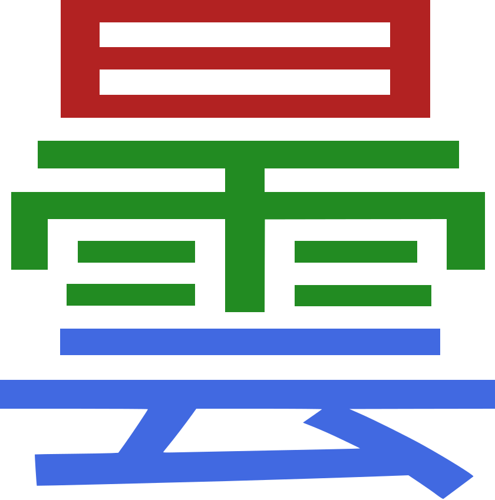

Unlike kana which you can learn in a matter of few days no matter what method you pick,
learning kanji is apparently more difficult, and there are many methods of doing it.

****

## How to approach kanji

To pick the right method
you have to understand why you want to learn kanji in the first place.
The "practice how you play" principle applies here as well.
Kanji do not exist in a vacuum, instead people use them to write Japanese words.
In order to "learn" them all you need to do is **learn whole words**.
The only time you ever need to do anything with kanji is
when you are either reading a word or writing a word.
So, as long as you can read and write words, your kanji problems are solved.

To learn a word means to memorize how it's read and what it means.
Over time as you keep learning words,
you unconsciously get better at recognizing the kanji.

We advise against learning kanji readings in isolation.
Very often a kanji character has a number of completely different readings.
Not only learning all of them is an enormous task,
but it's impossible to apply the knowledge to real native content when reading.
Take, for instance, this kanji: `生`.
[Looking it up](https://jisho.org/search/%E7%94%9F%20%23kanji)
on Jisho reveals that it has `10` readings.
When you see a word that contains this kanji (for example, `生きる`),
knowing the individual readings is not going to help.
You need to know the word itself to be able to pick the right reading.

It is glaringly obvious,
but people who have been exposed to Japanese textbooks
and traditional language learning in general
are trapped by dogma and have simply never actually thought it through.

## Kanji composition

To someone who hasn't started learning Japanese yet,
kanji may look like blobs of random scribbles.
Thankfully, in reality each kanji is just a
[composition](kanji-composition-in-relation-to-reading-japanese.html)
of either simpler kanji or primitive components called radicals.
For example, [曇](https://kanji.jitenon.jp/kanjic/1221.html)
is a combination of [日](https://kanji.jitenon.jp/kanji/065.html),
[雨](https://kanji.jitenon.jp/kanji/003.html)
and [云](https://kanji.jitenon.jp/kanjie/2171.html).
There are only about 200 of such basic components.

This property of kanji can be and often used to aid memorization.
Many kanji study methods exploit kanji composition and teach kanji in terms of their parts.
Being able to see kanji in terms of their components makes learning words easier.

## Types of readings

Usually,
a kanji has one or more Chinese-derived readings (音読み, on-yomi)
and one or more native Japanese readings (訓読み, kun-yomi).
Occasionally,
a kanji may have only *kun-yomi* or only *on-yomi* readings.

*Kun-yomi* readings are the native Japanese readings of kanji characters.
These readings are typically used when a kanji character appears
as part of a standalone word or in combination with hiragana characters.
Verbs like [逃げる](https://jisho.org/search/%E9%80%83%E3%81%92%E3%82%8B) (にげる),
adjectives like [苦い](https://jisho.org/search/%E8%8B%A6%E3%81%84) (にがい),
or standalone-kanji words like [肉](https://jisho.org/search/%E8%82%89) (にく)
are pronounced using Japanese readings.

*On-yomi* readings are borrowed readings from the Chinese language.
When kanji characters were introduced to Japan from China,
they brought along their Chinese pronunciation,
which became known as on-yomi.
On-yomi readings are often used in compound words,
especially in formal or technical contexts.
Compound words such as [特定](https://jisho.org/search/%E7%89%B9%E5%AE%9A),
[原案](https://jisho.org/search/%E5%8E%9F%E6%A1%88),
[脂肪](https://jisho.org/search/%E8%84%82%E8%82%AA)
are read using Chinese readings.

Understanding this trait of kanji will help you learn new words.
If you see a kanji on its own (e.g. [木](https://jisho.org/search/%E6%9C%A8)),
it is likely pronounced with a Japanese reading.
Likewise,
if you see a kanji compound (e.g. [綺麗](https://jisho.org/search/%E7%B6%BA%E9%BA%97)),
it's safe to assume that the kanji within the word
are pronounced using Chinese readings.

## Kanji sounds

The more words you learn,
the easier it becomes to learn new ones.
While each kanji character may have multiple readings,
there are patterns that you start to notice
as you grow your vocabulary.

For example:

- Learning the word [人生](https://jisho.org/search/%E4%BA%BA%E7%94%9F)
  makes learning [生活](https://jisho.org/search/%E7%94%9F%E6%B4%BB) easier,
  as both share the character [生](https://kanji.jitenon.jp/kanji/043.html) pronounced as せい.
- Similarly, learning the word [会社](https://jisho.org/search/%E4%BC%9A%E7%A4%BE)
  can help memorize [会議](https://jisho.org/search/%E4%BC%9A%E8%AD%B0),
  given their common [会](https://kanji.jitenon.jp/kanji/092.html) character pronounced as かい.

Understanding the following kanji trait can also aid in memorization.
The majority of all kanji look like two less complex halves joined together (known as 形声 kanji).
Such kanji are comprised of two different parts:
a left part denoting the vague meaning (semantic component)
and a right part indicating the pronunciation (phonetic component).
In cases where there is no left part,
the entire kanji represents both the reading and meaning.

Examples include:

* Kanji [招](https://kanji.jitenon.jp/kanjib/736.html),
  [沼](https://kanji.jitenon.jp/kanjic/1139.html),
  [昭](https://kanji.jitenon.jp/kanji/332.html),
  [紹](https://kanji.jitenon.jp/kanjic/1137.html),
  [詔](https://kanji.jitenon.jp/kanjid/1755.html)
  share the phonetic component [召](https://kanji.jitenon.jp/kanjic/1138.html)
  and are all read as しょう
  in words like [湖沼](https://jisho.org/search/%E6%B9%96%E6%B2%BC),
  [招待](https://jisho.org/search/%E6%8B%9B%E5%BE%85),
  [詔書](https://jisho.org/search/%E8%A9%94%E6%9B%B8).
* Kanji [冷](https://kanji.jitenon.jp/kanjib/633.html),
  [鈴](https://kanji.jitenon.jp/kanjid/1934.html),
  [齢](https://kanji.jitenon.jp/kanjic/1310.html),
  [鈴](https://kanji.jitenon.jp/kanjid/1934.html)
  share the phonetic component [令](https://kanji.jitenon.jp/kanjib/632.html)
  and are all read as れい
  in words like [年齢](https://jisho.org/search/%E5%B9%B4%E9%BD%A2),
  [予鈴](https://jisho.org/search/%E4%BA%88%E9%88%B4),
  [冷蔵](https://jisho.org/search/%E5%86%B7%E8%94%B5).
* Kanji [経](https://kanji.jitenon.jp/kanjib/684.html),
  [軽](https://kanji.jitenon.jp/kanji/285.html),
  [経](https://kanji.jitenon.jp/kanjib/684.html)
  share the phonetic component [圣](https://kanji.jitenon.jp/kanjiy/13633.html)
  and are all read as けい
  in words like [経済](https://jisho.org/search/%E7%B5%8C%E6%B8%88),
  [軽蔑](https://jisho.org/search/%E8%BB%BD%E8%94%91),
  [経路](https://jisho.org/search/%E7%B5%8C%E8%B7%AF).
* Kanji [償](https://kanji.jitenon.jp/kanjid/1746.html)
  and [賞](https://kanji.jitenon.jp/kanjib/538.html)
  share the phonetic component [賞](https://kanji.jitenon.jp/kanjib/538.html)
  and are read as しょう
  in words [弁償](https://jisho.org/search/%E5%BC%81%E5%84%9F)
  and [賞金](https://jisho.org/search/%E8%B3%9E%E9%87%91).

Recognizing various patterns can enhance your ability
to memorize words more efficiently.

## Kanji production

Some methods insist that you learn to write kanji from the start.
Due to the effort it takes we don't think it's a fair use of your time.
Japanese typing is done phonetically,
so as long as you can read kanji, you can type kanji as well.
Instead, we recommend waiting until you're fluent and
[learn handwriting](writing-japanese.html) then.
Learning to produce characters that you've already learned to recognize is going to be easier.

It's not a surprise that in Japan handwriting is still important.
But if you don't plan to live in Japan,
we think it's perfectly reasonable to
never learn how to write out kanji by hand.

## Kanji fluency

Jumping right into learning words in the beginning is not easy.
Similar characters often look the same
and remembering words takes many repetitions.
You have to somehow force the words into your brain
and there are no mental anchors to help you.
However,
if you do this enough,
eventually you arrive at the point when kanji stop being foreign anymore.
Once you reach this point, your brain starts to recognize each kanji as a whole
without paying attention to its component parts.
You start distinguishing them easily from each other,
and learning new kanji becomes effortless.
This point is called **kanji fluency**.

When you reach kanji fluency,
recognizing a kanji becomes just like recognizing someone's face.
It takes an instant to remember the face of a person.
Later if you just look at the person again
you immediately know if you've met them before
even if you might forget their name or why you know them.

With kanji, you're not analyzing the component parts
but taking the whole character as one unit.
When you see a new kanji, it will look like *something* to you.
When you encounter that character again,
you will instantly recognize it as the same exact character.

In other words,
if you wanted to test whether you have kanji fluency,
you could do this experiment.

1) Randomly select one kanji that you have never seen before in your life, look at it.
   Example: `賃`.
2) Wait a couple of days.
3) Take a number of randomly selected kanji that you have also never seen before.
   The kanji you saw in step 1 can be among them.
   Example: `責` `魔` `歓` `賃` `脅`.
   Ask yourself,
   "which of these kanji is the one I saw a couple of days ago?"
4) Guess if the kanji you saw in step 1 happens to be among the others.

If you could easily pass the test then that means you have kanji fluency.
It means just by looking at a kanji you can remember it.
Maybe you don't remember its exact strokes,
maybe you don't remember its readings,
maybe you don't remember its meanings,
but you can still tell characters apart and recall which kanji you saw the other day.
Of course, you don't have to do this test.
It's just an imaginary algorithm that demonstrates what kanji fluency is.

After you've achieved kanji fluency,
you can continue to improve your kanji ability only by [learning whole words](#how-to-approach-kanji),
through a process called sentence mining.
As long as you have that ability,
with some additional effort you'll be able to memorize
how to read and understand words that have kanji in them.

## Methods of learning kanji

Now that you undersand the concept of kanji fluency,
it's important to keep in mind that the objective of *learning kanji*
isn't just to memorize a set number of kanji characters.
Rather,
it's about reaching kanji fluency in order to start **learning words** later.
Initially,
it's crucial to focus on recognizing and distinguishing kanji visually
without getting bogged down by their readings.
The readings will come into play when you start learning vocabulary.

Here are what I consider the most effective methods for learning kanji:

* In-Context Vocabulary Study.
  This method involves learning **words** from the start.
  You memorize their meanings and readings.
  It's a natural, authentic approach,
  reflecting how all Japanese words are typically learned.
  However,
  it can be challenging for beginners who haven't yet developed kanji fluency.

  To help beginners remember words that contain kanji,
  we've created the JP1K method.
  *JP1K* is a method of in-context kanji study,
  where learners memorize words and their meanings,
  but the readings of the kanji are not hidden.
  This method is like having training wheels,
  giving you a chance to peek at kanji readings to jog your memory.
  After learning 1,000 common words this way,
  you'll remove the "training wheels" and continue learning new words in the standard way.
* Out-of-Context Isolated Kanji Study.
  This method focuses on learning the **meanings** of individual kanji characters.
  Understanding the meanings of kanji helps to memorize words.
  Typically,
  learners dedicate two or three months
  to learn one to two thousand kanji characters Out-of-Context.
  Afterwards,
  like with the the In-Context approach,
  you'll proceed to learn words in the standard way.
  RRTK and KanjiDamage
  are examples of isolated kanji study methods.

## JP1K method

The method is aimed at complete beginners
who don't want to go through isolated kanji study
but feel intimidated by the idea of learning whole words from the start.
JP1K is intended to be a compromise between the two.

To execute it,
you need an [Anki](setting-up-anki.html) deck formatted in a specific way.
On the front of each card you have a word, phrase or sentence in Japanese language
written in full kanji and without furigana,
but if you **hover** over it
then the furigana readings will appear.
On the back you have everything necessary to understand the flashcard,
which may include English translations, dictionary definitions and native audio.

The important part is how you review the deck:

1) A flashcard comes up, furigana is **hidden**.
1) Read the target word, or the whole sentence if you want.
1) If the word contains kanji try to recall its reading.
   Then hover over the word to make the furigana pop up
   and see if you've recalled the reading correctly.
1) Try to recall the meaning of the target word.
   It doesn't need to be precise.
1) Reveal the back side of the card and see if the meaning was correct.
1) When grading yourself, pass the card if you understand the **meaning**.
   Whether you remembered the reading or not doesn't matter.
   Avoid "Hard" and "Easy" buttons as usual.

This way when you review a card you may completely forget the reading,
but then if you get the meaning right you still **pass** the card.

The idea here is that this will make the process of going through the deck
much more enjoyable because all you have to do is remember the meaning
to pass the card. It's not that hard.
The advantage over isolated kanji study
is that you're going to start noticing
the new words you've learned in your immersion much earlier.

This should be enough to eventually achieve kanji fluency
because every time you're **still trying** to recall the reading,
you're just not taking it into account when grading yourself.
On the other hand, if you could see the reading immediately
then there would be no deliberate practice involved,
so you'd eventually start ignoring the kanji.

At Ajatt-Tools we have made an Anki deck
for people who wish to follow this method.
To download it, visit the linked page.

<a class="download_button" href="jp1k-anki-deck.html">KanjiTransition</a>

## Isolated kanji study

Training kanji recognition through isolated kanji study
can be used as a ladder to help you achieve kanji fluency
and to make moving on to learning vocabulary less of a burden.
You start by learning **meanings** of **individual** kanji.
By doing so you create **mental anchors** in your brain
which help you associate words with the kanji.
Kanji are learned by breaking them up into their components
and viewing each kanji as a combination of its parts.
The method uses short stories or images called mnemonics.
Each story ties the components together to make kanji easy to remember.

You memorize 1000-2000 characters this way,
and then you end up naturally reaching the point of kanji fluency.
The main goal of isolated kanji study is not to learn what every kanji means,
but simply to push learners to the point
where recognizing a kanji feels similar to recognizing a human face.

Now, another way to look at this is
if we watch Chinese people who learn Japanese,
they improve so much faster and reach higher levels
than traditional Japanse learners from the West
because they know the characters already.
So you first need to become like a Chinese person.
Chinese people don't know how to read the kanji in Japanese,
but they know how kanji look like,
and they know the meanings.
After you **catch up** to a Chinese person
then you can move on to learning words, sentences, and grammar.

Many commonly used resources that encourage mnemonics are based on RTK.
Originally, RTK refers to a book "Remembering the Kanji" by James Heisig.
The ordering of characters in the book
and its component-based mnemonic system
are used in combination with the [SRS](spaced-repetition.html).

Kanji in the book are ordered by the complexity and number of their components.
So for example before you learn `拐`, you have to learn `手`, `口` and `刀`.
Every character is given only one meaning (keyword) to avoid memory interference.
If you're interested in learning more about the logic behind RTK,
read the introduction at the beginning of the
[RTK part 1 book](https://midov.pl/_matrix/media/r0/download/midov.pl/PQuWVvjTjvQkBXuuOPYmqJDn).

Remembering the Kanji
only orders kanji in terms of their components and gives mnemonics for some of them.
Fortunately, there are many Anki decks created from RTK.
They free you from the need to copy the kanji from the book into Anki by hand,
preserve the ordering and mnemonic system,
and add the benefits of spaced repetition.

* [RRTK](https://disk.yandex.com/d/QRMVEsUtbItLyA).
  Recognition RTK.
  It is an Anki deck intended to optimize RTK for training recognition.
  Compared to the original book,
  the number of characters was reduced to the most common 1,000 kanji.
  The reason for this is that the main goal of RRTK is not to learn what every kanji means,
  but simply to bring learners to the point of kanji fluency.
  Kanji are given on the front of the cards,
  and you need to memorize the meanings they represent.
  The format of the flashcards is similar to
  [Lazy Kanji](https://web.archive.org/web/20100403201243/http://www.alljapaneseallthetime.com/blog/lazy-kanji-cards-a-new-srs-card-format),
  which is a card format Khatzumoto from AJATT recommended.
* AnkiWeb has a [large collection](https://ankiweb.net/shared/decks/rtk) of premade RTK decks.

Other options that use the mnemonic-based approach but are not based on RTK:

* [KanjiDamage](http://www.kanjidamage.com/).
  A big improvement over RTK.
  Similarly to RTK, kanji are broken up into their components,
  but the components themselves are different from RTK.
  They have clever names invented to facilitate the memorization process.
  While RTK gives mnemonic stories for some kanji,
  KanjiDamage has them for every kanji.
  The mnemonics are usually pretty great.
  There's also a mnemonic for the most important reading, usually
  <abbr title="on'yomi, Chinese-derived reading of a kanji">音読み</abbr>.
* [KanjiDamage Plus](https://mega.nz/#!CQg0SKyI!Ufho0RKmmW8P6XRx8KiDY1JeAXoGOgmjrEscayil8cA).
  A slightly larger version of KanjiDamage which contains ~200 additional kanji.
  Some component names were renamed.
  See [the online reference](https://kanjidamageplus.neocities.org/).

The downside is that although this method makes it easier to remember words later on,
it requires investing time into essentially memorizing English keywords
that have a very loose connection to real Japanese.
KanjiDamage gives you a little more benefit
by incorporating the main reading of each kanji into the mnemonic story.
Knowing the most common reading helps you trigger your memory
as you take your first steps in reading native Japanese.

## Learning radicals

The question of whether one should learn kanji radicals is a common one.
The answer is **no**.
Here's why.

If you're following an isolated kanji study approach,
such as using Anki decks like KanjiDamage or RTK,
you're already learning radicals and kanji composition.
These methods introduce new radicals or kanji components (primitives)
before presenting the kanji that use them.
Therefore,
there is no need to separately study radicals in this case.

If you are following the JP1K method,
radicals are not learned at all.
The method is designed to teach kanji like pictures,
as whole characters,
rather than breaking them down into parts.
The goal is to memorize kanji by repeated exposure.

RTK and KanjiDamage teach kanji parts in English.
It's important to note that the English keywords used for kanji components
are chosen to facilitate the creation of
[mnemonic stories](https://en.wikipedia.org/wiki/Mnemonic)
and may not accurately represent the Japanese meanings.
While these English keywords can be helpful in the beginning,
they are often forgotten once one becomes more proficient in reading Japanese,
as they are useless for actual language comprehension.

However,
in spoken Japanese,
people use radicals to explain how to write kanji.
To better understand these conversations during immersion,
you may actually want to
[learn the proper Japanese names](learning-kanji-radicals.html) for common radicals.
You can do it after you learn more fundamental aspects of Japanese.

## Conclusion

There are three paths you can take:

1) Learn words from the start.
   This is going to be a little difficult at first,
   but all of us learn this way past the beginner stage.
2) Use the JP1K method to learn words without penalizing yourself for not knowing their readings.
3) Study kanji in isolation using a mnemonic-based method
   such as KanjiDamage, KanjiDamagePlus, or RTK.
   For each kanji you memorize its meaning
   which later acts as a mental anchor making associating words with kanji easier.
   However,
   this path is likely the least preferable
   due to the loose correlation between English and Japanese names of the kanji parts.

The latter two paths only serve as intermediate steps
to prepare you for reading native content.
Any of them should take about a month or two to complete.

Either path will result in success
so long as you [persist](https://redirect.invidious.io/watch?v=S-ixV6nV0HU?t=18),
so the choice comes down to what you personally like more.

## Notes

### RTK books

There are 3 RTK books total.

1) Teaches how to write ~2000 kanji.
   The list of kanji taught roughly matches the `常用漢字` list.
2) Teaches readings of kanji introduced in the first book.
3) Teaches how to write additional ~1000 kanji.
   The list of kanji taught roughly matches the `人名用漢字` list.

For the purpose of training kanji recognition and reaching the point of kanji fluency
it is sufficient to learn only ~1000 kanji from the first book,
which is exactly what RRTK does.
As mentioned before, learning how to write them is not recommended.
The second book is not needed either,
kanji readings should be learned in context.

### Isolated kanji study and retention

If you decide to study kanji through any isolated kanji deck (RTK, KanjiDamage),
it's common to see a good initial retention rate.
However,
a few months after completing the deck,
you'll likely notice a significant drop in retention.
This is a common experience for many learners.
Initially,
they remember most of the kanji,
but the retention rate plummets to about 45-50% several months later.

Once you observe this decline in retention,
it might be time to consider **deleting** the deck.
At this stage,
you likely have some basic ability to read Japanese
and no longer need to rely heavily on English keywords to recognize kanji.

To mitigate the rapid loss of kanji recognition abilities
before fully developing your reading skills,
it's advisable to continue reviewing the kanji deck
for some number of months after you've completed the deck.
But don't try to continue reviewing it after your retention drops.

The challenge with retention when learning kanji in isolation
led to the creation of the JP1K method.
