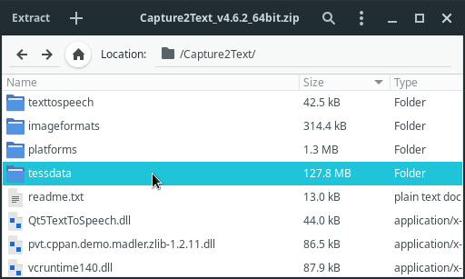

When reading manga in Japanese,
you sometimes need to quickly perform
[OCR](https://wikipedia.org/wiki/Optical_character_recognition?lang=en) on part of the screen
to look up new words and add sentences to [Anki](setting-up-anki.html).
You can use an OCR program
plus a few helper tools to do this.

****

## Preface

Our goal is to look up words in manga.

Expected workflow:

1) Capture a screenshot of the speech bubble containing Japanese text.
2) Process the screenshot.
3) Return the recognized text.
3) Send the text to a dictionary program.
   For example, [GoldenDict](setting-up-goldendict.html)
   or [Rikaitan Search](what-is-yomichan-search.html).
3) You can look up words and create Anki flashcards.

To recognize text in manga,
you can use *Tesseract* or *Lancet*.
Tesseract is lighter but usually less accurate.
Lancet requires installing many
[Python](https://docs.python.org/3/faq/general.html#what-is-python)
packages that take several GiB of disk space,
but it provides much better recognition.

This article explains how to set up both.
The user workflow is the same for each (see the demo below).

<video width="1920" autoplay loop controls>
	<source src="vid/mining_from_manga.mp4" type="video/mp4">
	<source src="https://github.com/user-attachments/assets/8859adac-1bd8-435a-9c81-945f875dc205" type="video/mp4">
	<source src="https://tatsumoto-ren.github.io/blog/vid/mining_from_manga.mp4" type="video/mp4">
	<source src="https://ajatt.top/blog/vid/mining_from_manga.mp4" type="video/mp4">
</video>
<p align="center"><i>Video demonstration.</i></p>

## Obtain manga

See [Resources](resources.html#manga) for places to get manga.
For the best image quality,
I recommend downloading manga from Torrent sites.
If you don't want to wait,
you can also read manga online on various websites.
Either way, it's easy to find a great selection of manga to read.

## Image viewer

To read manga,
it's helpful to have an [image viewer](resources.html#image-viewers).
I use `nsxiv`,
but any image viewer will work for this setup.
Many manga sites also let you read in a web browser.

To open a folder of images in nsxiv, run:

```
nsxiv .
```

## File manager

Another quick topic up front is your file manager.
Manga often comes as an archive (`*.zip`, `*.rar`, etc.) which has to be unpacked,
so it's convenient to bind a key to extract archives with a single keystroke.


For example, my file manager is [lf](https://wiki.archlinux.org/title/Lf).
To extract archives by pressing <kbd>E</kbd>,
add this to the config file at `~/.config/lf/lfrc`
([atool](https://archlinux.org/packages/?q=atool) must be installed as well).

```
map E aunpack $fx
```

`lf` supports **tags**.
When you finish a reading session,
tag the last page (image file) you read by pressing <kbd>t</kbd>
so you don't lose your position.
The next time you open the folder,
you will see a red asterisk next to the tagged file.

To have `lf` automatically select the image currently shown in `nsxiv`,
add this to `~/.config/nsxiv/exec/image-info`.
The snippet is [taken from my dotfiles](https://github.com/tatsumoto-ren/dotfiles/blob/main/.config/nsxiv/exec/image-info).

```
# If running as a child of lf, select the current file.
if [ -n "$id" ]; then
	lf -remote "send $id select \"$1\""
fi
```

You can also set a keyboard shortcut in `nsxiv`
that tells `lf` to tag the currently displayed image.
For example,
to tag the current file by pressing <kbd>t</kbd>,
add the following code to `~/.config/nsxiv/exec/key-handler`.
The snippet is [taken from my dotfiles](https://github.com/tatsumoto-ren/dotfiles/blob/main/.config/nsxiv/exec/key-handler).

```
while read file; do
	case "$1" in
	# ...
	# other keys you may have set
	# ...
	"t")
		# Tag the current file using lf. E.g, the last read manga page.
		if [ -n "$id" ]; then
			 lf -remote "send $id select \"$file\""
			 lf -remote "send $id tag x"
		fi
		;;
	esac
done
```

## OCR method

Although Lancet requires more system resources,
I prefer it to Tesseract.
It handles manga much better than Tesseract.

* [Lancet](#setting-up-lancet)
* [Tesseract](#setting-up-tesseract)

## Setting up Lancet

Install [lancet](https://github.com/Ajatt-Tools/lancet)
from the [pypi](https://pypi.org/project/ajt-lancet/).

```
pipx install ajt-lancet
```

**Note**: `pipx` installs Python packages in an **isolated location** (`~/.local/share/pipx`)
so you can later remove them with `pipx uninstall <package-name>`.

The first run will take longer than usual.
On first start Lancet downloads OCR model files (~500 MiB) to `~/.cache/huggingface`.

### Usage

Press the OCR shortcut (default <kbd>Alt</kbd>+<kbd>O</kbd>)
to show the snipping window, then drag and hold the mouse to perform OCR.
Lancet will ask you to select an area with Japanese text and will attempt to recognize it.
The result is sent to GoldenDict or copied to the system clipboard.

You can combine Lancet with [Rikaitan Search](what-is-yomichan-search.html)
for quick lookups in real-time.

To send recognized text directly to [GoldenDict](setting-up-goldendict.html)
instead of the clipboard,
set "Copy to" to "goldendict" in Preferences.

### Autostart

Before Lancet can recognize text,
it must be running in the background.
This is optional,
but to minimize startup lag add the following command to your autostart.

```
lancet
```

Here's an example for [i3wm](https://i3wm.org/):

```
exec --no-startup-id lancet
```

## Setting up Tesseract

Install the following dependencies:

```
$ sudo pacman -S --needed tesseract maim xclip imagemagick unzip
```

* [tesseract](https://github.com/tesseract-ocr/tesseract)
is the OCR engine. It is considered fairly accurate, and many people like it.
* [maim](https://github.com/naelstrof/maim)
is a utility for taking screenshots which can take parts of the screen.
* [xclip](https://github.com/astrand/xclip)
is a tool for copying text to the clipboard.
* [imagemagick](https://wiki.archlinux.org/title/ImageMagick)
is a command-line image editor.
It's going to come handy to edit the screenshots before Tesseract analyzes them.
* [unzip](https://archlinux.org/packages/extra/x86_64/unzip/)
is a tool for extracting zip archives.

Download
[maimocr](https://github.com/tatsumoto-ren/dotfiles/blob/main/.local/bin/maimocr)
and save it as `~/.local/bin/maimocr`.
`maimocr` is a script we are going to use to recognize Japanese text.

Make the file [executable](how-do-i-make-a-file-executable.html):

```
$ chmod +x ~/.local/bin/maimocr
```

The directory `~/.local/bin` should be in your
[PATH](how-do-i-add-a-directory-to-the-path.html).

### Usage

Tesseract doesn't work without
[trained data files](https://tesseract-ocr.github.io/tessdoc/Data-Files.html).
These files tell Tesseract how to read and recognize text from images.
When you first run `maimocr`, it should download Japanese data files **automatically**.
Check the terminal output to see if the process succeeds.

When you run it the second time,
`maimocr` will ask you to select an area with Japanese text and try to OCR it.
The resulting text will be saved to the system clipboard.
Use it in combination with [Rikaitan Search](what-is-yomichan-search.html)
to quickly lookup Japanese words in real-time.

### Keyboard shortcut

Bind this script to a keyboard shortcut in your DE, WM, sxhkd, xbindkeysrc, etc.
Here's an example for [i3wm](https://i3wm.org/):

```
bindsym $mod+o exec --no-startup-id maimocr
```

Now you can quickly call `maimocr` anywhere by pressing the keyboard shortcut.

### Expanding data set

By default, `maimocr` automatically downloads
[tessdata.zip](https://matrix.4d2.org/_matrix/media/v3/download/4d2.org/akBtGDReZvxAbHZvKtHKfbyi)
([mirror](https://t.me/ajatt_tools/173))
with Tesseract data files,
then saves the files to `~/.local/share/tessdata`.

To use additional data files with `maimocr`,
copy any new `*.traineddata` files to `~/.local/share/tessdata`.

<details>

<summary>Capture2Text files</summary>

> These instructions are no longer necessary.
> The files are included by default.

Download [capture2text](http://capture2text.sourceforge.net/#download).
We won't need the program itself because it's garbage
but the trained data files are going to be useful.
Extract the contents of the `tessdata` folder to `~/.local/share/tessdata`:

```
$ unzip -j Capture2Text_v*_64bit.zip 'Capture2Text/tessdata/*' -d ~/.local/share/tessdata
```

Alternatively, download just the Capture2Text Japanese files from
[here](https://sourceforge.net/projects/capture2text/files/Dictionaries/Japanese.zip/download).

<p align="center"></p>
<p align="center"><i>Contents of the ZIP archive.</i></p>

</details>

### Troubleshooting

If you notice that the script fails to OCR certain images,
try to zoom in or find a scan with a better resolution.
Tesseract works poorly at low resolutions.

Nonstandard fonts often fail to OCR properly.
In this case I don't have a definitive answer at the moment.
Try searching for more `*.traineddata` files online
and adding them to the `tessdata` folder.

## Adding screenshots

If you want to add a screenshot from a manga to your Anki card,
[maim](https://archlinux.org/packages/community/x86_64/maim/)
can do that too.
[maimpick](https://github.com/tatsumoto-ren/dotfiles/blob/main/.local/bin/maimpick)
is a script that uses `maim` to screenshot parts of the screen and copy them to the clipboard.
Install it to `~/.local/bin`, make it executable and bind it to a key.
Explore my [dotfiles](https://github.com/tatsumoto-ren/dotfiles) for details.

In addition to `maim`, `maimpick` requires
[dmenu](https://wiki.archlinux.org/title/dmenu)
and
[xdotool](https://archlinux.org/packages/?name=xdotool)
to work.

**Note:**
[ames](https://github.com/Ajatt-Tools/ames)
is another program that can add screenshots to Anki.

## Other software

See [Resources](resources.html#ocr-for-manga).
