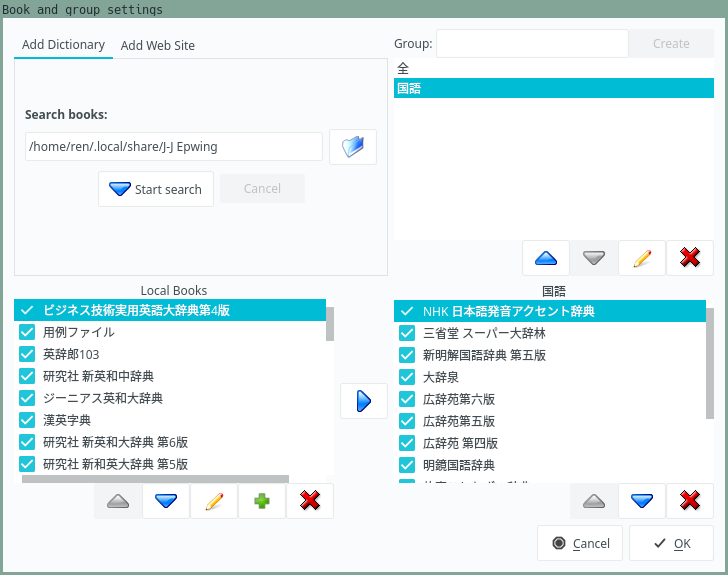
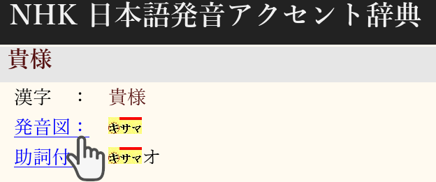
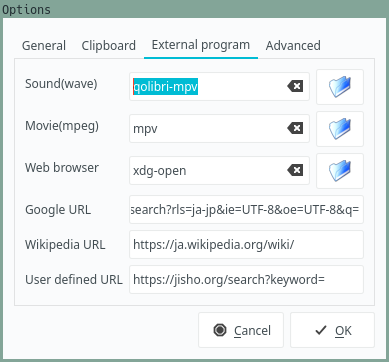
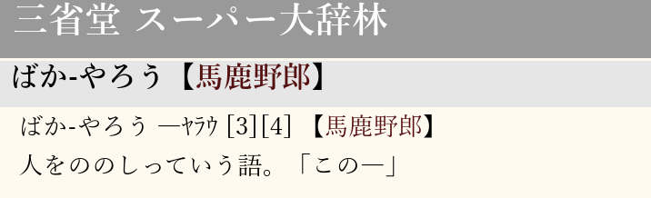
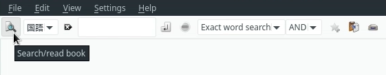

# Setting up Qolibri

[Qolibri](https://aur.archlinux.org/packages/qolibri/)
is a Qt-based dictionary viewer.
It lets you search multiple dictionaries at one time
so for every word you look up you immediately get multiple definitions.
Qolibri remains one of the most widely used Japanese dictionary viewers for GNU/Linux.

By itself, Qolibri is just a viewer.
To utilize it, you need **dictionary files**.
The dictionary files Qolibri reads are called [EPWING](https://ja.wikipedia.org/wiki/EPWING)s.
EPWING (electronic publishing WING) is a dictionary format
that was allegedly utilized in portable electronic dictionaries.

Qolibri is much better than Yomichan at searching a big number of dictionaries at the same time.
If you try to use more than 5 dictionaries with Yomichan,
it quickly becomes very cluttered and hard to navigate.
Qolibri lists all dictionaries you have on a sidebar.
It is easy to jump between them if you need to.

If you haven't started using Japanese to Japanese dictionaries yet,
feel free to skip this article for now.
Though Japanese to English dictionaries for Qolibri exist, their number is not very large.
The main reason you want to use the program is to browse monolingual dictionaries.

****

## Installation

On Arch Linux-based distributions you can install Qolibri with
[trizen](https://aur.archlinux.org/packages/trizen/)
or any other AUR helper.

```
$ trizen -S qolibri
```

If you don't want to build it yourself, install
[qolibri-bin](https://aur.archlinux.org/packages/qolibri-bin/):

```
$ trizen -S qolibri-bin
```

If you're running a different distribution of GNU/Linux or not running GNU/Linux at all,
check out the [GitHub](https://github.com/ludios/qolibri) page
for installation instructions.

## Dictionary files

Without dictionary files,
Qolibri is just an empty window with buttons.
Download the dictionaries and save them to a folder on your computer.
EPWINGs are usually larger compared to Yomichan dictionaries.
You need several GiB of disk space to store them.

You can find dictionary files [here](yomichan-and-epwing-dictionaries.html).

To import the dictionaries to Qolibri click "Setting" > "Book and group settings"
and insert the location where the dictionary files are stored on your computer.
Then press "Start search".
Once the dictionaries are loaded,
put the ones that you use most often at the top
to have them display first when searching.

<p align="center"></p>

Due to the nature of the format,
most Qolibri dictionaries are old, they date back to the 1990s.
But don't worry about it,
in rare occasions when you can't find a definition for a new word or slang,
you can use the web search or consult
[online dictionaries](resources.html#online).

## Recommended dictionaries

These dictionaries are recommended the most among Japanese learners.
Here I list generic names stripped of version notations, editions, etc.

* `大辞林`
* `新明解`
* `大辞泉`
* `明鏡`
* `広辞苑`

Usually people keep `NHK日本語発音アクセント辞典` at the very top
to quickly access pitch accent information and audio.

## Searching

To search in Qolibri,
insert what you're interested in finding into the search box
and press "Search".

There are multiple search types you can choose from.

* Exact word search (完全一致).
Search for a headword that matches exactly with the query.
* Forward search (前方一致).
Search words that start with the query.
* Backward search (後方一致).
Search words that end with the query.
* Full text search (全文検索).
Search whole page.

These types split the search query by whitespaces:

* Cross search (クロス検索).
Searches multiple words inside headwords.
E.g., if you search `繰 返`,
it's going to find entries like `繰り返す` or `繰り返し`.
After testing this search type I must say that it's far from perfect
and often finds nothing when you expect it to find something.
* Keyword search (条件検索).
Like cross search,
but searches words in the books' contents, including headwords.

Most of the time you want to use Exact search.

## Invoke search from a shortcut

Qolibri can accept search queries via command line arguments.
If you have `xclip` installed, you can write a small bash script
that will send the content of the primary selection (or the clipboard, if you want) to Qolibri.

Configure your DE, WM or a tool like sxhkd
to bind the following command to a key:

```
qolibri "$(xclip -o)"
```

Now you can select any text and then press the key you've set to quickly search it.
I recommend enabling "Server mode" in Qolibri's options.
Otherwise, every time you press the hotkey,
a new Qolibri window will be opened instead of a new tab.

## Playing NHK audio

One of the dictionaries available for Qolibri is `NHK 日本語発音アクセント辞典`.
It shows pitch accents of words and lets you play `wav` audio recordings
when you click on the blue links.

<p align="center"></p>
<p align="center"><i>NHK dictionary with audio recordings.</i></p>

If you face problems when playing audio inside Qolibri,
chances are Qolibri is not configured correctly.
If you can't hear anything
when clicking on pronunciations in the NHK dictionary or other dictionaries,
download [qolibri-mpv](https://github.com/tatsumoto-ren/dotfiles/blob/main/.local/bin/qolibri-mpv),
a script that can be used to play Qolibri's audio with `mpv`.
Naturally, you need [mpv](https://wiki.archlinux.org/title/Mpv) to be installed for it to work.

1) Save the script in `~/.local/bin`.
2) To make it executable, run `chmod +x ~/.local/bin/qolibri-mpv`
2) Make sure `~/.local/bin` is added to the [PATH](faq.html#how-do-i-add-a-directory-to-the-path).

In Qolibri, go to "Settings" > "Options..." > "External program" and specify the name of the executable.

<p align="center"></p>
<p align="center"><i>Qolibri's options.</i></p>

In addition to playing the files as you click on them,
`qolibri-mpv` also copies them to clipboard.
You are able to play an audio and paste it in an Anki note as an `ogg/opus` file.

Video: https://redirect.invidious.io/watch?v=xA_Af0DGmmQ

## Set browser font

To change the font used in the browser,
go to "Settings" > "Set browser font...".
Recommended fonts can be found [here](resources.html#fonts).

## Custom CSS

You can change the way definitions look using CSS.
To edit the style sheet, go to "Settings" > "Edit style sheet" > "Dictionary style sheet...".
I use a theme that looks similar to the style of my Anki cards.
To get it,
[download](https://gist.github.com/tatsumoto-ren/8b70f2fe739840ce81b93572ee8c90db)
this example CSS file.
The default CSS file Qolibri ships with can be found on
[GitHub](https://github.com/ludios/qolibri/blob/prime/data/dict-style.css).

<p align="center"></p>
<p align="center"><i>Definition.</i></p>

## How to use the dictionaries

If you click on the "Search/read book" button on the left side of the window,
the magnifying glass icon changes into a book.
Choose a dictionary in the dropdown menu and click the button that says "Open book".
The program will show you a page that explains how to use the dictionary.
Often dictionaries don't have this information,
but 新明解, 大辞泉, 明鏡, NHK日本語発音アクセント辞典 and several others do.

<p align="center"></p>

Here you can find the explanations what all the symbols mean.

Tags: dictionaries, epwing
