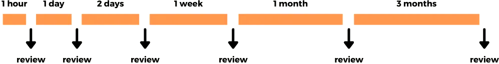
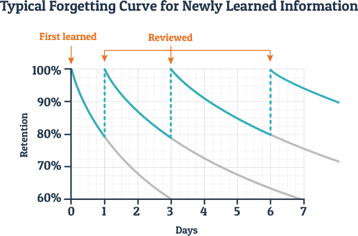

# Spaced repetition

To study efficiently
and help you keep track of the learning process
one of the first things you're going to want to do is
obtain a spaced repetition system.
In this article let's cover the theory behind spaced repetition,
why you need it
and what system to use.

****

## What's spaced repetition

> When you have memorized something,
> you need to review that material,
> otherwise you will forget it.

Spaced repetition is a memorization technique
where you review learned information at gradually increasing time intervals.
Any learned material gets forgotten over time,
but when we review something right before we forget it,
we can extend how long we know it for.

<i>An example of progressing intervals.</i>

In order to get the best results,
the intervals between revisions of the same piece of information gradually increase.
You are keeping the old information in memory
while spending less and less time maintaining it.

SRS is short for "spaced repetition system".
A spaced repetition system is a program
that automates spaced repetition
helping you retain large quantities of information long-term.

When using an SRS you create electronic flashcards.
Each flashcard needs to be learned first,
and then the system shows you this flashcard before you forget it,
so you can maintain and strengthen your memories.

## The forgetting curve

The forgetting curve shows how information or knowledge stored within the brain is lost over time
if the individual makes no attempt to retain it.

<i>Forgetting curve.</i>

Memory gradually declines with the passage of time.
The curve shows that we eventually forget whatever we don't review.

In order to overcome the forgetting curve
and retain a learned word in your long-term memory,
it needs to be reviewed occasionally.
Ideally, the most optimal time to review something is right before you forget it.

The memory becomes stronger with each review.
By spacing out sessions over time we create room for new information.

## Retention rate

There's no way to completely eliminate forgetting.
Instead, an SRS helps you forget less or *forget strategically*.
SRS is set to promise you a certain retention rate.
Your retention rate refers to the percentage of cards
that you successfully remember when reviewing.
With some SRS you directly input the desired retention rate,
and the system is trying to deliver the results.
With other SRS you can't control the retention rate you want,
but you can influence it by changing other settings,
like the multiplier of intervals between repetitions.

If your retention rate is 90%,
on every review session you forget 10% of the flashcards that come up for review.
Every forgotten piece should be relearned.

Chasing 100% retention turns out to be impossible in practice.
You're good as long as you review your flashcards every day and relearn forgotten material.
Essentially if you want to ensure you never forget something,
you have to review it *every minute*,
which requires unlimited time.

## SRS applications

Currently, there are many SRS applications available.

### Anki

[Anki](https://wiki.archlinux.org/title/Anki) is a Spaced Repetition System, an SRS.
Anki was created by Damien Elmes in 2006.
It's cross-platform, rich with features,
and supports [add-ons](https://ankiweb.net/shared/addons/), written in Python.
The catalog of add-ons is massive.
There are many add-ons that greatly aid language study, including a few of my own.
Because of the add-ons it's in my opinion really the only SRS application worth taking seriously.

What's most important, Anki is
[libre software](https://www.gnu.org/philosophy/free-sw.html)
that respects the users'
[freedom](https://web.archive.org/web/20220318054539/https://wiki.installgentoo.com/wiki/Freedom)
and community.

Today Anki is considerably worse than it was back in 2006, or even in 2017.
It's noticeably slower, clunkier, harder to use, easier to break, etc.
But I still think it's worth using for all the benefits it gives,
and if you take into account that it practically has no competitors.
With the help of add-ons we are able to fix some common problems of Anki
and make the app more user-friendly.

There are many reasons to hate Anki.
In fact, each new version adds a few more reasons.
Some people refuse to put up with the new "features" of Anki
and the constant flood of changes for the sake of making changes.
They keep using an older version, like `2.1.35`.
This choice means missing out on new add-ons and suffering from old bugs.
Other people choose to upgrade and witness the rush towards decay Anki is at right now.

The gradual downfall only affects the desktop version.
[AnkiDroid](https://github.com/ankidroid/Anki-Android),
the Android application,
is developed by a separate group of people
and is completely fine as of now.

### Mnemosyne

[Mnemosyne](https://wiki.archlinux.org/index.php/Mnemosyne)
is another flashcard program that uses a spaced repetition algorithm.

> Mnemosyne aims to be a user-friendly flash card program,
> with a clean, deceptively simple interface
> that does not require you to wrap your head around complicated concepts
> before you can start using it.

Mnemosyne can import Anki decks.
Anki has a Mnemosyne `.db` file importer.
With the mutual support you should be able to migrate back and forth if you want.

### Supermemo

[Supermemo](https://wikiless.org/wiki/SuperMemo?lang=en)
is a [proprietary malware](https://www.gnu.org/proprietary/) program.
You can't use Supermemo on GNU/Linux and Android.

The algorithm Anki uses is actually based on an older version of Supermemo.

## Alternative to the SRS

If you had the misfortune of visiting some language learning forums that shall not be named,
you may have encountered an opinion that using an SRS is not necessary to learn a foreign language.
Strictly speaking, it's true of course.
The SRS doesn't play a crucial role in the learning process,
it is often called "a supplement".

The alternative to using spaced repetition is
randomly coming across the same word multiple times.
If you're taking an immersion-based approach to language learning,
eventually you will see the word enough times to *acquire it*.

A major problem that happens when learning languages is that
a learner is liable to forget a word over and over until the word is seen many times.
The SRS takes care of that constant "leaking bucket" problem
where you only remember things learned recently.
With the SRS you are sure you don't slide down,
you are only moving forward.

Tags: guide
