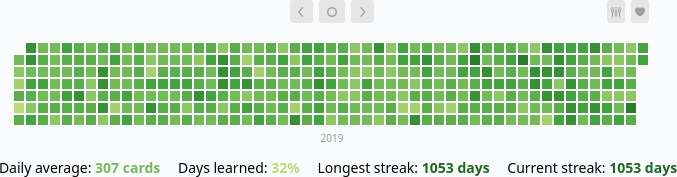
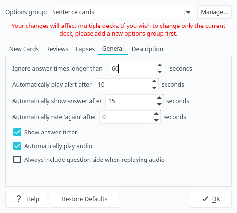
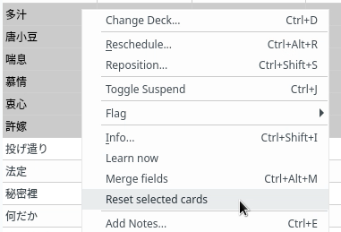
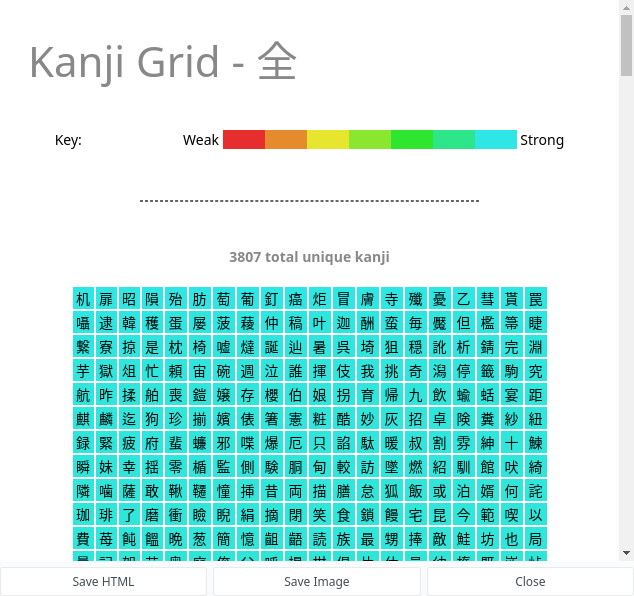
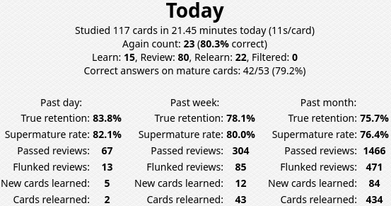
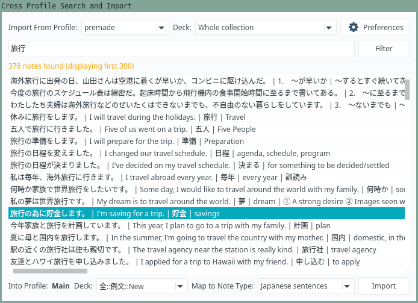
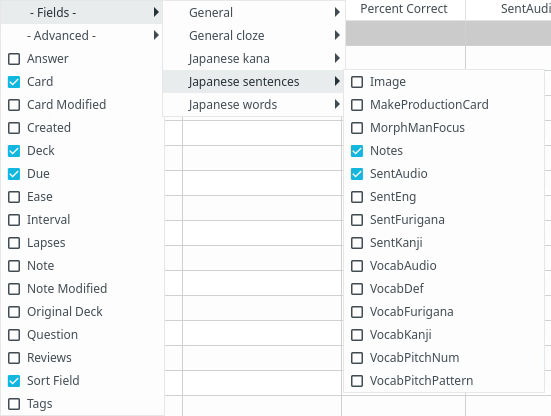
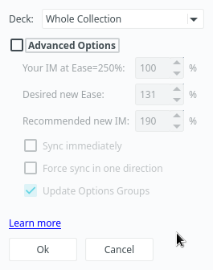
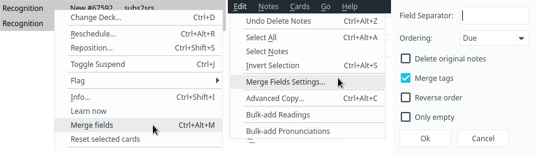
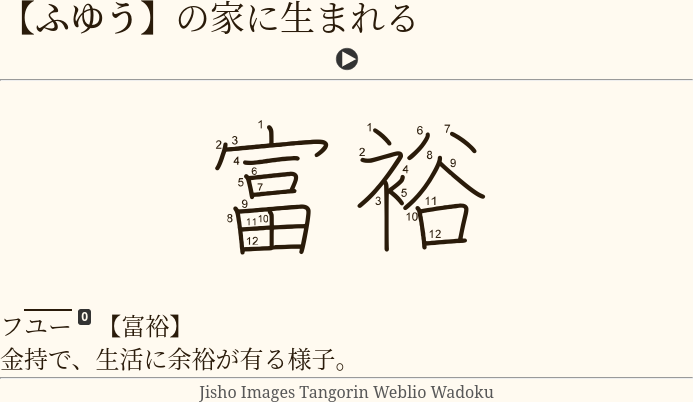

In this article I want to talk about Anki add-ons I recommend using when studying Japanese.
Anki add-ons are small Python programs that extend or change functionality of Anki.
To install an add-on open Anki, go to "Tools" > "Add-ons" > "Get add-ons"
and paste the code of the add-on.
To find the code you need to open the corresponding add-on page on
[AnkiWeb](https://ankiweb.net/shared/addons/)
and scroll down to the "Download" section.

****

## Install add-ons I use

Anki has an option to install many add-ons at once.
By following the instructions below
you can install the add-ons I use in my everyday studies (not every add-on from this page).

1) Open Anki and go to "Tools" > "Add-ons" > "Check for Updates".
1) Paste multiple codes separated by spaces.
    ```
    1046608507 1374772155 1463041493 1771074083 1779060522 1845503807 1898445115 2055492159 2179254157 2491935955 295889520 300884351 31746032 318752047 385888438 580654285 613684242 874215009 900801631 909972618 1772763629 182970692 196231552 1715096333 1021636467 1425504015 1255924302 1151815987 819023663
   ```
1) Restart Anki.

## Add-ons worth trying

### [Furigana](https://ankiweb.net/shared/info/1344485230)

The most important add-on you'll need is AJT Furigana.
It's primary and only feature is generating [furigana](https://wikiless.org/wiki/Furigana?lang=en),
which you're going to need every day.

<p align="center"></p>

The add-on comes bundled with our recommended Note Type from
[this example deck](setting-up-anki.html#import-an-example-mining-deck).

To configure the add-on, open the Anki Add-on Menu via "Tools" > "Add-ons" and select "AJT Furigana".
Then click the Config button on the right-side of the screen.

This add-on is similar to
[Japanese support](https://ankiweb.net/shared/info/3918629684).

### [Browser Play Button](https://ankiweb.net/shared/info/182970692)

This add-on lets you play audio on your cards right from the Anki Browser window.
Additionally, it has a configurable toolbar button and context menu actions.

<p align="center"></p>

### [Flexible Grading](https://ankiweb.net/shared/info/1715096333)

Bring keyboard-driven reviewing to Anki 2.1.
Use the Vim-keys of the keyboard to grade cards,
answer cards from their front side
and disable "Hard" and "Easy" buttons.

<p align="center"></p>

### [Review Heatmap](https://github.com/glutanimate/review-heatmap)

If you look around you see that everybody uses this add-on.
It visualizes your learning performance and encourages you to do your
reps every day to keep your current streak.

Set a goal for yourself - not a single empty square for the next 1000 days,
and punish yourself if you won't be able to fulfill it.

<p align="center"></p>
<p align="center"><i>Maintaining long streaks is very easy.</i></p>

### [Speed Focus Mode](https://ankiweb.net/shared/info/1046608507)

It is not uncommon for people to spend more time than necessary on their reviews.
It is likely that they get stuck on some material for too long,
their reading speed is slow,
or they start mind-wandering in the process.
With this add-on it is possible to stay focused and do your reviews quickly.

The add-on takes a few days to adjust to,
but after that you get used to reading your sentences faster.
I don't recommend this add-on to beginners though.
If you've just started
[mining sentences](sentence-mining.html),
you are lucky to read them at all,
let alone doing it fast.
At the intermediate stage the add-on is certainly useful,
and becomes unnecessary once you're advanced.

<p align="center"></p>
<p align="center"><i>Screenshot.</i></p>

As the answers get automatically revealed,
you can't spend too much time on a card
unless you want to re-read the target word's definition.
This also encourages you to add shorter sentences to your deck,
which is a good practice.

### [Reset Card Scheduling](https://ankiweb.net/shared/info/300884351)

This add-on turns selected cards back into new cards and erases any recorded lapse and repetition counts.
It is very handy for dealing with [leeches](setting-up-anki.html#lapses)
because you can reset a card and then change its contents
to make sure that you won't forget it anymore, and then learn it again.

<p align="center"></p>

### [Mortician](https://ankiweb.net/shared/info/1255924302)

Postpone difficult cards to the next day.

Still can't remember a card after several Agains?
Unfortunately, some knowledge just won't stick, and it happens randomly.
`Mortician` will automatically bury cards
that you've failed too many times in a given period of time.
Usually the next day you find that the cards have become easy.
That's how weird our brains are.

<p align="center"></p>

### [Quick Colour changing](https://ankiweb.net/shared/info/2491935955)

mattvsjapan suggests marking the pitch with this add-on.

You can select a word,
press a keyboard shortcut,
and the word will change its color to a value you defined in Settings.
You can set multiple shortcuts, one for each color you need.

### [Kanji Grid](https://ankiweb.net/shared/info/909972618)

Tells you exactly which kanji from a given deck you have learned
and how many kanji you know overall.
You can group the kanji by Kentei level, JLPT level, or school grade.
Duplicates similar functionality from the Japanese support add-on,
but comes with the ability to limit results to the required field name
and has a nicer interface that shows kanji in a colored grid.

<p align="center"></p>

### [Pitch Accent](https://ankiweb.net/shared/info/1225470483)


Adds pitch accent graphs to your cards.
Note that
[Yomichan](https://foosoft.net/projects/yomichan/)
has a similar feature,
but this add-on can be used when Yomichan doesn't have pitch graphs for the target word.
It also lets you mass-generate pitches for all cards in your sentence bank.

<p align="center"></p>

### [True Retention](https://ankiweb.net/shared/info/613684242)

Adds more info to the "Stats" window.
Depending on the value of your True Retention for the past month you can adjust your
[Interval Modifier](setting-up-anki.html#reviews). Aim at around 75-90%.
If you remember your cards too well it's worth increasing your `IM`
and studying more cards a day or spending more time immersing.

This is how True Retention is calculated:
```
tr = passed / (passed + flunked)
```
where `passed` is a number of `review` cards that you answered `hard`, `good` or `easy`,
and `flunked` is a number of `review` cards that you answered `again` on.

**Note:** on Anki 2.1.35+ you need to hold `Shift` down when you click "Stats"
in order to view add-on based stats information.

<p align="center"></p>

### [Cross Profile Search and Import](https://ankiweb.net/shared/info/1772763629)

With this add-on you can keep your [subs2srs](our-immersion-learning-toolset.html#subs2srs)
bank in a different profile and copy cards to your main profile on demand.
It lets you keep your main profile clean and not overload AnkiWeb servers
with hundreds of megabytes of media files.
You can select decks to import from and search cards containing certain words.

<p align="center"></p>

### [Advanced Browser](https://ankiweb.net/shared/info/874215009)

An add-on that lets you sort your cards by a myriad of additional parameters and fields.
Very useful when you want to sort a subs2srs deck based on its audio timestamps or if you want
to sort a premade deck using a frequency list without the need to export it as a `tsv` file.

<p align="center"></p>

### [RefoldEase](https://ankiweb.net/shared/info/819023663)

It is believed that the Ease factor can be harmful
when memorizing items with similar intrinsic difficulties, such as sentence cards.
After a card gets graded "Again" too many times, its Ease factor becomes smaller
and prevents the card's interval from growing at a normal rate.
RefoldEase lets you control Ease of cards in your collection.
Run this add-on once to set Ease of your cards to 131%
and change Interval Modifier and Starting Ease of your decks accordingly.
This is in my opinion the best way to solve the Ease Hell problem once and for all
because in Anki any given card can't have Ease lower than 130%.
After applying the settings you can uninstall the add-on.

* [The Ease Factor Problem](https://archive.md/4RJcr)
* [Guide to Anki Intervals and Learning Steps](https://redirect.invidious.io/watch?v=1XaJjbCSXT0)

<p align="center"></p>
<p align="center"><i>Settings.</i></p>

### [Learn now & Grade now](https://ankiweb.net/shared/info/1021636467)

This add-on adds new buttons to the card browser.
The `Learn now` button immediately puts selected new cards in the learning queue.
The `Grade now` button lets you grade selected cards without opening Reviewer.

> Easier than faffing about in the menus to do the same thing in 10 clicks.
>
> &mdash; Review on AnkiWeb

<p align="center"></p>
<p align="center"><i>Context menu.</i></p>

**Learn Now** moves selected new cards to the learning queue.
The cards will be shown to you next time you go to the review screen.
You can use this feature if you have a big collection of cards,
and you find a card that you want to learn right away without manually repositioning it.

**Grade Now** answers selected cards right from the Browser window.
For example, imagine that you learn a new Japanese word.
Then one day when reading a book in Japanese you see the word but can't recall it.
In this case it would be rational to open Anki and fail the corresponding card.
The card will be put in the relearning queue.

### [Add Hyperlink](https://ankiweb.net/shared/info/318752047)

As you know from the [rule 18](https://www.supermemo.com/de/archives1990-2015/articles/20rules)
of formulating knowledge:

> It is highly recommended that you include sources from which you have gathered your knowledge.

The add-on makes it simple to insert hyperlinks to provide sources on your cards.

### [Edit Field During Review](https://ankiweb.net/shared/info/385888438)

An Anki add-on that makes it quicker and easier to edit cards while reviewing.
You can edit cards while reviewing without having to open up a separate editor window.
Simply click the field you want to edit and make changes directly on the card.

<p align="center"></p>

### [Paste Images As WebP](https://ankiweb.net/shared/info/1151815987)

Convert images to
[WebP](https://developers.google.com/speed/webp)
on-the-fly when you make Anki cards.

As you're going to use Anki for years, expect your collection to slowly grow in size.
It's nice to keep your media files small
out of respect for people who run AnkiWeb servers
as well as to make syncing faster.
Paste Images As WebP helps to compress images on-the-fly when you make Anki cards.
As the name says, it does that by converting images to
[WebP](https://wikiless.org/wiki/WebP?lang=en)
format which is famous for excellent compression.

The add-on comes with a number of settings,
namely you can define the desired resolution and quality.
A [video demo](https://redirect.invidious.io/watch?v=kEsIykks1WY) is available on YouTube.

<p align="center"></p>
<p align="center"><i>Settings.</i></p>

### [MergeNotes](https://ankiweb.net/shared/info/1425504015)

The add-on is designed to fix premade subs2srs decks.
Due to the way subs2srs works usually many sentences in the produced decks
are split between two and more notes.
`MergeNotes` lets you merge content of selected cards without copy-pasting.

<p align="center"></p>
<p align="center"><i>Context menu and settings.</i></p>

### [Ze Frozen Fields](https://ankiweb.net/shared/info/94610912)

When you add many cards at once manually, it lets you keep what's typed in a field.

<p align="center"></p>

**Note:**
This add-on is no longer needed on newer versions of Anki.
You can achieve the same functionality by pressing the 📌 button.

### [AnkiWebView Inspector](https://ankiweb.net/shared/info/31746032)

This add-on adds a new button named *Inspect* to the right-click context menu in an Anki's WebView.
For example, by clicking it in the Review screen you can see what HTML code Anki adds to your cards.
It helps users tweak their Card Templates and developers make new Anki add-ons.

### [Autocopy](https://ankiweb.net/shared/info/1995103628)

This simple add-on automatically copies text from a card to the clipboard.
It is intended to assist in editing large amounts of cards.
For example, when you select a fresh subs2srs (or mpvacious) card in the Anki browser,
it will copy the sentence to the clipboard.
Then you can analyze the sentence using [Yomichan Search](what-is-yomichan-search.html)
and add dictionary definitions to the card.

<p align="center"></p>
<p align="center"><i>Autocopy - Settings.</i></p>

## Add-ons to avoid

All Anki add-ons by design add some new functionality to the program.
But among them are those that just feel like a fifth wheel
and don't bring a lot of value for language learners.
Nevertheless, they're popular, so I might as well mention them.

### Kanji Colorizer

Stores a bunch of bloated svg data in your Anki collection.

If you want to add stroke diagrams to your cards,
use the `KanjiStrokeOrders` font.
The font can be stored in your `collection.media` folder
and used to display kanji on your writing cards.
It comes with the [example mining deck](setting-up-anki.html#import-an-example-mining-deck)
or can be downloaded separately from [here](https://t.me/ajatt_tools/48).

<p align="center"></p>

<p align="center"><i>Example mpvacious writing card.</i></p>

### Awesome TTS

The plugin adds computer-generated audio to your Anki cards using text-to-speech.
Obviously, listening to robotic voice is not ideal when you're learning a language.
To acquire phonetics of your target language you need to listen to native speech,
you don't want to pick up weird habits from the robot.
And due to abundance of voiced native media in Japanese and the ability to mine sentences
with mpv scripts such as
[mpvacious](https://github.com/Ajatt-Tools/mpvacious)
or
[mpv2anki](https://github.com/SenneH/mpv2anki)
there won't be many times when you actually need it.

### Add-ons that modify Anki Scheduler

Basically everything that modifies the scheduler is completely unreliable and prone to breakage.

* If an add-on tunes the Ease factor on a card by card basis,
you can't predict your retention and will likely be forgetting more cards.
* If an add-on modifies the Due value,
a card may come up for review too early or too late, resulting in more forgetting.

I provide some examples below.

#### Straight Reward

This add-on messes your Anki cards when you rate them "Good" or "Easy".
The idea is that with the add-on your Ease will eventually recover after a lapse.
After trying it for a week with default Anki settings I found that it simply doesn't work,
and my cards aren't modified in any way. So the only thing I can recommend you is
to set your Ease to 131% with [RefoldEase](#refoldease) and keep your Anki setup simple.

#### Load Balancer

Prevents you from reviewing your cards on the right day, when they should be reviewed.

#### Auto Ease Factor

It's similar to Straight Reward.

> Adjusts ease factor on cards automatically after each rep

Terrible idea.

### Migaku add-ons

They're big, slow, redundant and intrusive.
