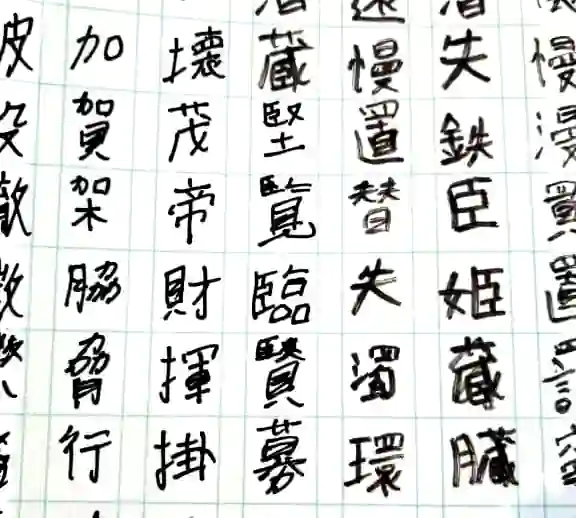
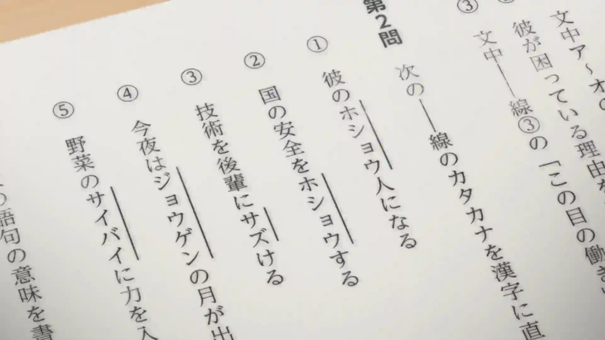
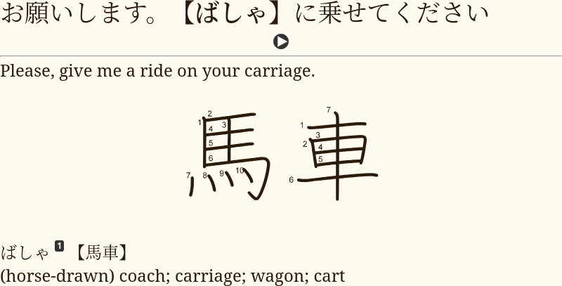
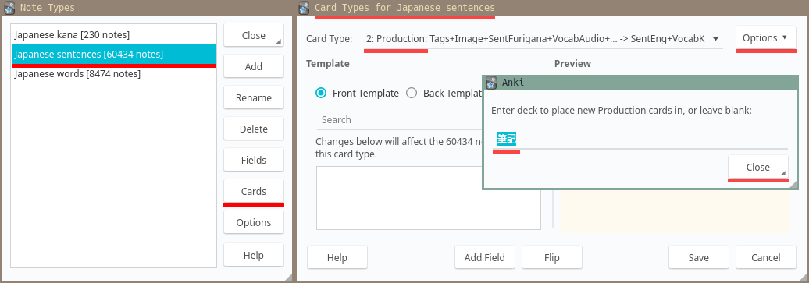

After you've got a few thousand hours of input
and can read content made for natives relatively effortlessly
it makes sense to start practicing writing Japanese by hand.
Bear in mind that being able to do so is not necessary unless you plan to live in Japan.
Nowadays writing is done on a keyboard
and doesn't require recalling characters from memory.
However, writing practice has the potential to improve your overall reading ability.

<p align="center"></p>

****

## When to learn handwriting

Let's say you want to learn how to write `薔薇` by hand.
It would be best if you already knew the word,
what it means and how it is read before learning to write it.
Of course,
you can do everything in one go and learn all three components at once:
how to read it, how to write it, and what it means.
But it will be more difficult.
In my experience, it is much more difficult.
Therefore,
it is recommended to become comfortable with reading Japanese first
and then focus on learning handwriting.

## Preparations

To write Japanese you need something to write on and something to write with.

* Paper, a few A4 sheets.
* A pencil or a pen.
* [原稿用紙 pdf](https://duckduckgo.com/?q=%E5%8E%9F%E7%A8%BF%E7%94%A8%E7%B4%99+a4+pdf&kp=-2&kl=jp-jp&ia=web),
[like this](http://www.sousakuba.com/genkouyousi/).
There are quite a lot of options to choose from,
so I'm going to link a search page where you can find any pdf you want.

Print the pdf you've downloaded on the paper you've got, and you should be set.

<p align="center"></p>

The point of printing 原稿用紙 is to have boxes
that you should attempt to fit each character in.
You can also draw a grid yourself or grab a math exercise book.

<p align="center">

</p>

Don't buy premade 漢字練習帳 or 原稿用紙 from somewhere, unless it costs $1 or less.

## Writing kana

Let's start with kana.
Download the writing deck below.
You should be able to complete it within two days.

<p align="center">

</p>

Each card contains a kana character written in romaji
along with its pronunciation on the front
and a stroke diagram on the back.
Your goal is to write the character on paper.
If you are able to do it with the correct stroke order then press "Good".
Otherwise press "Again".

<p align="center">
<a class="download_button" href="https://ankiweb.net/shared/info/1233553736">Download</a>
</p>
<p align="center">
<a href="https://disk.yandex.com/d/EoUsX-t62jiEGg">Mirror</a>
</p>

## Writing kanji

After you finish the kana, it's time to start learning how to write kanji.
This step is more complex and is going to take much longer.

### How Japanese do it

While watching real Japanese people in anime I noticed how they're tested on kanji in school.

<p align="center"></p>
<p align="center"><i>Episode 3 of <a href="https://myanimelist.net/anime/37450">青春ブタ野郎はバニーガール先輩の夢を見ない</a>.</i></p>

You are presented with sentences in Japanese,
and each sentence contains a **target word** written in kana.
The task is to write it in kanji.
Since you are given example sentences,
you should be able to differentiate words
that sound the same but are written with different kanji.
The screenshot above provides a good illustration of how to use
the similarly sounding words 保証 and 保障.

This method has been implemented in the TSC note type.
When you download the deck linked below,
you notice that each note has a field called `MakeProductionCard`.
If you put any text in the field, a production targeted sentence card will be created.

<p align="center"></p>
<p align="center"><i>A production targeted sentence card.</i></p>

In my opinion this is the most natural way to learn writing.
The method doesn't rely on English keywords whatsoever.
Making mnemonics might be helpful but is totally optional.
Feel free to use this note type for your own sentence cards.

<p align="center">
<a class="download_button" href="setting-up-anki.html#import-an-example-mining-deck">Download</a>
</p>

As with kana cards, if you could produce a word
with the right stroke order, grade the card "good".
If you couldn't write it, then mark the card "again".

Because the method is aimed at people who are already fluent,
it requires making your own cards.
By the time you start learning to write,
you should have plenty of sentence cards in your Anki collection to generate production cards from.
However, if you want a premade sentence pack that can be used for writing,
you can download [Ankidrone Starter Pack](basic-vocabulary.html).

### How to make your own cards

I recommend making production cards from your existing targeted sentence cards.
To do this:
1) Choose a kanji you want to learn.
2) Find a note in your Anki collection
   where the target word contains this kanji.
3) Fill the `MakeProductionCard` field to create a new Production card.
1) Learn the card later.

For example,
if you want to learn how to write this kanji `鬱`,
open the Anki Browser (shortcut: <kbd>b</kbd>) and type the following in the search bar:

```
is:review "note:Japanese sentences" card:Recognition VocabKanji:*鬱*
```

This search query assumes you're using our
[Japanese sentences Note Type](setting-up-anki.html#import-an-example-mining-deck).
If not, replace `note:NoteTypeName` with your Note Type
and `VocabKanji:*kanji*` with the name of your Vocabulary field.
`is:review` means that you're searching for cards that have graduated before.
This is important because you don't want to try learning how to write words that you don't know yet,
or the process is going to be too difficult.

I advise against using recently learned or new vocabulary for production cards
as this may have a negative impact on retention.
You can add `prop:ivl>180` to the search query to guard against freshly learned cards.

Now let's say Anki has shown you a card with this sentence in the search results:
```
病院で鬱病と診断されると、抗鬱薬が処方されます
```
The target word here is `抗鬱薬`, and it contains the kanji you need `鬱`.
Now you can create a Production cards from the existing Recognition card and learn it.

If there are no results, you haven't learned any words with this kanji yet,
and it's too early for you to learn how to write the kanji.

### Place production cards in another deck

Instead of moving cards manually to a writing deck,
you can put an override option on a specific card type,
so all your production cards go in a specific deck when they are generated.

If you want your production cards to be in another deck,
open Anki's main window and select
"Tools" > "Manage Note Types" > Select your Note Type >
"Cards" > Select your production Card Type > "Options" > "Deck override".
I put `筆記` here which is the name of my writing deck.

<p align="center"></p>
<p align="center"><i>Deck override.</i></p>

### In what order should I learn words

When applying this method, it is wise to start with simpler kanji first.
The exact order may wary.
I would like to note the following options:

* **Working your way up school grades or JLPT levels.**
  Start with the easiest level and make production cards for each kanji.
  The [Kanji Grid](useful-anki-add-ons-for-japanese.html#kanji-grid) add-on
  is going to help you determine what character to learn next.
  You can move production cards to a separate deck to make filtering easier.
* **Following the RTK order.**
  Make cards for each kanji in the Heisig's book.
  Check out [this site](https://hochanh.github.io/rtk/rtk1-v6/index.html)
  for an online RTK index.
* **Using a custom list.**
  In such lists characters are sorted to ensure that no kanji appears before its parts.
  [TopoKanji](https://github.com/scriptin/topokanji) is a good example.

### Learning the stroke order

There's no need to specifically memorize stroke order rules.
After learning to write a few hundred words in Anki
you will naturally acquire the ability to guess the stroke order of most new kanji you encounter,
and stroke order diagrams on your cards won't let you make a mistake and not notice it.

The important part is to have a stroke order font included on your cards
and precisely follow the order each time a card comes up.

### What about Production RTK

Sometimes you see people recommending doing *RTK after you're fluent*.
This means taking the first volume of the book *Remembering The Kanji* by James Heisig
and making each kanji into an Anki card.
After the first volume people usually skip the second one and continue with the third.
The second volume is skipped because it teaches readings of kanji, not their meanings.

There are two ways of doing it that I know of:

1) Using the English keywords provided by Heisig.
   You have a keyword on the front of the card, and the corresponding kanji on the back.
2) Replacing English keywords with Japanese words partially written in kana.
   You have a partially occluded word on the front, and the hidden kanji on the back.

The first method creates associations between a kanji and an arbitrary English keyword.
Because English keywords do not connect to real Japanese it **doesn't work**.
When you read Japanese there are no English keywords to reinforce your memory,
and when you write Japanese there's no guarantee
that being able to produce a kanji by its keyword
is going to enable you to produce the word that uses the kanji
given that the word itself isn't directly associated with the English keyword.

The second method **doesn't work** because
due to the way kanji are taught in the book you don't work at the level of words,
instead you have to write each kanji separately.
This leads to "cloze" cards where each card has a word on the front
but only one character in the word is hidden.
Learning how to produce parts of words
doesn't guarantee the ability to write whole words when necessary.
Moreover, this method requires to replace all Heisig's keywords with your own,
essentially presenting a task comparable to writing your own RTK.

## A look into the past

The AJATT community has come up with the current way to learn writing
after years of practice, trial and error.
A long time ago, it was recommended to use Traditional RTK.
This is a method where
people have to learn to write kanji from the very beginning,
right when they start learning Japanese.
To execute it, you take all kanji from the Heisig's Remembering The Kanji book,
and create Anki cards where on the front you have an English keyword,
on the back you have the kanji.
The goal is to recall the kanji from the keyword and write it down on a piece of paper.
However, this was found to be very difficult,
with some people taking a full year to get through Heisig,
despite it being designed to take about three months.
It was mentally challenging to do Traditional RTK as a beginner who doesn't know any words yet.

In response,
it was suggested to do RTK without learning how to write.
The method is known as "Lazy Kanji" or "Recognition RTK".
It involves learning only the meanings of characters and how to recognize them.
Then, the learners start sentence mining,
and finally do Traditional RTK again once they reach fluency.
The downside of this method is that it requires doing RTK twice,
Also, after going through Heisig the first time,
the memories are weak,
and the characters are quickly forgotten.

To avoid having to do RTK twice,
and to completely avoid RTK,
it was later suggested to replace RTK with learning to read words with hints.
The JP1K method involves learning the first 1,000 words using cards
where furigana is visible on mouse hover.
Then, handwriting can be learned by using Production Targeted Sentence Cards.
This is the method that is recommended today.
