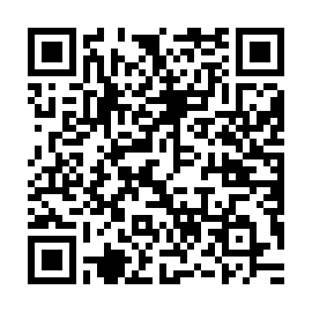

Спасибо за визит!

Поскольку почти весь мой контент доступен бесплатно,
этот сайт и проект [Ajatt-Tools](https://github.com/Ajatt-Tools)
полностью зависят от пожертвований и поддержки сообщества,
чтобы продолжать существовать.
У нас нет рекламы и трекеров, нарушающих приватность.
Мы полностью зависим от тебя.

Если этот сайт,
наше сообщество или свободное ПО, разработанное в Ajatt-Tools,
оказались тебе полезны,
я буду благодарен за помощь в виде пожертвования.
Это поможет мне и дальше обеспечивать себя
и продолжать выпускать новые руководства, инструменты и материалы.
Поддержать меня можно на одной из платформ ниже.
Помимо этого можно прислать криптовалюту.

****

## Пожертвования

Наш проект существует исключительно благодаря средствам людей, которые ему помогают.
Начиная с 2020 года я занимаюсь работой над AJATT полный рабочий день.
Проект было бы невозможно поддерживать, если бы я не мог покупать еду и оплачивать базовые потребности.
Каждый день на сайт заходят тысячи людей,
если бы даже небольшая часть из них прислала `$1` или `50 ₽` - это бы значительно помогло нам!
Вышеописанные суммы в текущих реалиях не сделают никого беднее,
но они могли бы помочь в развитии проекта и движении в нужном направлении.
❤️  Если же ты решился на пожертвование, можешь сделать это по ссылкам ниже, в соответствии с твоими возможностями.
Абсолютно любая сумма поможет,
поможет проекту не угаснуть.

Деньги, которые я получаю через пожертвования в основном уходят на поддержку сайта,
оплату хостинга и домена.
Я в том числе обновляю и улушаю уже существующие статьи,
выпускаю новые.
Поддержка от тебя в том числе помогает сохранять мотивацию для работы над Ajatt-Tools,
включая создание, обновление и улучшение наших программ, аддонов для Anki, колод - и иных вещей, использующихся в нашем методе.
В случае небольшого потока пожертвований мне придётся искать работу на стороне, что замедлит разработку и улучшение AJATT метода.

Чтобы процесс разработки, поддержки и улучшения наших инструментов, а также ресурсов не замедлялся - очень важна твоя постоянная поддержка.
Поддерживая нас, ты также поддерживаешь и других изучающих языки людей, ведь они тоже пользуются нашими программами и читают этот сайт.
Спасибо всем, кто остаётся с нами!
Мы продолжаем только благодаря вам всем!

## Monero

[Monero](https://www.getmonero.org/)
это криптовалюта, которая ценит приватность своих пользователей, а также защищает их от цензуры.
Транзакции в её блокчейне скрыты от злоумышленников.
Существует достаточно много способов купить и продать Monero, один из самых простых это
[ChangeNow.io](https://changenow.io/).
```
47sD7pSagHF7mp41SwrDj4KF8dSj4kdK6YUZ9fkmnR8h587wVc1kW66iJy9m83maVjWXtDJxmCVxdieMyGZNFHZ2Fifrbr5
```

<details>
<summary>XMR QR</summary>
<p align="center"></p>
</details>

## TON

TON это блокчейн платформа, разрабатываемая Телеграмом.
Прислать Toncoin (TON) можно через внутренний [кошелёк](https://t.me/wallet).
Присылай монету прямо на этот адрес.

```
UQAyVFHr_TSgoR3CkNUAh4kKEBv0ZYxULajueSES1v_wVnsj
```

<details>
<summary>TON QR</summary>
<p align="center"></p>
</details>

## Bitcoin

Bitcoin известен всем.
Не является анонимным, но довольно широко распространён.
Вот список [мест](https://web.archive.org/web/20250513142814if_/https://igwiki.lyci.de/wiki/Cryptocurrency#Where_You_Can_Buy), где можно купить его.

```
bc1q5q36gjlclzhhqet2fkav82cr7y6dqwfk5s2lga
```

<details>
<summary>BTC QR</summary>
<p align="center"></p>
</details>

## Boosty

Ты можешь также помочь через [Boosty](https://boosty.to/tatsumoto/donate).
Это платформа, похожая на Patreon.

<a target="V_blank" class="md-button boosty" href="https://boosty.to/tatsumoto/donate">Boosty</a>

## Помочь через бота в Telegram

По ссылке ниже ты можешь подписаться на ежемесячные пожертвования.
Сумму пожертвования можно поменять при его оформлении в разделе чаевых.

<a target="_blank" class="md-button telegram" href="https://t.me/ajatt_tools/348">Subscribe</a>

****

Ещё раз спасибо тебе за твою поддержку!
Если у тебя нет возможности помочь финансово - читай и делись моими статьями, рекомендуй сайт друзьям и знакомым,
и конечно же - становись частью нашего [сообщества](join-our-community.html).
